# Dispute Claims Resolution Platform — Target Solution Architecture

**From Pega OOTB Smart Dispute (monolith) → a domain-driven, capability-based platform**
Scope: card and e-commerce disputes — **Mastercard** (via the MCOM platform) and **Visa** (via VROL).
Personas: Cardholder and Issuer BackOffice Team are direct users. Acquirer and Merchant are **not** users of this platform.

> **New to this domain? Start at [§0 Terminology](#0-terminology--read-this-first)** — the shared vocabulary for all documents in this workspace.

---

## How to read this document

**This is a solution architecture, not an implementation plan.** Two rules govern it:

| Rule | What it means |
|---|---|
| **Technology-agnostic by default** | Parts 0–11 describe **capabilities and qualities** — "a durable queue with ordered per-key delivery", not a product name. Any vendor could satisfy them |
| **Products named in exactly one place** | [Part 12 · Technology realisation](#12-technology-realisation) is the only section that names products, and every choice there is explicitly replaceable |

**Completeness over phasing.** This document describes the **full target capability set**, including capabilities most programmes defer — reconciliation, appeal handling, deflection, compliance filing, fund-position tracking, FX. Sequencing is a separate decision; see [Part 13](#13-migration-roadmap). Nothing here is scoped out because it might not make a first release.

**Companion documents**

| Doc | Covers |
|---|---|
| [`scheme-lifecycles-and-customer-journeys.md`](./scheme-lifecycles-and-customer-journeys.md) | The Visa and Mastercard lifecycles, validated against both schemes' own publications, with four worked journeys |
| [`pega-smart-dispute-product-flow.md`](./pega-smart-dispute-product-flow.md) | The AS-IS flow as Pega documents it, and the seven gaps it exposed |
| [`pega-lite-db-schema.md`](./pega-lite-db-schema.md) | The AS-IS physical data model and its migration mapping |

---

## Table of Contents

0. [**Terminology — read this first**](#0-terminology--read-this-first)
1. [Executive summary & architectural decisions](#1-executive-summary--architectural-decisions)
2. [AS-IS — reverse-engineering Pega Smart Dispute](#2-as-is--reverse-engineering-pega-smart-dispute)
3. [Domain model — subdomains & bounded contexts](#3-domain-model--subdomains--bounded-contexts)
4. [Context map & integration patterns](#4-context-map--integration-patterns)
5. [Scheme resolution — where the routing decision lives](#5-scheme-resolution--where-the-routing-decision-lives)
6. [Capability catalog](#6-capability-catalog)
7. [C4 model — L1 / L2 / L3](#7-c4-model--l1--l2--l3)
8. [**Scheme integration — the four flows**](#8-scheme-integration--the-four-flows)
9. [**Reconciliation & assurance**](#9-reconciliation--assurance)
10. [Personas, journeys & partner access](#10-personas-journeys--partner-access)
11. [Cross-cutting concerns & NFRs](#11-cross-cutting-concerns--nfrs)
12. [**Technology realisation** — the only section naming products](#12-technology-realisation)
13. [Migration roadmap](#13-migration-roadmap)
14. [Decision log](#14-decision-log)

---

## 0. Terminology — read this first

This section is the shared vocabulary for all three documents in this workspace. Numbering starts at **0** deliberately, so every existing cross-reference to §1–§13 stays valid.

### 0.1 The three layers people conflate

The single most common source of confusion in this domain. **Scheme, platform and programme are three different things.**

| Layer | Visa | Mastercard | What it is |
|---|---|---|---|
| **Scheme** *(the card network)* | `VISA` | `MASTERCARD` | The **company and network** that owns the rails, sets the rules and ultimately rules on disputes |
| **Platform** *(the dispute system)* | **VROL** — Visa Resolve Online | **MCOM** — Mastercom | The **software the scheme gives you** to file and exchange disputes. An API and a portal |
| **Programme** *(the rulebook)* | **VCR** — Visa Claims Resolution | **MDR** — Mastercard Dispute Resolution | The **named set of rules** governing how disputes work — reason codes, cycles, time bars, evidence |

Read as a sentence: *"Under **VCR**, an issuer files a **Visa** dispute through **VROL**."*

**They are one-to-one today, which is exactly why they get conflated.** They are not the same kind of thing, and Amex breaks the mapping — scheme, acquirer and dispute platform are all the same entity, with no separately-branded platform.

#### The naming rule this workspace follows

| Context | Correct value | Never |
|---|---|---|
| Canonical fields, events, published language — `SchemeDecision.network`, `pySchemeNetwork`, `pyNetwork` | `MASTERCARD` \| `VISA` | ~~`MCOM`~~, ~~`VROL`~~ |
| Adapter service names | `mcom-adapter-svc`, `vrol-adapter-svc` | — |
| Scheme-specific correlation tables | `pc_data_mcom_case`, `pc_data_vrol_case` | — |
| Ruleset versions | `MDR-2026.1`, `VCR-2026.1` | — |

**Why the canonical value is the scheme, not the platform:** the field feeds two consumers. the network-routing capability needs to know *where to send it* (platform), but the rules capability needs to know *which rulebook applies* (scheme). Only the scheme value works for both — reason code 4837 belongs to Mastercard's rulebook, not to Mastercom the software. The platform is derivable from the scheme via router config, so putting it in the message would duplicate a fact the router already owns. See [ADR-002](#14-decision-log) and §5.

### 0.2 ⚠ Terms that mean different things depending on who is speaking

| Term | Meaning A | Meaning B | How to disambiguate |
|---|---|---|---|
| **Collaboration** | **Visa:** one of the two VCR workflows — 12.x processing, 13.x consumer disputes | **Mastercard:** a **pre-dispute deflection** process that runs *before* the first chargeback | Always qualify: *Visa Collaboration workflow* vs *Mastercom Collaboration request*. In code use `VISA_COLLABORATION` and `DEFLECTION` — never a bare `COLLABORATION` |
| **Dispute** | **Visa:** the formal name of stage 1 | Generic: any disputed transaction | Capitalised = the Visa stage |
| **Chargeback** | **Mastercard:** the formal name of cycle 1 | Generic: the whole process | "First Chargeback" = the MDR cycle |
| **Claim** | **Our model:** the `Claim` aggregate — a customer complaint covering 1..n transactions | **Both schemes:** a scheme-assigned identifier (`VROL Claim ID`, `Mastercom Claim ID`) | Ours is `pc_work_dispute`; theirs live on the correlation tables |
| **Case** | **Our model:** `DisputeCase` — one dispute against one transaction | **Both schemes:** `Mastercom Case ID`, `VROL Case ID` | Same rule as Claim |
| **Cycle** vs **Stage** | **Cycle:** a network exchange round (`FIRST`, `SECOND`, `PRE_ARB`, `ARBITRATION`) | **Stage:** our internal case stage (`Capture` … `Close`) | Cycles are the scheme's; stages are ours. See lifecycles doc §2 |
| **Representment** | **Mastercard:** older/acquirer-side term for Second Presentment | — | Prefer "Second Presentment" |
| **Network** | The scheme | Sometimes loosely used for the platform | In this workspace it always means the **scheme** |

### 0.3 The parties

| Term | Who | Access to this platform |
|---|---|---|
| **Cardholder / Customer** | The person who raised the dispute | Direct, authenticated digital banking |
| **Issuer** | The bank that issued the card — **us**, in this architecture | Direct, corporate SSO |
| **Acquirer** | The merchant's bank | **Indirect only, via PAI** |
| **Merchant** | The business that took the payment | **Indirect only, via PAI** |
| **Scheme / Network** | Visa or Mastercard | Not a user — the counterparty and the arbiter |

### 0.4 Dispute lifecycle vocabulary

| Term | Meaning |
|---|---|
| **Presentment / First Presentment** | The original transaction being cleared and settled, acquirer → network → issuer. Happens before any dispute exists |
| **Pre-dispute** | Optional deflection before a formal filing — Visa RDR / Order Insight, Mastercom Collaboration / Ethoca. The cheapest possible outcome |
| **Dispute (Visa) / First Chargeback (Mastercard)** | The issuer's formal filing. Moves funds acquirer → issuer |
| **Dispute Response (Visa) / Second Presentment (Mastercard)** | The acquirer's defence |
| **Pre-Arbitration** | Last bilateral chance to settle before the scheme is asked to rule. **Filed by the acquirer in Visa Allocation, by the issuer otherwise** |
| **Arbitration** | The scheme reviews and issues a **binding** ruling. Loser pays the fees |
| **Compliance / Pre-Compliance** | An **independent** flow for rule violations causing financial loss where no chargeback right exists. Filed by either party, at any point |
| **Time bar** | The scheme deadline for an action. Missing it is an unrecoverable loss |
| **Chargeback right** | Whether a valid dispute exists at all, under a given reason code, at the transaction date |
| **Liability shift** | Rules moving fraud liability between parties — e.g. EMV, 3DS |
| **Deflection** | Resolving before a formal dispute is filed |

### 0.5 Visa-specific

| Term | Meaning |
|---|---|
| **VCR** | Visa Claims Resolution — the programme |
| **VROL** | Visa Resolve Online — the platform |
| **Allocation** | The VCR workflow for **10.x Fraud** and **11.x Authorization**. Visa decides liability itself from VisaNet data. **3 stages** — no Dispute Response |
| **Collaboration** | The VCR workflow for **12.x Processing Errors** and **13.x Consumer Disputes**. Parties exchange evidence. **4 stages** |
| **Dispute condition** | Visa's reason vocabulary — `10.4`, `12.5`, `13.1`. Equivalent to a Mastercard message reason code |
| **CE3.0** | Compelling Evidence 3.0 — Visa's **structured** evidence standard: device ID, IP, prior undisputed transaction history |
| **RDR** | Rapid Dispute Resolution — automated pre-dispute refund by merchant rule |
| **Order Insight / Visa Merchant Purchase Inquiry** | Merchant supplies transaction detail to the issuer pre-dispute |
| **Associated Transactions** | VROL surfaces credits, reversals or adjustments that would invalidate the dispute. The issuer **must verify** before filing |
| **Dispute Questionnaire** | Mandatory structured intake form in Collaboration |
| **Response Certification** | Failure to respond in time = **acceptance of liability and closure**. Silence loses |
| **VCR index** | Visa's health score for issuers, acquirers, merchants and cardholders. Degraded by invalid filings |
| **VisaNet / BASE II / VIP** | Visa's processing rails — VIP is online auth, BASE II is file-based clearing |

### 0.6 Mastercard-specific

| Term | Meaning |
|---|---|
| **MDR** | Mastercard Dispute Resolution — the programme |
| **MCOM / Mastercom** | The platform |
| **Message reason code** | Mastercard's reason vocabulary — `4837`, `4853`, `4855`, `4863`. Equivalent to a Visa dispute condition |
| **Collaboration request** | **Pre-dispute** alert to the acquirer before a chargeback is processed. **Not** Visa's Collaboration workflow — see §0.2 |
| **Ethoca** | Mastercard-owned alert network used to initiate Collaboration |
| **Consumer Clarity** | Merchant transaction detail supplied to cardholders pre-dispute |
| **DMS / SMS** | Dual Message System (auth and clearing separate) / Single Message System (combined) |
| **Arbitration Case Filing** | Mastercard's name for escalating to arbitration |
| **Fee collection** | A separate Mastercom message type for dispute-related fees |

### 0.7 Money movement

| Term | Meaning |
|---|---|
| **Provisional credit** | Issuer credits the **cardholder** under Reg E or internal policy. **Not** the network refunding anyone |
| **Dispute financial** | The scheme moving funds between **acquirer and issuer**. Independent of provisional credit |
| **PC reversal** | Withdrawing provisional credit after an adverse outcome. Requires advance written notice |
| **Final credit** | Provisional credit made permanent |
| **Write-off** | Issuer absorbs the loss rather than pursue it |
| **Recovery / Good Faith Collection** | Attempting to recover outside the formal dispute rails |
| **Network fee** | Filing, arbitration and technical fees. Paid by the losing party |

### 0.8 Regulatory

| Term | Meaning |
|---|---|
| **Reg E** | US Electronic Fund Transfer Act rules. **10 business days** to provisional credit, **45 days** to resolve, **90 days** extended for card-not-present |
| **Reg Z** | US credit-card billing-error rules |
| **Breach** | A missed regulatory deadline. Recorded permanently even if later remediated |

### 0.9 Card and transaction

| Term | Meaning |
|---|---|
| **PAN** | Primary Account Number — the full card number. **Never** stored in this platform |
| **BIN / account range** | First 6–8 digits identifying the issuer and brand. Scheme files update weekly |
| **cardRef / token** | Opaque reference used everywhere a PAN would otherwise appear |
| **ARN** | Acquirer Reference Number — traces a transaction through clearing |
| **Settlement network** | The network the transaction **actually settled on**. Authoritative for scheme routing, above the card's headline brand |
| **Co-badged** | A card carrying two brands — e.g. Mastercard + a domestic scheme |
| **MCC** | Merchant Category Code |
| **3DS** | 3-D Secure cardholder authentication. Drives liability shift |

### 0.10 Architecture and DDD

| Term | Meaning |
|---|---|
| **BC-n** | **Bounded Context** number — an independently-owned slice of the domain with its own model. Full list in §3.2. BC-2 = Dispute Case Management, BC-4 = Network Exchange |
| **Aggregate** | A consistency boundary enforcing its own invariants transactionally — `Claim`, `DisputeCase`, `NetworkExchange` |
| **ACL** | Anti-Corruption Layer — translation at a boundary so a foreign model cannot leak inward |
| **Published Language** | A stable, versioned contract shared across contexts — here, the canonical event schema |
| **Conformist** | Accepting an upstream model unchanged because you have no leverage — our position with both schemes |
| **Customer/Supplier** | Upstream and downstream teams who can negotiate the contract |
| **OHS** | Open Host Service — one published contract serving many consumers. PAI is one |
| **PAI** | Partner API Interface — the only **inbound** door into our platform for acquirers and merchants. Not their only route into the *dispute*: that is normally the scheme portal |
| **BFF** | Backend For Frontend — a per-persona API aggregation layer |
| **Saga** | A long-running process with compensating actions. The dispute lifecycle is orchestrated as one |
| **Transactional outbox** | Writing an event in the same transaction as the state change, relayed afterwards — guarantees no lost events |
| **Idempotency key** | A value making a repeated command safe to reprocess |

### 0.11 Diagram conventions — the shared legend

Every diagram across all three documents uses this palette and these line styles. Individual diagrams do not repeat the legend; this is it. Authoring rules are in [`prompts/mermaid-diagram-rules.md`](../prompts/mermaid-diagram-rules.md).

**Node colour**

| Colour | Meaning |
|---|---|
| Dark blue `#0D3B66` | **Person / actor** — a human using a UI |
| Bright blue `#1061B0`, heavy border | **The system in scope.** Only one element per diagram gets the heavy border |
| Teal `#2A9D8F` | **Ours, supporting** — our published API, or an owned supporting service |
| Visa blue `#1A1F71` + gold border | **Visa · VROL** |
| Mastercard red `#CF0A2C` + orange border | **Mastercard · MCOM** |
| Grey `#8C8C8C` | **External system** — we integrate, we don't own |
| Red `#D1495B` | **Risk, breach or blocked path** |
| Amber `#E9C46A` | **Datastore** |

**Line style** — meaning is carried by style as well as colour, so the diagrams survive greyscale printing.

| Style | Meaning |
|---|---|
| `-->` solid | Primary path · a person using a UI · a synchronous call |
| `==>` thick | **System-to-system API — no UI, no human involved** |
| `-.->` dotted | Secondary, asynchronous, optional, or an unenforced reference |
| `--x` | Blocked, rejected, or terminated |
| `~~~` invisible | Layout hint only — draws nothing |

**In ER diagrams** the crow's-foot legend is separate and lives in [`pega-lite-db-schema.md` §4](./pega-lite-db-schema.md#4-mermaid-erd-notation--legend--conventions), because `erDiagram` supports no styling at all — grouping there is carried entirely by table-name prefix.

**Presentation masters.** Where a diagram must look exactly one way — the C4 L1 context in §7.1 — the authoritative artifact is draw.io or SVG, and the Mermaid version is an inline approximation. Mermaid cannot hold fixed bands, lane positions or connection points.

### 0.12 Pega (as-is system)

Table and column prefixes — `pc_`, `pr_`, `pr4_`, `px`, `py`, `pz` — are covered in [`pega-lite-db-schema.md` §0](./pega-lite-db-schema.md#0-naming-conventions--read-this-first).

| Term | Meaning |
|---|---|
| **Smart Dispute** | Pega's OOTB dispute application — the system being replaced |
| **Case type** | A Pega work-object class with a lifecycle |
| **Work object** | An instance of a case type |
| **Workbasket / Worklist** | Pega's queue and personal-inbox constructs |
| **Ruleset / ruleset version** | Pega's unit of rule packaging and deployment |
| **Declare Index** | Embedded page-list rows flattened into real rows so SQL can query them |
| **Blob (`pzPvStream`)** | The serialised property store holding everything not exposed as a column |

---

## 1. Executive summary & architectural decisions

Pega Smart Dispute packages six things into one deployable: the **dispute case lifecycle**, the **network rules engine**, **financial posting**, **scheme connectivity**, the **agent and customer UI**, and the **background processing** that drives all of it. That bundling is what makes it hard to change — a Mastercard release note forces a full platform regression, and a UI tweak forces a case-engine deploy.

The target architecture splits those along **domain seams, not technical layers**.

### 1.1 The one-paragraph description

A cardholder raises a claim — self-service or through the contact centre. **Claim Intake** establishes identity, deduplicates, and produces a validated `Claim`. **Dispute Case Management** opens one `DisputeCase` per disputed transaction and orchestrates its lifecycle. **Scheme Resolution** determines the card network server-side from the settlement record. **Eligibility & Rules** answers whether a dispute right exists, under which reason code, within which time bar, requiring which evidence. **Financial Posting** issues provisional credit under regulatory timers held by **Compliance & Timers** — independently of the network. **Evidence** assembles and redacts scheme-compliant bundles. **Network Exchange** conducts the conversation with the scheme across four distinct flows — file, poll, fan-out, reconcile. **Reconciliation & Assurance** independently proves our view of every open case matches the scheme's. Everything emits to an **event backbone** feeding read models and an immutable audit store.

### 1.2 The fifteen decisions that shape everything else

| # | Decision | Choice | Rationale |
|---|---|---|---|
| **D1** | Where scheme routing lives | **Backend.** A Scheme Resolution capability owns it. The front end never sees a PAN, a BIN, or a routing decision it can act on | PCI scope, BIN-table volatility, co-badged cards, multi-channel consistency. [§5](#5-scheme-resolution--where-the-routing-decision-lives) |
| **D2** | Case orchestration style | **Orchestrated saga** for the lifecycle; choreographed events for side effects | The lifecycle is long-running, regulator-auditable and compensating. Choreography alone makes the state unauditable |
| **D3** | Scheme adapters | **One deployable per scheme**, behind a canonical published language | Scheme release and certification cycles are independent and misaligned |
| **D4** | Relationship to the schemes | **Conformist + anti-corruption layer.** We conform on the wire; no scheme type reaches the domain | We have zero negotiating power over the scheme contracts |
| **D5** | Merchant & acquirer access | **They are not users of this platform.** They work disputes in their own systems against the scheme. A partner API exists only as an *optional* deflection channel | The scheme rails are how disputes actually reach acquirers. [§7.1](#71-level-1--system-context), [§10](#10-personas-journeys--partner-access) |
| **D6** | Front end | Decompose the monolith UI into experience apps per persona, each with its own backend-for-frontend | Personas have irreconcilable UX and authentication models |
| **D7** | Data ownership | **Store per capability.** No shared schema. Transactional stores for case state, append-only stores for high-volume journals, object storage for evidence | Removes the single-schema coupling that defines the Pega failure mode |
| **D8** | Rules | Externalised, **versioned and effective-dated** decision model | A scheme release becomes a data deployment, not a code deployment |
| **D9** | Money movement | **Ledger-adjacent, not ledger-owning.** Posting instructions are issued to core banking; balances are never held here | Keeps the platform out of the system of record for money |
| **D10** | Migration | **Strangler fig** by case type | Lowest-risk first slice with real volume |
| **D11** | **Inbound integrity** | **Persist → commit → acknowledge, in that order.** Never acknowledge to a scheme before the local commit | Acknowledging first discards the message permanently on failure. On Visa, silence is acceptance of liability. [§8.3](#83-flow-2--poll--we-retrieve) |
| **D12** | **Reconciliation** | A **separate bounded context** that independently compares our state to the scheme's, and **never mutates a case** | It is the only capability allowed to distrust every other one. Auto-fixing would hide the defect. [§9](#9-reconciliation--assurance) |
| **D13** | **Raw scheme payloads** | **Never leave the adapter.** The journal sits inside the anti-corruption boundary; only canonical events cross it | A shared raw-message store would put scheme vocabulary outside the ACL — the exact failure D4 prevents |
| **D14** | **Filing party** | `NetworkExchange` carries an explicit **`initiatingParty`** | The **acquirer** files pre-arbitration in Visa Allocation. Inferring the filer from cycle type is wrong on roughly half of Visa volume |
| **D15** | **Cycle vocabulary** | `DisputeCycle` includes `DEFLECTION` and `APPEAL`; **Compliance is a sibling flow, not a cycle** | Deflection has nowhere to live today, appeal is a real post-arbitration stage (≥ USD 5,000), and compliance has independent entry conditions |

**D11 to D15 are new.** They come from validating the model against Visa's VCR guide, Mastercard's Mastercom documentation and Pega's own product material — findings that had no home in the previous design.

### 1.3 Patterns explicitly rejected

| Pattern | Where it was tempting | Why rejected |
|---|---|---|
| **Shared kernel** between Dispute Case and Rules | "Just share the ReasonCode enum" | Recreates the Pega coupling in miniature. Reason codes are *scheme* vocabulary — they belong to Rules and arrive as validated opaque values |
| **A single "network service"** | One integration component for both schemes | Couples two independent release trains. Visa's Allocation workflow has no Mastercard analogue |
| **A shared raw-message store** across adapters | Deduplicating the journal | Puts raw scheme vocabulary outside the ACL. See D13 |
| **Reconciliation inside the adapter** | Fewer moving parts | A reconciler that shares the poller's assumptions cannot detect the poller's bugs. See D12 |
| **Shared database** | "One dispute DB is simpler" | Precisely the Pega failure mode being escaped |
| **Separate ways** for correspondence | Buy a comms platform, disconnect it | Regulatory notices are legally coupled to case timers |

---

## 2. AS-IS — reverse-engineering Pega Smart Dispute

### 2.1 What OOTB Smart Dispute actually gives you

Pega Smart Dispute (Issuer edition, built on Pega Customer Service / Financial Services Industry Foundation) ships as a layered application:

```
PegaSmartDispute (implementation layer)   ← customer customisations
   └── PegaCS-SmartDispute (framework)    ← dispute case types, network rules
        └── PegaFS (Financial Services Industry Foundation)
             └── PegaCS (Customer Service)
                  └── PegaCPM / Pega Platform
```

### 2.2 Case type hierarchy (the heart of the monolith)

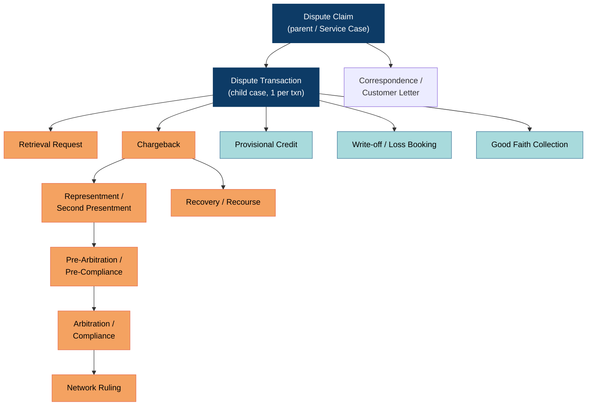

**Key structural insight for decomposition:** Pega models `Dispute Claim` (customer-facing, 1..n transactions) and `Dispute Transaction` (network-facing, exactly 1 transaction) as separate case types. **That split survives into the target architecture as two bounded contexts** — Claim Intake vs Dispute Case Management. It is the single most reusable piece of Pega's domain model.

### 2.3 OOTB stage / step model (`Dispute Transaction` case)

| Stage | OOTB steps | SLA (typical OOTB config) | Where it lands in the target |
|---|---|---|---|
| **Capture** | Collect claim details, select transaction, capture reason, capture cardholder statement | — | Claim Intake BC |
| **Validate** | Duplicate check, eligibility, time-bar check, fraud-block check, card-status check | 1 day | Eligibility & Rules BC |
| **Investigate** | Assign to work queue, request docs, review evidence, fraud referral, merchant contact | 5–10 days | Dispute Case + Evidence BC |
| **Provisional Credit** | Reg E 10-business-day timer, PC posting, PC reversal | 10 business days | Financial Posting + Compliance BC |
| **Network Action** | Determine chargeback right, build chargeback, submit to Mastercom/VROL, attach docs | 2 days | Network Exchange BC |
| **Await Network Response** | Poll/receive representment, second presentment, network decision | 30–45 days | Network Exchange BC |
| **Adjudicate** | Accept / re-present / escalate to pre-arb / arbitration | 5–10 days | Dispute Case BC |
| **Resolve** | Final credit / debit, write-off, recovery booking | 2 days | Financial Posting BC |
| **Close & Notify** | Regulatory letters, customer notification, archive | Reg E 45/90 day cap | Correspondence + Compliance BC |

### 2.4 OOTB data model → aggregate candidates

| Pega class | What it holds | Target aggregate / context |
|---|---|---|
| `PegaCS-Work-Dispute` | Claim header, status, cardholder statement | `Claim` → Claim Intake |
| `PegaCS-Work-Dispute-Txn` | Per-transaction dispute, reason code, network status | `DisputeCase` → Dispute Case Mgmt |
| `PegaFS-Data-Transaction` | Original authorisation/settlement record | `DisputedTransaction` (VO) → Transaction Retrieval |
| `PegaFS-Data-Account` / `-Card` | Account, card, BIN, product | Reference data (upstream, ACL) |
| `PegaCS-Data-Adjustment` | Provisional credit, final credit, reversal | `Adjustment` → Financial Posting |
| `PegaCS-Data-NetworkMessage` | Mastercom/VROL request & response payloads | `NetworkExchange` → Network Exchange |
| `Data-Attachment` / `Link-Attachment` | Evidence, letters, receipts | `EvidenceItem` → Evidence |
| `Rule-Declare-*`, `Rule-Decision-Table` | Reason-code matrices, time bars, chargeback rights | Ruleset → Dispute Rules |
| `Rule-Obj-Flow`, `Assign-Worklist`, `Assign-Workbasket` | Work routing, queues, ticklers | Work Assignment (supporting) |
| `Data-ServiceLevel` / SLA agents | Reg E, network time bars | `Timer` → Compliance & Timers |

### 2.5 Coupling hot-spots in the Pega monolith (the "why" of the rebuild)

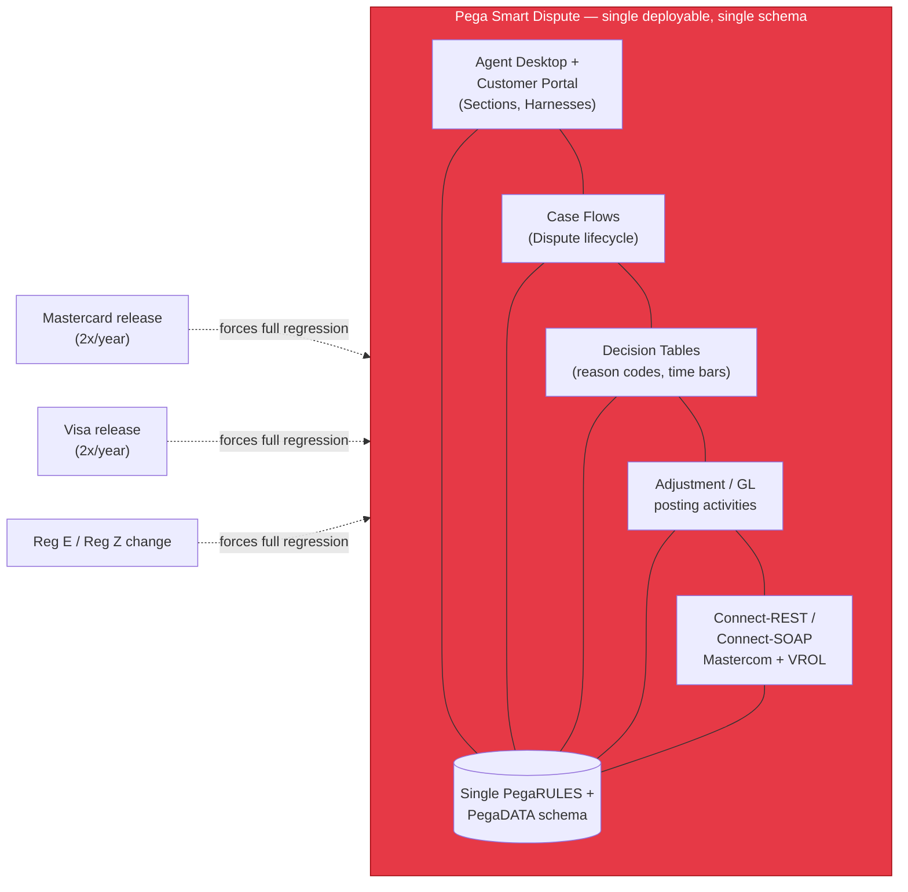

| Hot-spot | Symptom | Target-state remedy |
|---|---|---|
| Rules embedded in flows | Reason-code change → flow change → full app deploy | Externalized, effective-dated ruleset (D8) |
| Single schema | Reporting queries throttle case processing | Database per service + CQRS read model |
| Network connectors inside the case engine | Mastercom outage stalls the whole case engine | Adapter services + circuit breaker + outbox |
| UI tightly bound to case model | Any persona UX change needs a case-type change | BFF per persona (D6) |
| Provisional-credit logic in activities | Money logic untestable in isolation | Financial Posting Service, idempotent commands |
| Agents/tickler for all timers | SLA agent contention at scale | Dedicated timer capability (external scheduler + TTL-expiring journal) |

---

## 3. Domain model — subdomains & bounded contexts

### 3.1 Subdomain classification

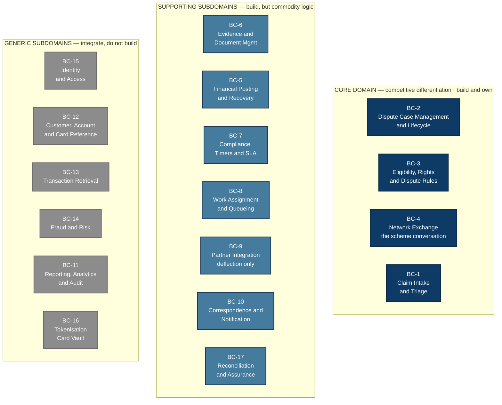

*Colour key: [§0.11](#011-diagram-conventions--the-shared-legend).*

**Reconciliation & Assurance (S7) is new.** It is classified *supporting* rather than *core* because it creates no competitive advantage — but it is **control-critical**: it is the only capability that detects the others failing silently.

### 3.2 Bounded context index

All seventeen contexts, in number order. Every subdomain box above maps to exactly one — there are no unassigned subdomains.

| BC | Name | Class | What it is responsible for | Detail |
|---|---|---|---|---|
| **BC-1** | Claim Intake & Triage | Core | Turns an inbound complaint into an identity-verified, deduplicated `Claim` covering 1..n transactions | [→](#bc-1--claim-intake--triage-core) |
| **BC-2** | Dispute Case Management | Core · **kernel** | The `DisputeCase` aggregate — stage machine, adjudication, saga orchestration. One case per disputed transaction | [→](#bc-2--dispute-case-management-core--the-kernel) |
| **BC-3** | Eligibility, Rights & Dispute Rules | Core | Is there a right, under which reason code, within which time bar, needing which evidence, and what may this case do next | [→](#bc-3--eligibility-rights--dispute-rules-core) |
| **BC-4** | Network Exchange | Core | The conversation with each scheme across four flows — file, poll, fan-out, reconcile-support | [→](#bc-4--network-exchange-core) |
| **BC-5** | Financial Posting & Recovery | Supporting | Provisional credit, final credit, reversal, write-off, recovery, fees, FX — as commands to core banking | [→](#bc-5--financial-posting--recovery-supporting) |
| **BC-6** | Evidence & Document Management | Supporting | Capture, scan, classify, redact and package evidence into scheme-compliant bundles | [→](#bc-6--evidence--document-management-supporting) |
| **BC-7** | Compliance, Timers & SLA | Supporting | Every regulatory and scheme clock, and the evidence of compliance | [→](#bc-7--compliance-timers--sla-supporting) |
| **BC-8** | Work Assignment & Queueing | Supporting | Queues, skills routing, ownership, escalation, quarantine handling | [→](#bc-8--work-assignment--queueing-supporting) |
| **BC-9** | Partner Integration | Supporting · **optional** | An optional deflection and evidence channel. No dispute depends on it | [→](#bc-9--partner-integration-supporting--optional) |
| **BC-10** | Correspondence & Notification | Supporting | Templated notices, including extension notices and advance notice of debit | [→](#bc-10--correspondence--notification-supporting) |
| **BC-11** | Reporting, Analytics & Audit | Generic | Read models and the immutable audit trail, fed by the published language | [→](#bc-1116--generic-contexts--integrate-do-not-build) |
| **BC-12** | Customer, Account & Card Reference | Generic | Read-only projection over core banking and CIF | [→](#bc-1116--generic-contexts--integrate-do-not-build) |
| **BC-13** | Transaction Retrieval | Generic | ACL over the switch and settlement store; produces the canonical `DisputedTransaction` | [→](#bc-1116--generic-contexts--integrate-do-not-build) |
| **BC-14** | Fraud & Risk | Generic | ACL to the fraud platform — score and case linkage, with degraded fallback | [→](#bc-1116--generic-contexts--integrate-do-not-build) |
| **BC-15** | Identity & Access | Generic | Customer IdP, corporate IdP, partner credentials. Conformist | [→](#bc-1116--generic-contexts--integrate-do-not-build) |
| **BC-16** | Tokenisation / Card Vault | Generic | The PCI boundary. **PAN never crosses into our contexts** | [→](#bc-1116--generic-contexts--integrate-do-not-build) |
| **BC-17** | **Reconciliation & Assurance** | Supporting · **control-critical** | Independently proves our view of every open case matches the scheme's. **Never mutates a case** | [→](#9-reconciliation--assurance) |

**Reading the numbering.** BC-1 to BC-10 are core and supporting, BC-11 to BC-16 generic, and **BC-17 was added last** — it is a supporting context that sits numerically after the generic ones. That is discovery order, not classification order. Renumbering would break every cross-reference in this workspace, so the number is kept and the class column carries the meaning.

### 3.3 Bounded context definitions

#### BC-1 · Claim Intake & Triage *(Core)*

| Aspect | Detail |
|---|---|
| **Purpose** | Turn an inbound complaint into a structured, identity-verified, deduplicated `Claim` with 1..n disputable transactions |
| **Aggregate root** | `Claim`, `Complaint` |
| **Entities / VOs** | `DisputedTransactionRef`, `CardholderStatement`, `IntakeChannel`, `TriageOutcome`, `IdentityAssertion` |
| **Ubiquitous language** | *Complaint, Claim, Intake Channel, Cardholder Statement, Identity Resolution, Duplicate Claim, Reassertion, Triage, Withdrawal* |
| **Key invariants** | A claim cannot contain a transaction already under an open dispute; a claim must reference an account the identified customer holds; a cardholder statement is mandatory for fraud reason groups |
| **Owns** | Claim ID generation, intake channel metadata, the dedup index, identity resolution for unauthenticated intake |
| **Does NOT own** | Chargeback rights, money, network state |

> **`Complaint` and `Claim` are different aggregates.** An unauthenticated intake produces a `Complaint` — no verified identity, so no dedup, no transaction resolution, no scheme routing. It becomes a `Claim` only once identity is resolved. Regulatory complaint-handling and dispute-resolution are separate regimes with separate clocks; conflating them starts the wrong one.

#### BC-2 · Dispute Case Management *(Core — the kernel)*

| Aspect | Detail |
|---|---|
| **Purpose** | Own the long-running lifecycle of one dispute against exactly one transaction; the saga orchestrator |
| **Aggregate root** | `DisputeCase` |
| **Entities / VOs** | `CaseStatus`, `LifecycleStage`, `ReasonCode`, `DisputeAmount`, `CaseParty`, `Decision`, `Outcome`, `LiabilitySplit` |
| **Ubiquitous language** | *Dispute Case, Stage, Cycle, Adjudication, Liability Shift, Partial Acceptance, Case Outcome, Withdrawal, Recall, Re-open, Appeal* |
| **Key invariants** | A case is in exactly one stage; transitions follow the scheme-specific state machine; a case cannot advance to a network cycle without an active chargeback right; the amount of any cycle never exceeds the amount of the cycle before it; the sum of chargebacks on one transaction never exceeds the transaction amount |
| **Owns** | Case state machine, timeline, decisions, outcomes, liability allocation |
| **Does NOT own** | Rule content, money postings, network wire format |

**Three capabilities the previous model lacked:**

- **Partial acceptance** — a counterparty may accept part of a claim; the remainder is treated as declined, and the accepted portion needs its own liability decision (write-off or cardholder-liable).
- **Recall and withdraw** — available throughout, whenever we are the initiating party and are awaiting the counterparty.
- **Appeal** — a real stage after arbitration where the disputed amount is at or above the scheme threshold. The stage machine must accept it.

#### BC-3 · Eligibility, Rights & Dispute Rules *(Core)*

| Aspect | Detail |
|---|---|
| **Purpose** | Answer "is there a dispute right, under which reason code, within which time bar, requiring which evidence, and what may this case legally do next?" |
| **Aggregate root** | `RuleSet` (versioned, effective-dated), `EligibilityAssessment` |
| **Entities / VOs** | `ChargebackRight`, `ReasonCode`, `TimeBar`, `EvidenceRequirement`, `SchemeVersion`, `PreCondition`, `PermittedAction` |
| **Ubiquitous language** | *Chargeback Right, Reason Code, Dispute Condition, Time Bar, Dispute Window, Evidence Requirement, Pre-condition, Permitted Action, Workflow Type, Good Faith* |
| **Key invariants** | An assessment is always evaluated against the ruleset version effective at the **transaction date**, never today's; every denial carries a machine-readable reason |
| **Owns** | Reason codes and dispute conditions, workflow classification, time bars, evidence matrices, pre-conditions, permitted-action sets, write-off thresholds |
| **Notable** | This is the context that turns a scheme release note into a **data change** |

> **It also owns `permittedActions`.** The UI never computes what a case may do next — including whether pre-arbitration is skippable, whether good faith is available after a time bar expires, and who the filing party is for this workflow.

#### BC-4 · Network Exchange *(Core)*

| Aspect | Detail |
|---|---|
| **Purpose** | Reliable, ordered, idempotent, auditable conversation with each scheme across four distinct flows |
| **Aggregate root** | `NetworkExchange` — one per message plus its correlated response |
| **Entities / VOs** | `SchemeMessage`, `NetworkCorrelationId`, `TransmissionAttempt`, `SchemeAcknowledgement`, `NetworkRuling`, `InitiatingParty`, `FundPosition` |
| **Ubiquitous language** | *File, Poll, Acknowledge, Cycle, Correlation, Ruling, Fee, Quarantine, Initiating Party, Fund Position* |
| **Key invariants** | Exactly-once semantics per scheme correlation ID; every outbound message is journalled **before** transmission; a scheme acknowledgement is sent **only after** the local commit; no message leaves without a ruleset-derived reason code; raw scheme payloads never cross the context boundary |
| **Detail** | [§8 — the four flows](#8-scheme-integration--the-four-flows) |

**`fundPosition` is new.** The scheme moves the disputed amount between issuer and acquirer as cycles progress, and the rules differ by workflow — in Visa Allocation the funds stay with the issuer, in Collaboration and MDR they return to the acquirer on a decline. Nothing previously tracked where the money sat mid-dispute.

#### BC-5 · Financial Posting & Recovery *(Supporting)*

| Aspect | Detail |
|---|---|
| **Purpose** | Provisional credit, final credit and debit, reversal, write-off, recovery, fee booking, FX — as **commands** to core banking |
| **Aggregate root** | `PostingInstruction` |
| **Entities / VOs** | `ProvisionalCredit`, `FinalCredit`, `Reversal`, `WriteOff`, `NetworkFee`, `RecoveryItem`, `FxAdjustment`, `PostingIdempotencyKey` |
| **Ubiquitous language** | *Provisional Credit, PC Reversal, Final Credit, Write-off, Recovery, Good Faith Collection, Suspense, Loss Booking, FX Revaluation* |
| **Key invariants** | Every posting is idempotent on `(caseId, postingType, cycle)`; a reversal cannot exceed the original; postings are never issued without a case decision event; **a provisional credit cannot be reversed while the investigation is open**, and reversal requires advance notice |
| **Does NOT own** | Ledger balances — core banking is the system of record |

> **FX is in scope.** A cross-currency dispute settles at a different rate from the one it was filed at. Somebody absorbs the difference, and it must be booked deliberately rather than discovered at reconciliation.

#### BC-6 · Evidence & Document Management *(Supporting)*

| Aspect | Detail |
|---|---|
| **Purpose** | Capture, virus-scan, classify, redact and package evidence into scheme-compliant bundles |
| **Aggregate root** | `EvidenceBundle` |
| **Entities / VOs** | `EvidenceItem`, `DocumentClassification`, `RedactionPolicy`, `SchemeDocumentManifest`, `StructuredEvidence` |
| **Key invariants** | Evidence is immutable once bundled and transmitted; PAN and PII redaction runs before any transmission; retention honours the longest of scheme and regulatory clocks |

> **Structured versus document evidence.** Visa's compelling-evidence standard delivers machine-evaluable fields; Mastercard delivers documents. That asymmetry decides where auto-adjudication is viable first.

#### BC-7 · Compliance, Timers & SLA *(Supporting)*

| Aspect | Detail |
|---|---|
| **Purpose** | Own every clock — regulatory, scheme and internal — and the evidence of compliance |
| **Aggregate root** | `RegulatoryTimer`, `ComplianceObligation` |
| **Key invariants** | A timer is deterministic from the event that started it; a breach is recorded permanently even if later remediated; **a scheme response deadline is a hard escalation, not a soft SLA** |

> Under Visa's response certification, failing to respond in time **is** acceptance of liability. A missed timer here is a financial loss, not a missed KPI.

#### BC-8 · Work Assignment & Queueing *(Supporting)*

Aggregate: `WorkItem`. Language: *Queue, Skill, Assignment, Escalation, Ownership, Pull versus Push routing, Quarantine queue*.

#### BC-9 · Partner Integration *(Supporting — optional)*

| Aspect | Detail |
|---|---|
| **Purpose** | An **optional** deflection and evidence channel for acquirers and merchants. No dispute depends on it |
| **Aggregate root** | `PartnerEngagement` |
| **Key invariants** | A partner may only see cases where they are a named party; partner-supplied data is untrusted until validated; **a partner response never overrides a scheme fact** |
| **Pattern** | Open Host Service + Published Language |

> **This is not how acquirers work disputes.** They use their own dispute system against the scheme. This context exists to capture value from pre-dispute deflection — the cheapest possible outcome — not to provide access.

#### BC-10 · Correspondence & Notification *(Supporting)*

Aggregate: `CommunicationRequest`. Language: *Acknowledgement, Provisional Credit Notice, Resolution Letter, Regulatory Notice, Extension Notice, Advance Notice of Debit, Template, Channel Preference*.

> Includes the **advance notice** that must precede a provisional-credit reversal, and the **extension notice** required when an investigation runs past the regulatory limit.

#### BC-17 · Reconciliation & Assurance *(Supporting — control-critical)* — NEW

| Aspect | Detail |
|---|---|
| **Purpose** | Continuously prove that our view of every open case matches the scheme's view, and surface every divergence |
| **Aggregate roots** | `ReconciliationRun`, `Divergence` |
| **Entities / VOs** | `DiscrepancyClass`, `AssuranceWindow`, `RemediationAction`, `CoverageMetric` |
| **Ubiquitous language** | *Reconciliation run, divergence, drift, discrepancy class, remediation, assurance window, coverage* |
| **Key invariants** | **It never mutates a case** — it raises a divergence and a work item; a divergence is recorded permanently even after remediation; it must query the scheme **independently** of the polling path |
| **Detail** | [§9](#9-reconciliation--assurance) |

#### BC-11..16 · Generic contexts — integrate, do not build

| BC | Integrate with | Pattern |
|---|---|---|
| BC-12 Customer / Account / Card Reference | Core banking, CIF | ACL, read-only |
| BC-13 Transaction Retrieval | Payment switch, settlement store | ACL, read-only |
| BC-14 Fraud & Risk | Existing fraud platform | ACL, request-reply with degraded fallback |
| BC-15 Identity & Access | Customer IdP, corporate IdP, partner OAuth2 | Conformist |
| BC-16 Tokenisation / Card Vault | Existing PCI vault | ACL — **PAN never crosses into our contexts** |
| BC-11 Reporting, Analytics & Audit | Analytical store, search index | Published Language via the event backbone |

---

## 4. Context map & integration patterns

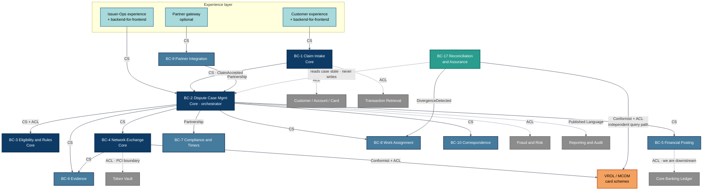

### 4.1 Relationship catalogue

| # | Upstream → Downstream | Pattern | Why this pattern |
|---|---|---|---|
| R1 | Claim Intake → Dispute Case | **Customer/Supplier** | Intake is upstream and must satisfy Case Mgmt's contract; both teams are internal |
| R2 | Dispute Case ↔ Eligibility & Rules | **Customer/Supplier + ACL** | Prevents scheme rule vocabulary leaking into the case model |
| R3 | Dispute Case → Network Exchange | **Customer/Supplier** | Case Mgmt is the client; Network Exchange publishes a stable canonical command interface |
| R4 | **Network Exchange → each scheme** | **Conformist + ACL** | The scheme dictates the model absolutely. The adapter *is* the ACL |
| R5 | Dispute Case ↔ Compliance & Timers | **Partnership** | Neither succeeds without the other; a stage transition without its clock is a compliance failure |
| R6 | Dispute Case → Financial Posting | **Customer/Supplier** | Case decisions drive postings; posting exposes a stable idempotent command API |
| R7 | Financial Posting → Core Banking | **Conformist + ACL** | Core banking will not change its posting API for us |
| R8 | Partner Integration ↔ Dispute Case | **Partnership** | Deflection changes case state and vice versa; **but a partner fact never overrides a scheme fact** |
| R9 | Partner Integration → partners | **Open Host Service + Published Language** | Many partners, one published contract |
| R10 | Claim Intake → Customer/Account/Card | **ACL** | The reference model is legacy and hostile; must not pollute the domain |
| R11 | Claim Intake → Transaction Retrieval | **ACL** | Settlement record formats vary by product |
| R12 | Dispute Case → Fraud & Risk | **ACL** | The fraud platform speaks scores, not disputes |
| R13 | Network Exchange → Token Vault | **ACL, PCI boundary** | PAN is dereferenced only inside the PCI-scoped adapter, at the last possible moment |
| R14 | All contexts → Reporting/Audit | **Published Language** | One canonical event schema, many read models |
| **R15** | **Reconciliation → each scheme** | **Conformist + ACL, independent path** | It must not reuse the polling code, or it inherits the polling bugs |
| **R16** | **Reconciliation → Dispute Case** | **Read-only** | It reads case state and **never writes**. Divergences leave as events, not mutations |
| R17 | Legacy platform during migration ↔ new platform | **ACL, bidirectional** | Coexistence period; neither model should infect the other |

**R15 and R16 are the two that make reconciliation trustworthy.** An independent query path means a poller defect cannot hide itself; read-only access means a reconciler defect cannot corrupt case state.

---

## 5. Scheme resolution — where the routing decision lives

### 5.1 The question, stated precisely

> When a dispute is raised on a card, who decides whether the case is filed under **VISA** (via the VROL platform) or **MASTERCARD** (via the MCOM platform) — the front end, or the backend?

*(Scheme vs platform: see [§0.1](#01-the-three-layers-people-conflate). The decision resolves a **scheme**; routing to a platform is the adapter's job, one layer down.)*

### 5.2 Answer: **the backend. Unambiguously. The front end must never know.**

The FE does not receive a PAN, does not receive a BIN, and does not receive a scheme-routing decision it can act on. It receives a **card reference token** and, at most, a *display-only* network brand for iconography.

### 5.3 The eight reasons (ordered by how much they'd hurt you)

| # | Reason | Consequence of putting it in the FE |
|---|---|---|
| 1 | **PCI-DSS scope** | For the browser/mobile app to derive a network from a BIN, it must hold the first 6–8 digits of the PAN. That pulls the entire web tier, CDN, mobile binary and its build pipeline into PCI scope. Cost: an order of magnitude in audit and control burden. |
| 2 | **BIN tables are volatile and licensed** | Visa and Mastercard BIN/account-range files update **weekly**; ISO 8583 8-digit BIN migration is still shaking out. Shipping that table to a mobile app means users on an old app version route to the wrong network. Backend = one deploy, instant consistency. |
| 3 | **Co-badged and multi-network cards** | A card can be Mastercard + a domestic scheme (Cartes Bancaires, Bancontact, RuPay, Elo, or a US debit network under Reg II). The routing decision depends on *how the transaction was actually routed at authorisation* — data the FE has never seen. Only the backend, holding the settlement record, can decide. |
| 4 | **Routing depends on transaction data, not just the card** | The correct scheme for a dispute is determined by the **network the original transaction settled on** (from the settlement/clearing record), not by the card's headline brand. Debit transactions especially. The FE has no access to this. |
| 5 | **Multi-channel consistency** | Disputes arrive from web, iOS, Android, IVR, contact-centre desktop, branch, and API partners. FE-side routing = the same rule implemented seven times, drifting immediately. |
| 6 | **Tamperability** | A client-supplied routing hint is attacker-controlled input. An attacker forcing a Visa-branded case onto the Mastercard rail creates rejected filings, time-bar expiry, and real financial loss. |
| 7 | **Auditability** | Regulators and scheme compliance audits ask "why was this case filed under condition 13.1 on VROL?" The answer must come from a server-side, versioned, logged decision — not from a JS bundle. |
| 8 | **Future networks** | Adding Amex/Discover/JCB/domestic schemes must be a backend ruleset change, not a coordinated app-store release. |

### 5.4 Where the decision *does* live: the Scheme Resolution Service

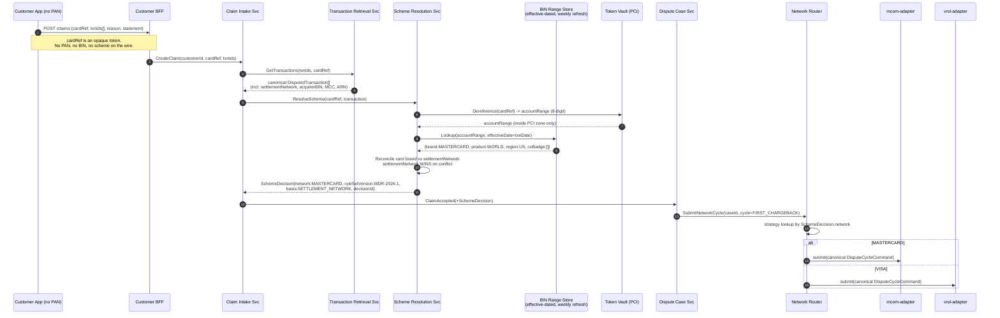

### 5.5 The resolution algorithm (precedence order)

```
resolveScheme(cardRef, transaction, asOfDate):
  1. If transaction.settlementNetwork is present and recognised
        -> network = settlementNetwork            [HIGHEST PRECEDENCE]
           basis   = SETTLEMENT_NETWORK
  2. Else if transaction.arn / acquirerReferenceNumber encodes a scheme
        -> network = decodeFromARN(arn)
           basis   = ARN_DERIVED
  3. Else dereference cardRef -> accountRange (8-digit, PCI zone)
        binRecord = binStore.lookup(accountRange, effectiveOn = transaction.date)
        3a. If binRecord.coBadge is empty
              -> network = binRecord.brand;  basis = BIN_TABLE
        3b. If co-badged
              -> apply CoBadgeRoutingPolicy(issuerCountry, MCC, POS entry mode,
                                            domestic-scheme regulation)
              -> if still ambiguous: network = UNRESOLVED
  4. If network == UNRESOLVED
        -> raise ManualSchemeReviewRequired -> Work Assignment queue
           (never guess: a wrong filing burns the time bar)
  5. Emit SchemeResolved event with {network, basis, decisionId, ruleSetVersion,
     binFileVersion, resolvedAt} -> immutable audit
```

**Design notes**

- `basis` is persisted on the case. In an audit, "why VROL?" is answered by a single field plus the BIN file version.
- The BIN store is keyed by **effective date**, so a dispute raised in 2027 on a 2026 transaction resolves against the 2026 account-range file. This mirrors the effective-dated ruleset principle in BC-3.
- `UNRESOLVED` routes to a human. Silent fallback to a default network is the single most expensive bug this design prevents.

### 5.6 What the front end legitimately does

| FE responsibility | FE explicitly NOT responsible for |
|---|---|
| Collect reason, statement, evidence, contact preference | Deriving the network |
| Render a scheme logo from a `displayBrand` field the BFF returns | Holding a BIN table |
| Show reason-code options **fetched from the BFF** (which got them from BC-3, already scheme-filtered) | Knowing which reason codes belong to which scheme |
| Show deadlines the BFF returns | Computing time bars |
| Progressive disclosure of dynamic evidence questions driven by a server-returned form schema | Knowing scheme evidence requirements |

**Corollary for the UI decomposition:** because reason codes, evidence questions, and deadlines all arrive as *server-driven schemas*, the Pega monolith's hard-coded sections can be replaced by a **dynamic form renderer**. This is what lets one Customer app serve both Mastercard and Visa without any scheme branching in the client.

### 5.7 Network Router — the strategy/adapter pattern

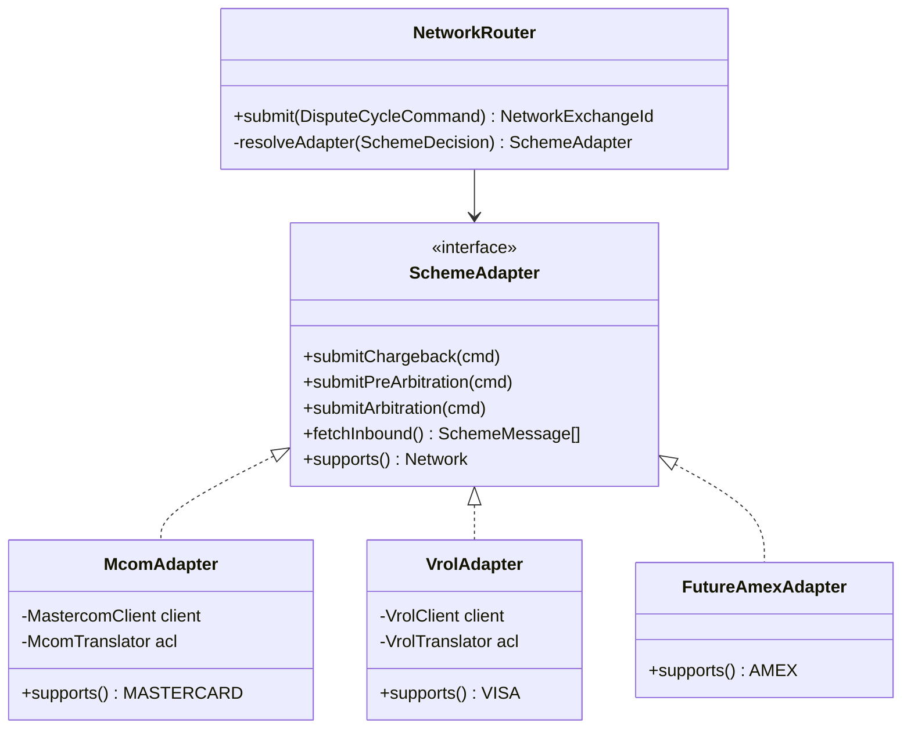

Adding Visa after Mastercard is then: deploy `vrol-adapter`, load the Visa ruleset into BC-3, enable the Visa account ranges in the BIN store. **Zero changes to Claim Intake, Dispute Case, the BFFs, or any client app.**

---

## 6. Capability catalog

**Capabilities, not products.** Each row states *what must be true*, its consistency boundary, and the store **class** it needs. [Part 12](#12-technology-realisation) maps store classes to concrete products.

**Store classes** — `TX` transactional, ACID, supports an outbox in the same transaction · `JRN` append-only journal, high write volume, WORM-capable · `KV` key-value with TTL and conditional writes · `OBJ` object storage with immutability locks · `IDX` search / analytical read model · `NONE` stateless.

### 6.1 Experience capabilities

| # | Capability | BC | Responsibility | Store |
|---|---|---|---|---|
| 1 | Customer dispute experience | Exp | Self-service intake, status, evidence upload, deadline display. Serves both authenticated and unauthenticated intake | `KV` session |
| 2 | Issuer operations workspace | Exp | Case investigation, adjudication, queue management, quarantine handling | `KV` session |
| 3 | Partner gateway *(optional)* | BC-9 | The only externally reachable surface for acquirers and merchants — deflection and evidence only | `KV` rate + idempotency |

### 6.2 Core domain capabilities

| # | Capability | BC | Responsibility | Store | Key interface |
|---|---|---|---|---|---|
| 4 | **Claim intake** | BC-1 | Identity resolution, dedup, entitlement, complaint-to-claim promotion | `TX` | `POST /claims`, `POST /complaints` |
| 5 | **Dispute case management** | BC-2 | The case aggregate, stage machine, saga orchestration, adjudication, partial acceptance, recall, appeal | `TX` + orchestration | `POST /cases/{id}/decisions` |
| 6 | **Eligibility & rules** | BC-3 | Effective-dated rulesets; rights, reason codes, time bars, pre-conditions, permitted actions, write-off thresholds | `TX` + decision engine | `POST /assessments`, `GET /permitted-actions` |
| 7 | **Scheme resolution** | BC-4 | The BIN-to-scheme decision, effective-dated by transaction date | `KV` | `POST /scheme:resolve` |
| 8 | **Network routing** | BC-4 | Outbox, per-case ordering, strategy dispatch to the right adapter | `TX` outbox | `POST /network/cycles` |
| 9 | **Scheme adapter — one per scheme** | BC-4 | Filer, Poller, Journal, ACL. See [§8](#8-scheme-integration--the-four-flows) | `JRN` + `OBJ` | internal only |
| 10 | **Reconciliation & assurance** | BC-17 | Independent state comparison, divergence detection, coverage reporting | `TX` + `IDX` | `GET /divergences` |

### 6.3 Supporting capabilities

| # | Capability | BC | Responsibility | Store |
|---|---|---|---|---|
| 11 | Evidence management | BC-6 | Upload, scan, classify, redact, bundle, retain | `OBJ` + `TX` metadata |
| 12 | Financial posting | BC-5 | Idempotent posting commands, recovery, write-off, fee booking, **FX adjustment** | `TX` |
| 13 | Compliance & timers | BC-7 | Every regulatory and scheme clock; breach detection; hard escalation on scheme deadlines | `KV` + scheduler |
| 14 | Work assignment | BC-8 | Queues, skills routing, ownership, escalation, **quarantine queue** | `TX` |
| 15 | Correspondence | BC-10 | Templated notices, **extension notice**, **advance notice of debit** | `TX` + delivery |
| 16 | Partner notification *(optional)* | BC-9 | Webhook delivery with retry, DLQ and signature | `KV` |

### 6.4 Integration and cross-cutting capabilities

| # | Capability | BC | Responsibility | Store |
|---|---|---|---|---|
| 17 | Transaction retrieval | BC-13 | ACL over switch and settlement; canonical `DisputedTransaction` | `TX` + cache |
| 18 | Party reference | BC-12 | ACL over CIF for customer, account, card, entitlement | `TX` projection |
| 19 | Fraud gateway | BC-14 | ACL to the fraud platform; score and case linkage | `NONE` |
| 20 | Audit | X | Append-only, tamper-evident case audit trail | `OBJ` immutable |
| 21 | Reporting projections | X | CQRS read models — inventory, aging, scheme SLA, loss, **fund position** | `IDX` |
| 22 | Legacy bridge *(migration only)* | X | Bidirectional ACL to the incumbent platform during coexistence | `TX` correlation |

### 6.5 Granularity rationale

| Grouping decision | Why not finer | Why not coarser |
|---|---|---|
| One dispute case capability, not one per stage | Stage-transition invariants must be enforced transactionally in one place | It would become a distributed state machine with no consistency boundary |
| One adapter per scheme | Release, certification and outage domains are independent | A single network capability couples the two release trains |
| Filer and Poller inside one adapter | They share the scheme contract, the credentials and the certification | They have different SLAs and runbooks — hence separate **components**, not separate deployables |
| Scheme resolution separate from adapters | Needs the PCI vault boundary and a weekly-refreshed range store | Embedding it duplicates the decision and breaks auditability |
| Rules separate from case | Rules change on the scheme's schedule; the case engine on ours | Embedding them reproduces the flow/rule entanglement being escaped |
| **Reconciliation separate from adapters** | **It must not share the poller's assumptions** | — |
| Timers separate | They must fire when the case capability is degraded | — |
| Financial posting separate | Different compliance controls — segregation of duties, four-eyes, reconciliation | — |

### 6.6 Canonical domain events — the published language

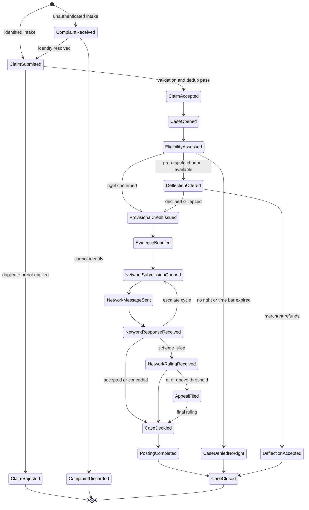

Every event carries a standard envelope: `eventId`, `eventType`, `eventVersion`, `occurredAt`, `correlationId`, `causationId`, `tenant`, `subject`, `scheme`, `payload`, `dataClassification`.

> **`dataClassification: CONFIDENTIAL_NO_PAN` is enforced by the schema registry: no event schema may contain a PAN field.** This keeps the entire event backbone out of PCI scope.

**Three event families are new:** `ComplaintReceived` / `ComplaintDiscarded` (unauthenticated intake), `DeflectionOffered` / `DeflectionAccepted` (pre-dispute), and `AppealFiled` (post-arbitration).

---

## 7. C4 model — L1 / L2 / L3

### 7.1 Level 1 — System context

> **Presentation master:** [`source/C4_L1_SystemContext_DisputePlatform.drawio`](../source/C4_L1_SystemContext_DisputePlatform.drawio) · rendered at [`diagrams/C4_L1_SystemContext_DisputePlatform.svg`](../diagrams/C4_L1_SystemContext_DisputePlatform.svg). The Mermaid below is the inline approximation — it cannot hold fixed bands or connection points.

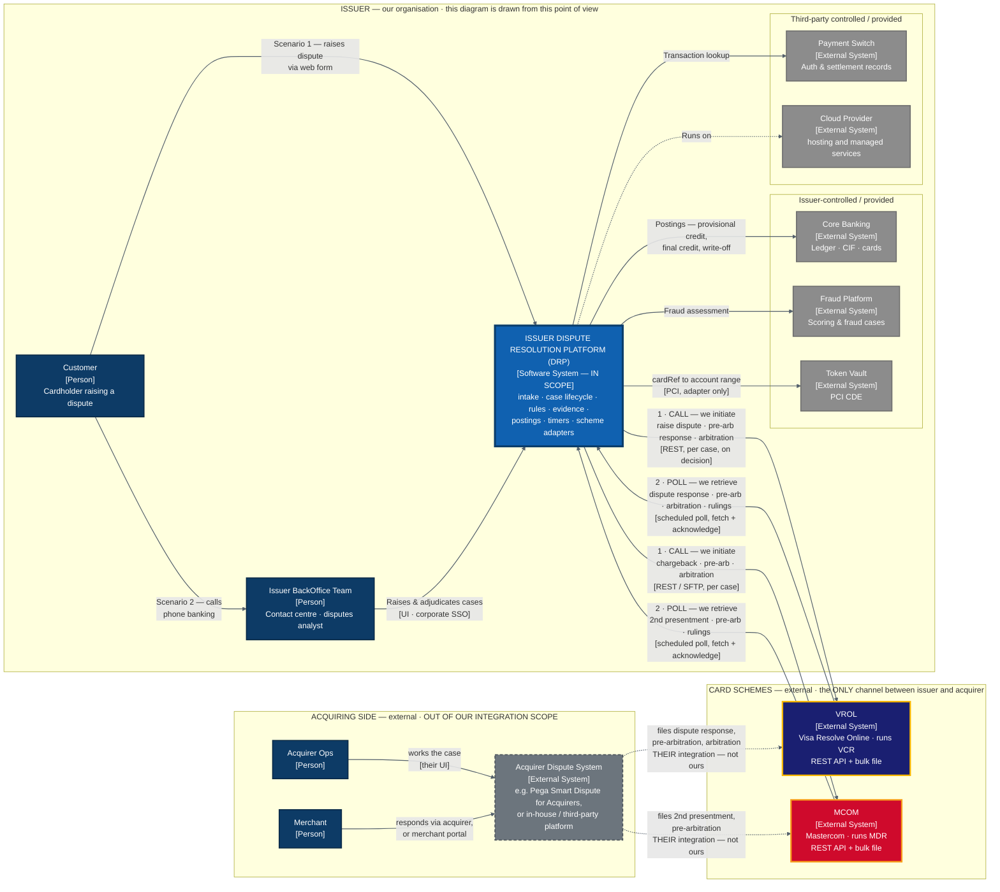

*Colour and line-style key: [§0.11](#011-diagram-conventions--the-shared-legend).*

#### 7.1.1 The two integration patterns to each scheme

| | **1 · CALL** — we initiate | **2 · POLL** — we retrieve |
|---|---|---|
| Trigger | A case decision | A schedule |
| Shape | Synchronous, **per case** | Batch fetch of our pending queue, then **acknowledge** |
| Carries | Dispute · pre-arbitration · arbitration · appeal · evidence | Responses · pre-arbitration · rulings · fees |
| Reliability | Outbox, per-case ordering, idempotency, journal before transmit | Persist raw **before** queueing; acknowledge **only after** commit |
| Whose clock | **Ours** — the time bar is ours to burn | Theirs — 30–45 day windows |

Full detail in [§8](#8-scheme-integration--the-four-flows).

#### 7.1.2 The four things this diagram asserts

1. **The scheme is the only channel between issuer and acquirer.** Every inbound fact arrives because we asked a scheme for it.
2. **The acquirer runs its own dispute system** — a vendor product, an in-house build, or a third party. Its integration to the schemes is real but **out of our scope**: we neither build nor operate it.
3. **We rely entirely on the scheme APIs.** No contract with the acquirer, no SLA over their system, no visibility into how they work.
4. **Two intake scenarios, one platform** — self-service and assisted. They converge after intake.

### 7.2 Level 2 — Containers

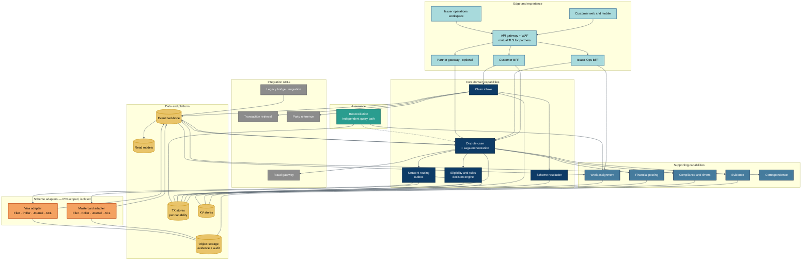

**Note the adapters and reconciliation reach the scheme independently.** That separation is D12; drawing them as one path would be drawing the bug.

### 7.3 Level 3 — Inside a scheme adapter

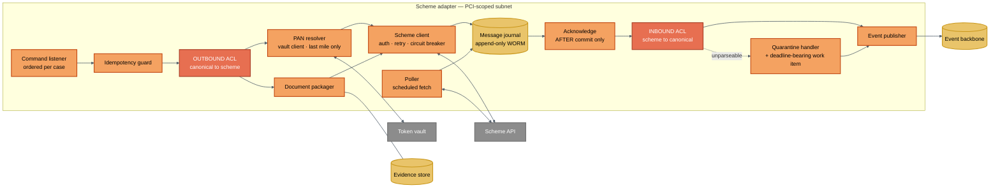

**Two ACL components, because the corruption risk is bidirectional.** Scheme nouns, fee structures and cycle names must not travel inward; our internal stage names must not leak outward into filings.

**The `JRN → ACK` edge is D11 drawn as a dependency.** The acknowledgement is physically downstream of the journal write — it cannot happen first.

---

## 8. Scheme integration — the four flows

**This is the part of the architecture that determines whether the platform is trustworthy.** Everything else can be rebuilt from the case store; a scheme message lost here is gone permanently, and the deadline attached to it expires silently.

"Integrating with the scheme" is not one thing. It is four flows with different triggers, different failure modes and different runbooks.

| | **1 · FILE** | **2 · POLL** | **3 · FAN-OUT** | **4 · RECONCILE** |
|---|---|---|---|---|
| **Trigger** | A case decision | A schedule | A poll result | A schedule |
| **Direction** | Outbound, synchronous | Inbound, batch | Internal | Outbound query |
| **Granularity** | One case | Many cases | One case | One case |
| **Whose clock** | **Ours** — the time bar is ours to burn | Theirs — 30–45 day windows | Ours | Ours |
| **Worst failure** | Double filing, or a burnt time bar | **Silent permanent message loss** | A poison record blocking good work | *(this flow is the detector)* |
| **Owner** | BC-4 routing + adapter Filer | BC-4 adapter Poller | BC-4 adapter ACL + BC-2 | **BC-17** |

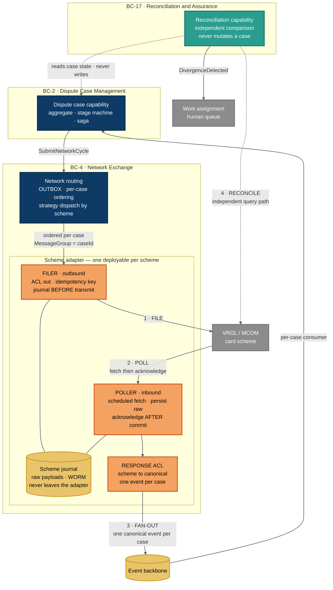

### 8.1 The adapter's internal structure

One deployable per scheme, four named components. They share the scheme contract, credentials and certification — so they ship together — but they have different SLAs, so they are named, monitored and paged separately.

| Component | Responsibility | Fails when |
|---|---|---|
| **Filer** | Canonical → scheme translation, PAN dereference at the last moment, idempotency guard, journal before transmit, circuit breaker | The scheme is down, or a filing is rejected |
| **Poller** | Scheduled fetch of our institution's pending queue, persist raw, acknowledge after commit | The scheme is down, or — worse — we acknowledge and then crash |
| **Journal** | Append-only WORM record of every raw payload in both directions | Storage failure. This is the evidence store; it is never truncated |
| **Response ACL** | Scheme → canonical translation, one event per case | The scheme changes its schema without notice |

> **D13 in practice: the journal sits inside the adapter.** A shared raw-message store across adapters would put Mastercom vocabulary outside the anti-corruption layer, which is precisely the coupling D4 exists to prevent. Raw goes in; canonical comes out.

### 8.2 Flow 1 · FILE — we initiate

Triggered by a case decision: raise the dispute, respond to a pre-arbitration, escalate to arbitration, file an appeal.

```
case decision
  → write command + outbox row in ONE transaction
  → outbox relay publishes to an ordered per-case queue
  → Filer: idempotency check on (caseId, cycle, messageType)
  → journal the outbound payload BEFORE transmitting
  → transmit, with circuit breaker and rate limit
  → journal the acknowledgement, publish NetworkMessageSent
```

**Required properties**

| Property | Why |
|---|---|
| **Outbox in the same transaction as the decision** | A decision that commits without its command is a case that silently stops |
| **Ordered per case** | Cycle 2 must not overtake cycle 1. Ordering *across* cases is irrelevant |
| **Idempotent on `(caseId, cycle, messageType)`** | A retry after a socket timeout must not file twice. A duplicate filing consumes a cycle the scheme will reject |
| **Journal before transmit** | If the response is lost, we still know what we sent |
| **Time-bar-aware dead-lettering** | A failed submission is not just an ops incident — it burns a regulatory clock. If the remaining time bar is below threshold, escalate to a human immediately rather than exhausting the retry budget |

### 8.3 Flow 2 · POLL — we retrieve

The highest-risk flow in the platform. Scheme queues are **acknowledge-based**: unacknowledged items redeliver, acknowledged items are gone.

```
scheduled trigger
  → fetch our institution's pending queue items
  → persist each raw item, one row per case         ← D11 step 1
  → COMMIT                                           ← D11 step 2
  → acknowledge to the scheme                        ← D11 step 3
  → fan out (flow 3)
```

> **The ordering of steps 2 and 3 is the single most consequential line in this document.** Acknowledge before the commit and a crash discards the scheme's message permanently — no local copy, and no way to request it again. Under Visa's response certification, a missed response deadline **is** acceptance of liability.

| Property | Why |
|---|---|
| **Persist raw, one row per case** | The grain is the message, not the poll. A batch-grained row cannot carry a correlation ID, a message type or a per-case status |
| **Acknowledge only after commit** | See above |
| **Unique index on the scheme correlation ID** | The scheme queue is at-least-once by design. You *will* see the same case twice |
| **Poll frequency derived from the tightest active time bar** | "Batch" is not a frequency. A daily cycle burns a day per hop; across four cycles that is meaningful against a 30-day window |
| **Both transports supported** | Schemes offer synchronous APIs *and* bulk file. Case state suits the API; evidence documents suit the file transport |

### 8.4 Flow 3 · FAN-OUT — one case, one message, one retry unit

```
persisted rows
  → one lightweight message per case (a reference, not the payload)
  → independent consumer per message
  → advance the case
```

**Never batch multiple cases into one message.** The retry unit must equal the failure unit:

| | One message per case | A batch in one message |
|---|---|---|
| Case 47 fails | Only case 47 retries | **All 100 reprocess** |
| The 46 already processed | Untouched | Reprocessed on every retry |
| Diagnostics | "case 47 broken" | "1 broken item" — which one? |
| Parallelism | Across partitions | Serial |
| Time bars | One case blocked | **100 deadlines blocked** |

**Quarantine, for records that cannot be processed at all:**

| Rule | Detail |
|---|---|
| Use a **quarantine status of our own**, never a scheme reason code | Two vocabularies must not mix |
| Persist the raw payload regardless | It is the evidence, parseable or not |
| **Acknowledge to the scheme anyway** | Otherwise it redelivers and fails identically, forever |
| **Raise a work item carrying the original deadline** | A quarantined case still has a running time bar. This is the step that costs money if skipped |

> **Distinguish one bad record from a scheme release.** One case failing is a data problem. *Many cases failing the same way* is a schema change — an engineering incident, not a hundred independent data errors. The quarantine handler must alert differently for the two.

### 8.5 Flow 4 · RECONCILE

Covered in [§9](#9-reconciliation--assurance). In summary: it queries the scheme **through a different path** than the poller, compares against case state, and raises divergences without ever mutating a case.

### 8.6 What each scheme requires that the other does not

| Concern | Visa | Mastercard |
|---|---|---|
| Workflow split | **Allocation vs Collaboration** — determines who files pre-arbitration | None |
| Filing party at pre-arbitration | **Acquirer** in Allocation, issuer in Collaboration | Issuer, always |
| Skipped stage | Allocation has **no** response stage — `FIRST → PRE_ARB` is valid | Every cycle present |
| Filing party at pre-arbitration | **Acquirer** in Allocation · **Issuer** in Collaboration — confirmed by arrow direction in both Visa figures | Issuer, always |
| Pre-arbitration mandatory? | Yes, both workflows | Generally, but **optional** for some categories |
| Structured evidence | Compelling-evidence fields, machine-evaluable | Documents only |
| Amount rules | No published amount ladder | **Non-increasing chain enforced at every cycle** |
| Fund position as cycles progress | **Allocation:** never moves before the ruling · **Collaboration:** follows the last filing — acquirer on the response, issuer again on pre-arbitration | Issuer on chargeback, acquirer on second presentment |
| Missing a deadline means | **Acceptance of liability** | Loss of the cycle |

Every one of these is absorbed by the adapter. None reaches BC-2.

---

## 9. Reconciliation & assurance

### 9.1 Why this is a bounded context and not a feature

Flows 1 to 3 can all fail **silently**. A filing that never landed, a message acknowledged and lost, a quarantined record nobody worked, a schema change that turned twenty fields into nulls — none of these raise an error at the time. They surface weeks later as an expired time bar and an unrecoverable loss.

**Reconciliation is the only capability whose job is to distrust the others.** That is why it is a separate context:

| Property | Consequence |
|---|---|
| It must query the scheme **through a different code path** than the poller | A reconciler sharing the poller's client, mapping and assumptions cannot detect the poller's bugs — it would agree with them |
| It has a **different ubiquitous language** — divergence, drift, coverage, assurance window | These words mean nothing to a case handler |
| It has **different consumers** — operations, risk, audit | Not the person working the case |
| It has a **different release cadence** | It changes when controls change, not when the domain changes |
| It **must not fix anything** | See §9.4 |

### 9.2 The model

| Aggregate | Holds |
|---|---|
| **`ReconciliationRun`** | Scope, window, start and end, cases examined, divergences found, coverage achieved. Immutable once complete |
| **`Divergence`** | The case, the discrepancy class, our state, the scheme's state, when detected, remediation status. **Permanent** — retained after remediation |

### 9.3 Discrepancy classes

Each class has a distinct root cause and a distinct runbook. Classifying at detection is what makes the output actionable rather than a list of anomalies.

| Class | Meaning | Usual root cause |
|---|---|---|
| **MISSING_INBOUND** | The scheme has an event we never recorded | The acknowledge-before-commit window (§8.3), or a scheme-side drop |
| **MISSING_OUTBOUND** | We believe we filed; the scheme has no record | Lost filing, or a silently rejected submission |
| **STATE_DRIFT** | Both sides know the case; the stage or cycle disagrees | A missed event, or an out-of-order transition |
| **AMOUNT_DRIFT** | The disputed or ruled amount disagrees | Partial acceptance mishandled, or FX applied differently |
| **DEADLINE_DRIFT** | The response deadline disagrees | Ruleset version mismatch, or a scheme release |
| **FUND_POSITION_DRIFT** | We disagree on who holds the disputed funds | Workflow misclassification — Allocation treated as Collaboration |
| **ORPHANED** | The scheme has a case we cannot correlate at all | Correlation ID lost or never persisted |
| **SCHEMA_UNRECOGNISED** | The scheme sent a field or enum we do not understand | **A scheme release.** Many at once means an incident, not a data problem |

### 9.4 The invariant that makes it trustworthy

> **Reconciliation never mutates a case.** It emits `DivergenceDetected` and raises a work item.

This is deliberate and worth defending. An auto-healing reconciler that quietly re-applies missing events would:

- **hide the defect** that caused the divergence, so it recurs forever
- **mask a control failure** that an auditor is entitled to see
- risk **compounding** the error if its own view is the wrong one
- destroy its value as evidence — a control that fixes things cannot also attest to them

The correct behaviour is to make the divergence loud, attributable and permanent. Remediation is a **human decision recorded against the divergence**, not a side effect.

### 9.5 Coverage — the metric that matters

A reconciliation capability that runs but examines the wrong cases is worse than none, because it manufactures false confidence.

| Metric | Target |
|---|---|
| **Coverage** — open cases reconciled within the assurance window | 100% of cases with an active time bar |
| **Detection lag** — divergence occurrence to detection | Materially shorter than the shortest active deadline |
| **Divergence rate by class** | Trended. A step change in `SCHEMA_UNRECOGNISED` is a scheme release |
| **Remediation lag** | Detection to human resolution |
| **False-positive rate** | High values mean the comparison logic is wrong and will be ignored |

**Prioritise by deadline, not by age.** A case with three days of time bar left matters more than one filed three months ago with ninety days remaining.

### 9.6 What it needs from the schemes

Single-case retrieval by scheme case ID — the state query, not the queue fetch. This is the endpoint that gives an independent view, and it is a **different endpoint from the one the poller uses**. If a scheme offers only queue-based retrieval, reconciliation degrades to comparing our journal against our case store, which detects flow-3 failures but not flow-2 losses.

> **Open question for the scheme licences:** confirm both schemes expose single-case state retrieval, and that it is not rate-limited below what full coverage of open cases requires.

---

## 10. Personas, journeys & partner access

### 10.1 Who actually uses this platform

| Persona | Uses this platform? | How they participate in a dispute |
|---|---|---|
| **Cardholder** | **Yes** — self-service, authenticated or unauthenticated | Raises the claim, supplies evidence, receives outcomes |
| **Issuer BackOffice Team** | **Yes** — corporate SSO | Raises on behalf, investigates, adjudicates, works quarantine and divergence queues |
| **Acquirer** | **No** | Through **their own dispute system**, against the scheme. Optionally reaches us via the partner gateway for deflection |
| **Merchant** | **No** | Through their acquirer, or a scheme portal if they hold direct access. Optionally via the partner gateway |

**Two access questions, routinely confused:**

| Question | Answer |
|---|---|
| How does an acquirer *participate in a dispute*? | Through the scheme. That is the system of record for the filing, and it works whether or not we exist |
| How does an acquirer *reach our platform*? | Only through the partner gateway — and only if they choose to. It is optional |

### 10.2 Access matrix

| | Claim Intake | Dispute Case | Rules | Network Exchange | Evidence | Financial Posting | Work Assignment | Timers | Reconciliation |
|---|---|---|---|---|---|---|---|---|---|
| **Cardholder** | Create, read own | Read own, simplified | Read filtered options | ✗ | Create, read own | Read credit status | ✗ | Read deadlines | ✗ |
| **Issuer BackOffice** | Read all | Full, RBAC-gated | Read + propose change | Read + trigger | Full | Request, four-eyes above threshold | Full | Read | Read + remediate |
| **Acquirer** *(optional gateway)* | ✗ | Scoped projection only | Reference only | ✗ | Create + read own | ✗ | ✗ | Read own deadline | ✗ |
| **Merchant** *(optional gateway)* | ✗ | Scoped projection, own MID | Reference only | ✗ | Create + read own | ✗ | ✗ | Read own deadline | ✗ |

**Design principle for the partner view:** it is a **projection**, not the case aggregate. The partner gateway never returns the internal case model — it returns a deliberately narrower published language with its own vocabulary, which stays stable when internal stages change.

### 10.3 Journey 1 — Customer raises a dispute (happy path, Mastercard e-commerce fraud)

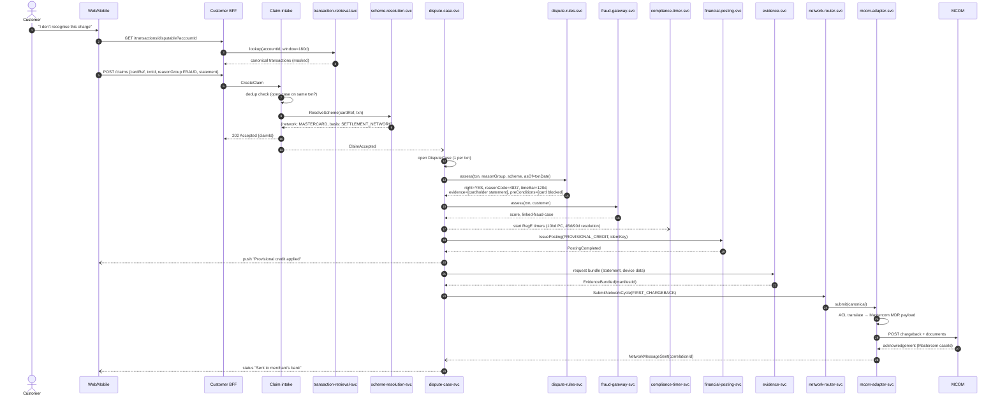

### 10.4 Journey 2 — Acquirer / Merchant respond via PAI (second presentment)

The journey that makes the partner boundary concrete: *acquirer and merchant never get a UI in our platform*. **Path A is how this normally happens** — the acquirer works the case in the scheme's own portal and the scheme relays it to us. **Path B is the optional PAI channel** that can pre-empt Path A.

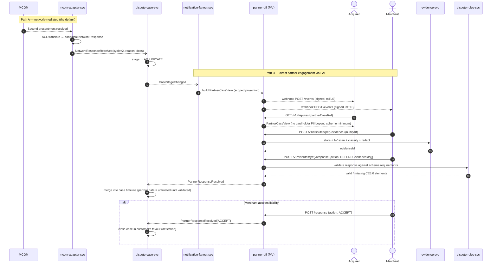

**Two paths, one case.** Path A is authoritative (the scheme is the system of record for the filing). Path B is *pre-emptive* — it lets a merchant accept or defend before the network cycle is consumed, which is how deflection programmes (RDR/CDRN-style, Order Insight, Consumer Clarity) reduce chargeback volume. `dispute-case-svc` reconciles the two: **a Path B response never overrides a Path A network fact**; it can only pre-empt an unsent cycle or supply evidence.

### 10.5 Journey 3 — Issuer analyst adjudicates

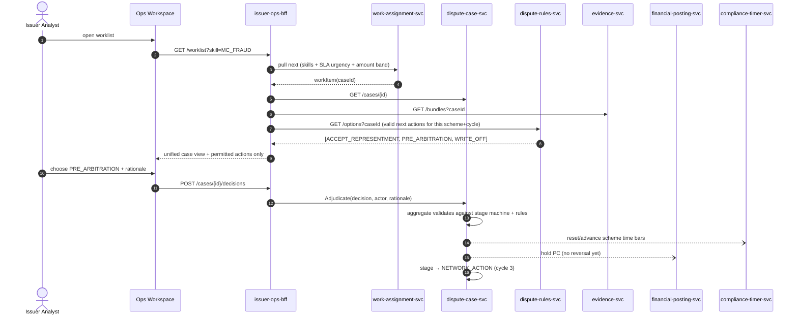

Note the pattern: **the UI never computes permitted actions.** `dispute-rules-svc` returns them. That is what allows the same workspace to handle Mastercard and Visa cases side by side with zero scheme branching in the front end — the same principle as D1.

## 11. Cross-cutting concerns & NFRs

### 11.1 PCI-DSS scope containment

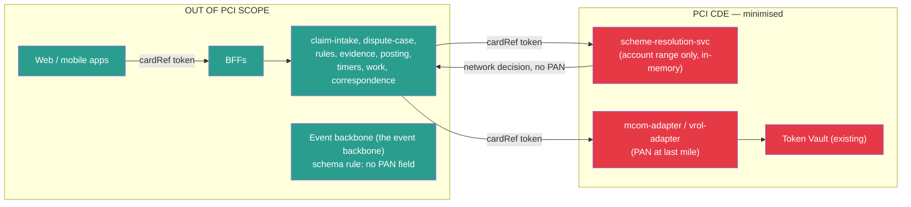

Three services in scope instead of an entire platform. This is the single largest operational-cost saving versus the Pega monolith, where the case engine, its database and its UI all sit inside the CDE.

### 11.2 NFR targets

| NFR | Target | How it is met |
|---|---|---|
| Claim submission latency (p95) | < 800 ms to `202 Accepted` | Async enrichment; intake commits only the claim |
| Case query (p95) | < 300 ms | CQRS read model in the search index |
| Throughput | 50k claims/day sustained, 5x seasonal peak | HPA on the container platform; the queue buffering |
| Network submission SLA | 99.5% submitted within 1 business day of decision | Outbox + time-bar-aware DLQ |
| Availability — intake & case | 99.95% | Multi-AZ, no single-AZ dependency |
| Availability — adapters | 99.5% (bounded by scheme uptime) | Outbox absorbs scheme outages |
| Durability of network journal | 11 nines, WORM | write-once object storage |
| Auditability | Every state change attributable to actor + rule version + input | Append-only `case_event` + hash-chained audit |
| Reg E compliance | 100% of PC deadlines met or breach-logged | Dedicated timer service with independent availability |
| RTO / RPO | 1 h / 5 min (core); 0 for journal | Warm standby + Global Tables |

### 11.3 Security controls

| Layer | Control |
|---|---|
| Edge | WAF (OWASP + bot), Shield Advanced, per-partner rate limits |
| Partner auth | mTLS + OAuth2 client-credentials, short-lived tokens, IP allowlist, request signing |
| Customer auth | OIDC + step-up MFA for claim submit and evidence upload |
| Internal | mTLS service mesh (Istio/App Mesh), SPIFFE identities, deny-by-default NetworkPolicy |
| Data | KMS CMK per classification, field-level encryption for PII, tokenized PAN only |
| Authorization | OPA sidecar; partner scoping enforced as a policy, not application code |
| Evidence | AV scan + Macie PII detection + mandatory redaction before network transmission |
| Segregation of duties | Four-eyes on postings above threshold; analyst cannot adjudicate own-account cases |
| Audit | Immutable, hash-chained, exportable to the regulator |

### 11.4 Data consistency model

| Boundary | Consistency | Mechanism |
|---|---|---|
| Within `DisputeCase` aggregate | Strong | Single-row optimistic locking in the transactional store |
| Case ↔ Postings | Eventual, compensating | Saga with `ReversePosting` compensation |
| Case ↔ Network | Eventual, **non-compensable** | Once filed, a chargeback cannot be un-filed — the saga must therefore *pre-validate*, never roll back. All validation (rights, evidence, time bar) happens **before** `NetworkSubmissionQueued`. |
| Case ↔ Read models | Eventual (< 2 s) | the event backbone → projection |
| Case ↔ Partner view | Eventual (< 5 s) | Webhook fan-out |

The non-compensable network boundary is the most important consistency constraint in the whole design and is why D2 chose orchestration: the saga must be able to *refuse to advance*, with full state visibility, rather than discover a problem after emission.

---

## 12. Technology realisation

> **This is the only section that names products.** Everything in Parts 0–11 is expressed as capabilities and qualities. If your platform standards differ, replace this section — the architecture does not change.

### 12.1 How to read this

Each row states the **capability requirement** first. The product column is *one* realisation that satisfies it. The alternatives column exists to make the point that the requirement, not the product, is the architectural decision.

### 12.2 Store classes

| Class | Requirement | One realisation | Alternatives |
|---|---|---|---|
| **TX** | ACID, relational, supports an outbox row committed in the same transaction as the business write | Managed PostgreSQL | Any managed RDBMS; self-hosted PostgreSQL |
| **JRN** | Append-only, high write volume, immutable retention, cheap at scale | Managed PostgreSQL partitioned by month + object storage for payloads | Wide-column store; log-structured store |
| **KV** | Key-value, TTL expiry, conditional writes for idempotency | Managed key-value store | Redis with persistence; any KV with CAS |
| **OBJ** | Object storage with write-once retention locks and server-side encryption | Managed object storage with object lock | Any WORM-capable store |
| **IDX** | Search and analytical read models, rebuildable from events | Managed search + columnar warehouse | Any query engine — read models are disposable |

### 12.3 Platform capabilities

| Requirement | One realisation | Why it matters architecturally |
|---|---|---|
| **Ordered, durable queue keyed per case** | FIFO queue with message-group ordering | Cycle ordering per case is a **correctness** requirement, not a performance one |
| **Event backbone with replay and schema enforcement** | Managed Kafka + schema registry | Replay is how read models are rebuilt; schema enforcement is how the no-PAN rule is enforced |
| **Long-running orchestration with an audit trail** | Managed workflow service | The saga spans months and must be explicable to a regulator |
| **Reliable scheduling** | Managed scheduler service | Replaces the incumbent's cluster-coordinated agents. Must not require its own quorum |
| **Decision engine, versioned and effective-dated** | DMN engine | Scheme releases become data deployments |
| **Container orchestration with network isolation** | Managed Kubernetes | The PCI-scoped adapters need their own subnet and egress path |
| **Distributed tracing** | OpenTelemetry | One trace across a saga that spans months and four systems |
| **Secrets and key management** | Managed secrets store + KMS, separate key per data class | PCI |

### 12.4 Runtime

| Choice | Recommendation | Reasoning |
|---|---|---|
| **Language** | A mainstream managed-runtime language with a mature banking ecosystem — Java or equivalent | The migration source is a JVM platform, the existing team skews Java, and PCI-attested libraries are readily available. This is a **team and risk** decision, not a technical one |
| **Service framework** | Any mainstream framework with first-class observability, health, and config | No architectural dependency |
| **API style** | REST + OpenAPI for synchronous, events for asynchronous | Partner contract needs to be publishable and versionable |

> **If your platform standard is a different language, adopt it.** Nothing in Parts 0–11 depends on the runtime. Consistency with the organisation's existing operating model is worth more than any language-level advantage.

### 12.5 The one trade-off worth deciding consciously

**Managed orchestration versus an in-aggregate state machine.**

| | Managed workflow service | State machine in the aggregate |
|---|---|---|
| Audit trail | Visual, per-execution, regulator-friendly | Must be built and maintained |
| Cost | Per state transition | Negligible |
| Testability | Requires the service | Plain unit tests |
| Long waits | Native | Needs timer integration |

The dispute lifecycle spends most of its life *waiting*, so transition counts are low and cost is not the deciding factor. **The auditability is worth paying for** — but it should be a conscious choice, not a default.

---

## 13. Migration roadmap

```mermaid
flowchart LR
    subgraph P0["Phase 0 — Foundation (0-3m)"]
        A1["the cloud platform landing zone, the container platform,<br/>the event backbone, schema registry"]
        A2["Canonical event model<br/>+ published language"]
        A3["pega-bridge-svc<br/>(bidirectional ACL)"]
    end
    subgraph P1["Phase 1 — Read-side strangle (3-6m)"]
        B1["reporting-projection-svc<br/>off Pega CDC"]
        B2["party-reference +<br/>transaction-retrieval ACLs"]
        B3["Customer status-tracking UI<br/>leaves Pega"]
    end
    subgraph P2["Phase 2 — Intake strangle (6-10m)"]
        C1["claim-intake-svc live<br/>for all channels"]
        C2["scheme-resolution-svc<br/>+ BIN store"]
        C3["evidence-svc<br/>(Pega attachments migrated)"]
    end
    subgraph P3["Phase 3 — MC fraud vertical (10-16m)"]
        D1["dispute-case-svc +<br/>dispute-rules-svc (MDR ruleset)"]
        D2["mcom-adapter-svc<br/>+ Mastercard certification"]
        D3["financial-posting +<br/>compliance-timer"]
        D4["Cut over MC fraud<br/>reason codes only"]
    end
    subgraph P4["Phase 4 — Widen (16-24m)"]
        E1["MC non-fraud codes"]
        E2["vrol-adapter + VCR ruleset"]
        E3["partner-bff / PAI GA"]
        E4["Issuer ops workspace<br/>replaces Pega desktop"]
    end
    subgraph P5["Phase 5 — Decommission (24-30m)"]
        F1["Legacy case backfill /<br/>run-off in place"]
        F2["Retire pega-bridge"]
        F3["Decommission Pega SD"]
    end
    P0 --> P1 --> P2 --> P3 --> P4 --> P5

    classDef p fill:#457b9d,color:#fff
    classDef last fill:#2a9d8f,color:#fff
    class P0,P1,P2,P3,P4 p
    class P5 last
```

### 13.1 Coexistence rules during Phases 2–4

| Rule | Detail |
|---|---|
| **Single writer per case** | A given case is owned by *either* Pega or the new platform — never both. Ownership is decided at intake by a routing flag (scheme + reason group + pilot cohort). |
| **Bridge is read-mostly** | `pega-bridge-svc` projects legacy case state into the new read model so agents see one worklist; it writes back only status acknowledgements. |
| **Reason-code cohorting** | Cut over by (scheme, reason-code family), not by percentage of traffic — a partially-cut reason code creates inconsistent rule versions. |
| **No dual network filing** | Only one system holds the scheme connection for a given cohort. Dual connections risk duplicate chargebacks and scheme fines. |
| **Run-off, don't migrate** | Open Pega cases stay in Pega until closed. Migrating in-flight cases across a 120-day network clock is where these programmes fail. |
| **Reconciliation** | Daily three-way reconciliation: new platform journal ↔ Pega ↔ scheme raw report. Any break blocks the next cohort. |

### 13.2 Phase exit criteria

| Phase | Exit criteria |
|---|---|
| P1 | Read models match Pega reports to the cent for 30 consecutive days |
| P2 | 100% of new claims captured in `claim-intake-svc`; zero scheme-resolution `UNRESOLVED` above 0.5% |
| P3 | MC fraud cohort: chargeback acceptance rate ≥ Pega baseline; zero time-bar breaches for 60 days; Mastercard certification passed |
| P4 | Visa certification passed; PAI onboarded top-5 acquirers with green contract tests |
| P5 | Zero open Pega cases; regulator-facing audit export reproduced from the new platform for a 7-year sample |

---

## 14. Decision log

| ADR | Decision | Status | Rejected alternative |
|---|---|---|---|
| **ADR-001** | Scheme routing resolved server-side, from the settlement record, never in the front end | Accepted (D1) | Front-end BIN lookup — drags the web and mobile tier into PCI scope |
| **ADR-002** | Canonical fields carry the **scheme** (VISA / MASTERCARD), never the platform (VROL / MCOM) | Accepted | Platform-named values — break as soon as a scheme has no separately branded platform |
| **ADR-003** | Orchestrated saga for the case lifecycle; choreography for side effects | Accepted (D2) | Pure choreography — case state becomes unauditable |
| **ADR-004** | One adapter deployable per scheme | Accepted (D3) | A single network capability — couples independent release trains |
| **ADR-005** | Conformist + ACL toward the schemes | Accepted (D4) | Attempting to negotiate the contract — we have no leverage |
| **ADR-006** | Acquirers and merchants are **not users** of this platform | Accepted (D5) | A partner API as the primary path — models a deflection channel as the rail |
| **ADR-007** | Store per capability, no shared schema | Accepted (D7) | Shared database — the incumbent failure mode |
| **ADR-008** | Rules externalised, versioned, effective-dated by transaction date | Accepted (D8) | Rules embedded in flows — a scheme release becomes a code deploy |
| **ADR-009** | Ledger-adjacent posting; balances never held here | Accepted (D9) | Owning balances — makes the platform a system of record for money |
| **ADR-010** | Strangler-fig migration by case type | Accepted (D10) | Big-bang cutover |
| **ADR-011** | **Persist → commit → acknowledge**, never reordered | Accepted (D11) | Acknowledge-then-persist — silently loses scheme messages |
| **ADR-012** | **Reconciliation is a separate context that never mutates a case** | Accepted (D12) | Auto-healing reconciler — hides the defect and destroys the control's evidential value |
| **ADR-013** | **Raw scheme payloads never leave the adapter** | Accepted (D13) | A shared raw-message store — puts scheme vocabulary outside the ACL |
| **ADR-014** | **`NetworkExchange` carries an explicit `initiatingParty`** | Accepted (D14) | Inferring the filer from cycle type — wrong on Visa Allocation |
| **ADR-015** | **`DisputeCycle` includes `DEFLECTION` and `APPEAL`; compliance is a sibling flow** | Accepted (D15) | Cycles ending at arbitration — cannot represent a legitimate appeal |
| **ADR-016** | One message per case on the inbound fan-out | Accepted | Batched messages — retry unit no longer equals failure unit |
| **ADR-017** | Complaint and Claim are separate aggregates | Accepted | One aggregate — conflates two regulatory regimes and their clocks |
| **ADR-018** | Fund position tracked per cycle | Accepted | Ignoring it — the treasury exposure becomes invisible |
| **ADR-019** | Technology named in Part 12 only | Accepted | Products embedded in the domain design — welds the architecture to one vendor |

### 14.1 Open questions

These need answers from the scheme licences, the SME, or the platform team. Each changes something material.

| # | Question | What it changes |
|---|---|---|
| 1 | Do both schemes expose **single-case state retrieval**, un-throttled enough for full coverage of open cases? | Whether reconciliation can detect flow-2 losses at all ([§9.6](#96-what-it-needs-from-the-schemes)) |
| 2 | Current **time bars, response windows and fees** per reason code | Every deadline calculation and the write-off threshold model |
| 3 | Is the **appeal threshold** regionally variable? | Whether the threshold is configuration or a rule |
| 4 | Does the incumbent acknowledge to the scheme **before or after** its local commit? | The size of the migration's data-integrity remediation |
| 5 | Are **non-card disputes** in scope for this platform? | Materially changes scope and volume |
| 6 | Reg E interpretation for the extended investigation limit | Whether certain journeys breach or not |
| 7 | Organisational **runtime and platform standards** | [Part 12](#12-technology-realisation) only — nothing in Parts 0–11 |

---

**Document status.** Parts 0–11 are technology-agnostic and describe the complete target capability set, including capabilities most programmes defer. Part 12 is one realisation and is expected to be replaced. Part 13 sequences delivery without removing anything from scope.
