# Dispute Claims Resolution Platform — E2E Target Architecture

**From Pega OOTB Smart Dispute (monolith) → Domain-Driven Microservices on AWS**
Scope: Card + e-commerce disputes — **Mastercard** first (via the MCOM platform), **Visa** next (via VROL).
Personas: Customer, Issuer (direct users) · Acquirer, Merchant (indirect, via PAI).

> **New to this domain? Start at [§0 Terminology](#0-terminology--read-this-first)** — it is the shared vocabulary for all three documents in this workspace, and it disambiguates the terms that mean two different things depending on which scheme you are reading about.

---

## Table of Contents

0. [**Terminology — read this first**](#0-terminology--read-this-first)
1. [Executive summary & key decisions](#1-executive-summary--key-decisions)
2. [Part A — Reverse-engineering Pega OOTB Smart Dispute](#2-part-a--reverse-engineering-pega-ootb-smart-dispute)
3. [Part B — Domain-Driven Design: subdomains & bounded contexts](#3-part-b--domain-driven-design-subdomains--bounded-contexts)
4. [Part C — Context map & integration patterns](#4-part-c--context-map--integration-patterns)
5. [Part D — The BIN routing decision (FE vs BE)](#5-part-d--the-bin-routing-decision-fe-vs-be)
6. [Part E — Microservice catalog](#6-part-e--microservice-catalog)
7. [Part F — C4 model (L1 / L2 / L3)](#7-part-f--c4-model-l1--l2--l3)
8. [Part G — Persona journeys & the PAI](#8-part-g--persona-journeys--the-pai-partner-api-interface)
9. [Part H — Network integration: MCOM & VROL](#9-part-h--network-integration-mcom--vrol)
10. [Part I — AWS deployment architecture](#10-part-i--aws-deployment-architecture)
11. [Part J — Cross-cutting concerns & NFRs](#11-part-j--cross-cutting-concerns--nfrs)
12. [Part K — Strangler-fig migration roadmap](#12-part-k--strangler-fig-migration-roadmap)
13. [Appendix — Decision log (ADR summary)](#13-appendix--decision-log-adr-summary)

---

## 0. Terminology — read this first

This section is the shared vocabulary for all three documents in this workspace. Numbering starts at **0** deliberately, so every existing cross-reference to §1–§13 stays valid.

### 0.1 The three layers people conflate

The single most common source of confusion in this domain. **Scheme, platform and programme are three different things.**

| Layer | Visa | Mastercard | What it is |
|---|---|---|---|
| **Scheme** *(the card network)* | `VISA` | `MASTERCARD` | The **company and network** that owns the rails, sets the rules and ultimately rules on disputes |
| **Platform** *(the dispute system)* | **VROL** — Visa Resolve Online | **MCOM** — Mastercom | The **software the scheme gives you** to file and exchange disputes. An API and a portal |
| **Programme** *(the rulebook)* | **VCR** — Visa Claims Resolution | **MDR** — Mastercard Dispute Resolution | The **named set of rules** governing how disputes work — reason codes, cycles, time bars, evidence |

Read as a sentence: *"Under **VCR**, an issuer files a **Visa** dispute through **VROL**."*

**They are one-to-one today, which is exactly why they get conflated.** They are not the same kind of thing, and Amex breaks the mapping — scheme, acquirer and dispute platform are all the same entity, with no separately-branded platform.

#### The naming rule this workspace follows

| Context | Correct value | Never |
|---|---|---|
| Canonical fields, events, published language — `SchemeDecision.network`, `pySchemeNetwork`, `pyNetwork` | `MASTERCARD` \| `VISA` | ~~`MCOM`~~, ~~`VROL`~~ |
| Adapter service names | `mcom-adapter-svc`, `vrol-adapter-svc` | — |
| Scheme-specific correlation tables | `pc_data_mcom_case`, `pc_data_vrol_case` | — |
| Ruleset versions | `MDR-2026.1`, `VCR-2026.1` | — |

**Why the canonical value is the scheme, not the platform:** the field feeds two consumers. `network-router-svc` needs to know *where to send it* (platform), but `dispute-rules-svc` needs to know *which rulebook applies* (scheme). Only the scheme value works for both — reason code 4837 belongs to Mastercard's rulebook, not to Mastercom the software. The platform is derivable from the scheme via router config, so putting it in the message would duplicate a fact the router already owns. See [ADR-002](#13-appendix--decision-log-adr-summary) and §5.

### 0.2 ⚠ Terms that mean different things depending on who is speaking

| Term | Meaning A | Meaning B | How to disambiguate |
|---|---|---|---|
| **Collaboration** | **Visa:** one of the two VCR workflows — 12.x processing, 13.x consumer disputes | **Mastercard:** a **pre-dispute deflection** process that runs *before* the first chargeback | Always qualify: *Visa Collaboration workflow* vs *Mastercom Collaboration request*. In code use `VISA_COLLABORATION` and `DEFLECTION` — never a bare `COLLABORATION` |
| **Dispute** | **Visa:** the formal name of stage 1 | Generic: any disputed transaction | Capitalised = the Visa stage |
| **Chargeback** | **Mastercard:** the formal name of cycle 1 | Generic: the whole process | "First Chargeback" = the MDR cycle |
| **Claim** | **Our model:** the `Claim` aggregate — a customer complaint covering 1..n transactions | **Both schemes:** a scheme-assigned identifier (`VROL Claim ID`, `Mastercom Claim ID`) | Ours is `pc_work_dispute`; theirs live on the correlation tables |
| **Case** | **Our model:** `DisputeCase` — one dispute against one transaction | **Both schemes:** `Mastercom Case ID`, `VROL Case ID` | Same rule as Claim |
| **Cycle** vs **Stage** | **Cycle:** a network exchange round (`FIRST`, `SECOND`, `PRE_ARB`, `ARBITRATION`) | **Stage:** our internal case stage (`Capture` … `Close`) | Cycles are the scheme's; stages are ours. See lifecycles doc §2 |
| **Representment** | **Mastercard:** older/acquirer-side term for Second Presentment | — | Prefer "Second Presentment" |
| **Network** | The scheme | Sometimes loosely used for the platform | In this workspace it always means the **scheme** |

### 0.3 The parties

| Term | Who | Access to this platform |
|---|---|---|
| **Cardholder / Customer** | The person who raised the dispute | Direct, authenticated digital banking |
| **Issuer** | The bank that issued the card — **us**, in this architecture | Direct, corporate SSO |
| **Acquirer** | The merchant's bank | **Indirect only, via PAI** |
| **Merchant** | The business that took the payment | **Indirect only, via PAI** |
| **Scheme / Network** | Visa or Mastercard | Not a user — the counterparty and the arbiter |

### 0.4 Dispute lifecycle vocabulary

| Term | Meaning |
|---|---|
| **Presentment / First Presentment** | The original transaction being cleared and settled, acquirer → network → issuer. Happens before any dispute exists |
| **Pre-dispute** | Optional deflection before a formal filing — Visa RDR / Order Insight, Mastercom Collaboration / Ethoca. The cheapest possible outcome |
| **Dispute (Visa) / First Chargeback (Mastercard)** | The issuer's formal filing. Moves funds acquirer → issuer |
| **Dispute Response (Visa) / Second Presentment (Mastercard)** | The acquirer's defence |
| **Pre-Arbitration** | Last bilateral chance to settle before the scheme is asked to rule. **Filed by the acquirer in Visa Allocation, by the issuer otherwise** |
| **Arbitration** | The scheme reviews and issues a **binding** ruling. Loser pays the fees |
| **Compliance / Pre-Compliance** | An **independent** flow for rule violations causing financial loss where no chargeback right exists. Filed by either party, at any point |
| **Time bar** | The scheme deadline for an action. Missing it is an unrecoverable loss |
| **Chargeback right** | Whether a valid dispute exists at all, under a given reason code, at the transaction date |
| **Liability shift** | Rules moving fraud liability between parties — e.g. EMV, 3DS |
| **Deflection** | Resolving before a formal dispute is filed |

### 0.5 Visa-specific

| Term | Meaning |
|---|---|
| **VCR** | Visa Claims Resolution — the programme |
| **VROL** | Visa Resolve Online — the platform |
| **Allocation** | The VCR workflow for **10.x Fraud** and **11.x Authorization**. Visa decides liability itself from VisaNet data. **3 stages** — no Dispute Response |
| **Collaboration** | The VCR workflow for **12.x Processing Errors** and **13.x Consumer Disputes**. Parties exchange evidence. **4 stages** |
| **Dispute condition** | Visa's reason vocabulary — `10.4`, `12.5`, `13.1`. Equivalent to a Mastercard message reason code |
| **CE3.0** | Compelling Evidence 3.0 — Visa's **structured** evidence standard: device ID, IP, prior undisputed transaction history |
| **RDR** | Rapid Dispute Resolution — automated pre-dispute refund by merchant rule |
| **Order Insight / Visa Merchant Purchase Inquiry** | Merchant supplies transaction detail to the issuer pre-dispute |
| **Associated Transactions** | VROL surfaces credits, reversals or adjustments that would invalidate the dispute. The issuer **must verify** before filing |
| **Dispute Questionnaire** | Mandatory structured intake form in Collaboration |
| **Response Certification** | Failure to respond in time = **acceptance of liability and closure**. Silence loses |
| **VCR index** | Visa's health score for issuers, acquirers, merchants and cardholders. Degraded by invalid filings |
| **VisaNet / BASE II / VIP** | Visa's processing rails — VIP is online auth, BASE II is file-based clearing |

### 0.6 Mastercard-specific

| Term | Meaning |
|---|---|
| **MDR** | Mastercard Dispute Resolution — the programme |
| **MCOM / Mastercom** | The platform |
| **Message reason code** | Mastercard's reason vocabulary — `4837`, `4853`, `4855`, `4863`. Equivalent to a Visa dispute condition |
| **Collaboration request** | **Pre-dispute** alert to the acquirer before a chargeback is processed. **Not** Visa's Collaboration workflow — see §0.2 |
| **Ethoca** | Mastercard-owned alert network used to initiate Collaboration |
| **Consumer Clarity** | Merchant transaction detail supplied to cardholders pre-dispute |
| **DMS / SMS** | Dual Message System (auth and clearing separate) / Single Message System (combined) |
| **Arbitration Case Filing** | Mastercard's name for escalating to arbitration |
| **Fee collection** | A separate Mastercom message type for dispute-related fees |

### 0.7 Money movement

| Term | Meaning |
|---|---|
| **Provisional credit** | Issuer credits the **cardholder** under Reg E or internal policy. **Not** the network refunding anyone |
| **Dispute financial** | The scheme moving funds between **acquirer and issuer**. Independent of provisional credit |
| **PC reversal** | Withdrawing provisional credit after an adverse outcome. Requires advance written notice |
| **Final credit** | Provisional credit made permanent |
| **Write-off** | Issuer absorbs the loss rather than pursue it |
| **Recovery / Good Faith Collection** | Attempting to recover outside the formal dispute rails |
| **Network fee** | Filing, arbitration and technical fees. Paid by the losing party |

### 0.8 Regulatory

| Term | Meaning |
|---|---|
| **Reg E** | US Electronic Fund Transfer Act rules. **10 business days** to provisional credit, **45 days** to resolve, **90 days** extended for card-not-present |
| **Reg Z** | US credit-card billing-error rules |
| **Breach** | A missed regulatory deadline. Recorded permanently even if later remediated |

### 0.9 Card and transaction

| Term | Meaning |
|---|---|
| **PAN** | Primary Account Number — the full card number. **Never** stored in this platform |
| **BIN / account range** | First 6–8 digits identifying the issuer and brand. Scheme files update weekly |
| **cardRef / token** | Opaque reference used everywhere a PAN would otherwise appear |
| **ARN** | Acquirer Reference Number — traces a transaction through clearing |
| **Settlement network** | The network the transaction **actually settled on**. Authoritative for scheme routing, above the card's headline brand |
| **Co-badged** | A card carrying two brands — e.g. Mastercard + a domestic scheme |
| **MCC** | Merchant Category Code |
| **3DS** | 3-D Secure cardholder authentication. Drives liability shift |

### 0.10 Architecture and DDD

| Term | Meaning |
|---|---|
| **BC-n** | **Bounded Context** number — an independently-owned slice of the domain with its own model. Full list in §3.2. BC-2 = Dispute Case Management, BC-4 = Network Exchange |
| **Aggregate** | A consistency boundary enforcing its own invariants transactionally — `Claim`, `DisputeCase`, `NetworkExchange` |
| **ACL** | Anti-Corruption Layer — translation at a boundary so a foreign model cannot leak inward |
| **Published Language** | A stable, versioned contract shared across contexts — here, the canonical event schema |
| **Conformist** | Accepting an upstream model unchanged because you have no leverage — our position with both schemes |
| **Customer/Supplier** | Upstream and downstream teams who can negotiate the contract |
| **OHS** | Open Host Service — one published contract serving many consumers. PAI is one |
| **PAI** | Partner API Interface — the only **inbound** door into our platform for acquirers and merchants. Not their only route into the *dispute*: that is normally the scheme portal |
| **BFF** | Backend For Frontend — a per-persona API aggregation layer |
| **Saga** | A long-running process with compensating actions. The dispute lifecycle is orchestrated as one |
| **Transactional outbox** | Writing an event in the same transaction as the state change, relayed afterwards — guarantees no lost events |
| **Idempotency key** | A value making a repeated command safe to reprocess |

### 0.11 Diagram conventions — the shared legend

Every diagram across all three documents uses this palette and these line styles. Individual diagrams do not repeat the legend; this is it. Authoring rules are in [`prompts/mermaid-diagram-rules.md`](../prompts/mermaid-diagram-rules.md).

**Node colour**

| Colour | Meaning |
|---|---|
| Dark blue `#0D3B66` | **Person / actor** — a human using a UI |
| Bright blue `#1061B0`, heavy border | **The system in scope.** Only one element per diagram gets the heavy border |
| Teal `#2A9D8F` | **Ours, supporting** — our published API, or an owned supporting service |
| Visa blue `#1A1F71` + gold border | **Visa · VROL** |
| Mastercard red `#CF0A2C` + orange border | **Mastercard · MCOM** |
| Grey `#8C8C8C` | **External system** — we integrate, we don't own |
| Red `#D1495B` | **Risk, breach or blocked path** |
| Amber `#E9C46A` | **Datastore** |

**Line style** — meaning is carried by style as well as colour, so the diagrams survive greyscale printing.

| Style | Meaning |
|---|---|
| `-->` solid | Primary path · a person using a UI · a synchronous call |
| `==>` thick | **System-to-system API — no UI, no human involved** |
| `-.->` dotted | Secondary, asynchronous, optional, or an unenforced reference |
| `--x` | Blocked, rejected, or terminated |
| `~~~` invisible | Layout hint only — draws nothing |

**In ER diagrams** the crow's-foot legend is separate and lives in [`pega-lite-db-schema.md` §4](./pega-lite-db-schema.md#4-mermaid-erd-notation--legend--conventions), because `erDiagram` supports no styling at all — grouping there is carried entirely by table-name prefix.

**Presentation masters.** Where a diagram must look exactly one way — the C4 L1 context in §7.1 — the authoritative artifact is draw.io or SVG, and the Mermaid version is an inline approximation. Mermaid cannot hold fixed bands, lane positions or connection points.

### 0.12 Pega (as-is system)

Table and column prefixes — `pc_`, `pr_`, `pr4_`, `px`, `py`, `pz` — are covered in [`pega-lite-db-schema.md` §0](./pega-lite-db-schema.md#0-naming-conventions--read-this-first).

| Term | Meaning |
|---|---|
| **Smart Dispute** | Pega's OOTB dispute application — the system being replaced |
| **Case type** | A Pega work-object class with a lifecycle |
| **Work object** | An instance of a case type |
| **Workbasket / Worklist** | Pega's queue and personal-inbox constructs |
| **Ruleset / ruleset version** | Pega's unit of rule packaging and deployment |
| **Declare Index** | Embedded page-list rows flattened into real rows so SQL can query them |
| **Blob (`pzPvStream`)** | The serialised property store holding everything not exposed as a column |

---

## 1. Executive summary & key decisions

Pega Smart Dispute packages five things into one deployable: (a) the **dispute case lifecycle**, (b) the **network rules engine** (reason codes, time bars, chargeback rights), (c) **financial posting** (provisional credit, write-off, recovery), (d) **network connectivity** (Mastercom/VROL adapters), and (e) the **agent + customer UI**. That bundling is exactly what makes it hard to change: a Mastercard release note forces a full platform regression, and a UI tweak forces a case-engine deploy.

The target architecture splits those five along **domain seams, not technical layers**.

### The ten decisions that shape everything else

| # | Decision | Choice | Rationale |
|---|---|---|---|
| D1 | Where does card-network routing (VROL vs MCOM) live? | **Backend.** A `Scheme Resolution Service` owns it. The FE never sees a PAN or a network name. | PCI scope, BIN-table volatility, co-badged cards, multi-channel consistency. See [Part D](#5-part-d--the-bin-routing-decision-fe-vs-be). |
| D2 | Case orchestration style | **Orchestrated saga** (AWS Step Functions) for the dispute lifecycle; choreographed events for side effects | The dispute lifecycle is a long-running, regulator-auditable, compensating process. Choreography alone makes the state unauditable. |
| D3 | Network adapters | One **microservice per scheme** (`mcom-adapter`, `vrol-adapter`) behind a **Published Language** (canonical `DisputeCaseEvent`) | Scheme release cycles are independent (MC twice a year, Visa twice a year, misaligned). |
| D4 | Relationship to the networks | **Conformist + ACL.** We conform to their wire model, but never let it leak inside. | We have zero negotiating power over Mastercom/VROL schemas. |
| D5 | Merchant & Acquirer access | **Primary path is the scheme's own portal** (VROL / Mastercom), which relays to us machine-to-machine. **PAI** is a *secondary* deflection & evidence channel — an Open Host Service with mTLS + OAuth2. No partner ever gets a UI in our platform. | The scheme rails are how disputes actually reach acquirers; PAI adds pre-emptive resolution on top. See [§7.1](#71-level-1--system-context). |
| D6 | Front end | Decompose the Pega monolith UI into **3 experience apps + 3 BFFs** (Customer BFF, Issuer-Ops BFF, Partner BFF) | Personas have irreconcilable UX and auth models. |
| D7 | Data | **Database per service**, Aurora PostgreSQL for transactional contexts, DynamoDB for high-volume append-only (BIN cache, idempotency, network journals), S3 for evidence | Removes the Pega single-schema coupling. |
| D8 | Rules | Externalize Pega decision tables into a **Dispute Rules Service** (DMN / Drools or Camunda DMN) with versioned, effective-dated rulesets | Network rule changes become data deployments, not code deployments. |
| D9 | Money movement | **Ledger-adjacent, not ledger-owning.** A `Financial Posting Service` issues commands to core banking; it never holds balances. | Keeps the dispute platform out of the system-of-record for money. |
| D10 | Migration | **Strangler fig** by case type, Mastercard-fraud-first | Lowest-risk first slice with real volume. |

### One-paragraph target-state description

A customer raises a claim in digital banking; the **Claim Intake** context creates a `Claim` aggregate and the **Dispute Case** context opens a `DisputeCase` per disputed transaction. **Scheme Resolution** resolves the network from the card's BIN (server-side, from a token, never from a PAN sent by the browser). **Eligibility & Rules** determines chargeback rights, reason code and time bars for that scheme. **Financial Posting** issues provisional credit under Reg E timers held by **Compliance & Timers**. When the case is ready to go to the network, the **Network Exchange** context routes the canonical event to `mcom-adapter` or `vrol-adapter`, which translates to Mastercom / VROL wire format via an anti-corruption layer. Merchant and acquirer responses (representment / second presentment, pre-arbitration, arbitration) arrive back through the same adapters, or through **PAI** if the acquirer/merchant engages directly. **Evidence** holds documents in S3 with a network-facing manifest. Everything emits to an **Event Backbone** (MSK) feeding **Reporting & Analytics** and an immutable **Audit** store.

---

## 2. Part A — Reverse-engineering Pega OOTB Smart Dispute

### 2.1 What OOTB Smart Dispute actually gives you

Pega Smart Dispute (Issuer edition, built on Pega Customer Service / Financial Services Industry Foundation) ships as a layered application:

```
PegaSmartDispute (implementation layer)   ← customer customisations
   └── PegaCS-SmartDispute (framework)    ← dispute case types, network rules
        └── PegaFS (Financial Services Industry Foundation)
             └── PegaCS (Customer Service)
                  └── PegaCPM / Pega Platform
```

### 2.2 Case type hierarchy (the heart of the monolith)

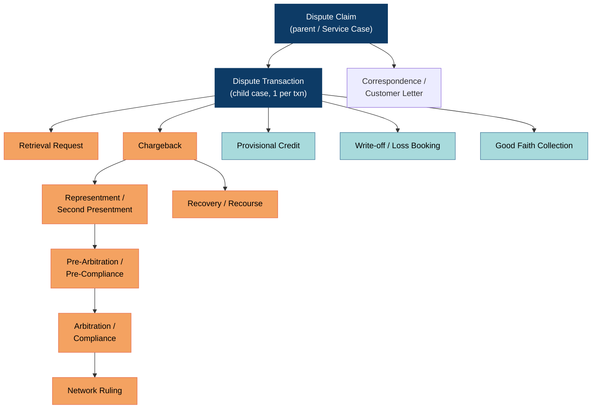

**Key structural insight for decomposition:** Pega models `Dispute Claim` (customer-facing, 1..n transactions) and `Dispute Transaction` (network-facing, exactly 1 transaction) as separate case types. **That split survives into the target architecture as two bounded contexts** — Claim Intake vs Dispute Case Management. It is the single most reusable piece of Pega's domain model.

### 2.3 OOTB stage / step model (`Dispute Transaction` case)

| Stage | OOTB steps | SLA (typical OOTB config) | Where it lands in the target |
|---|---|---|---|
| **Capture** | Collect claim details, select transaction, capture reason, capture cardholder statement | — | Claim Intake BC |
| **Validate** | Duplicate check, eligibility, time-bar check, fraud-block check, card-status check | 1 day | Eligibility & Rules BC |
| **Investigate** | Assign to work queue, request docs, review evidence, fraud referral, merchant contact | 5–10 days | Dispute Case + Evidence BC |
| **Provisional Credit** | Reg E 10-business-day timer, PC posting, PC reversal | 10 business days | Financial Posting + Compliance BC |
| **Network Action** | Determine chargeback right, build chargeback, submit to Mastercom/VROL, attach docs | 2 days | Network Exchange BC |
| **Await Network Response** | Poll/receive representment, second presentment, network decision | 30–45 days | Network Exchange BC |
| **Adjudicate** | Accept / re-present / escalate to pre-arb / arbitration | 5–10 days | Dispute Case BC |
| **Resolve** | Final credit / debit, write-off, recovery booking | 2 days | Financial Posting BC |
| **Close & Notify** | Regulatory letters, customer notification, archive | Reg E 45/90 day cap | Correspondence + Compliance BC |

### 2.4 OOTB data model → aggregate candidates

| Pega class | What it holds | Target aggregate / context |
|---|---|---|
| `PegaCS-Work-Dispute` | Claim header, status, cardholder statement | `Claim` → Claim Intake |
| `PegaCS-Work-Dispute-Txn` | Per-transaction dispute, reason code, network status | `DisputeCase` → Dispute Case Mgmt |
| `PegaFS-Data-Transaction` | Original authorisation/settlement record | `DisputedTransaction` (VO) → Transaction Retrieval |
| `PegaFS-Data-Account` / `-Card` | Account, card, BIN, product | Reference data (upstream, ACL) |
| `PegaCS-Data-Adjustment` | Provisional credit, final credit, reversal | `Adjustment` → Financial Posting |
| `PegaCS-Data-NetworkMessage` | Mastercom/VROL request & response payloads | `NetworkExchange` → Network Exchange |
| `Data-Attachment` / `Link-Attachment` | Evidence, letters, receipts | `EvidenceItem` → Evidence |
| `Rule-Declare-*`, `Rule-Decision-Table` | Reason-code matrices, time bars, chargeback rights | Ruleset → Dispute Rules |
| `Rule-Obj-Flow`, `Assign-Worklist`, `Assign-Workbasket` | Work routing, queues, ticklers | Work Assignment (supporting) |
| `Data-ServiceLevel` / SLA agents | Reg E, network time bars | `Timer` → Compliance & Timers |

### 2.5 Coupling hot-spots in the Pega monolith (the "why" of the rebuild)

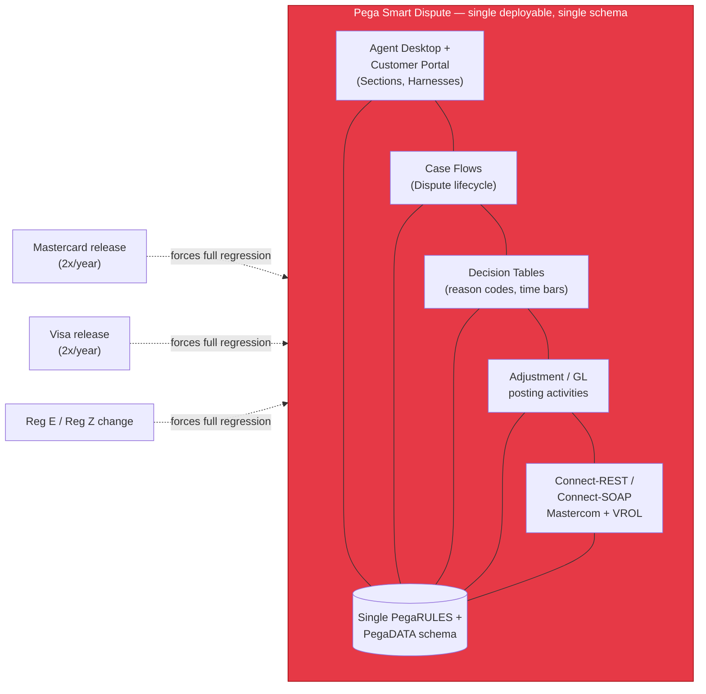

| Hot-spot | Symptom | Target-state remedy |
|---|---|---|
| Rules embedded in flows | Reason-code change → flow change → full app deploy | Externalized, effective-dated ruleset (D8) |
| Single schema | Reporting queries throttle case processing | Database per service + CQRS read model |
| Network connectors inside the case engine | Mastercom outage stalls the whole case engine | Adapter services + circuit breaker + outbox |
| UI tightly bound to case model | Any persona UX change needs a case-type change | BFF per persona (D6) |
| Provisional-credit logic in activities | Money logic untestable in isolation | Financial Posting Service, idempotent commands |
| Agents/tickler for all timers | SLA agent contention at scale | Dedicated Timer service (EventBridge Scheduler + DynamoDB TTL journal) |

---

## 3. Part B — Domain-Driven Design: subdomains & bounded contexts

### 3.1 Subdomain classification

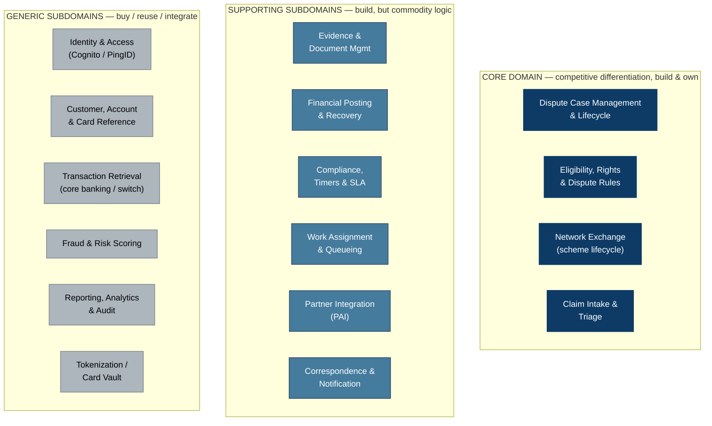

**Why this split matters commercially:** engineering investment should be concentrated in the four core contexts. Everything in GENERIC should be integrated, not rebuilt — this is precisely where Pega implementations historically over-build (custom customer masters, custom document stores, custom auth).

### 3.2 Bounded context definitions

#### BC-1 · Claim Intake & Triage *(Core)*

| Aspect | Detail |
|---|---|
| **Purpose** | Turn a customer's complaint into a structured, validated, deduplicated `Claim` with 1..n disputable transactions |
| **Aggregate root** | `Claim` |
| **Entities / VOs** | `DisputedTransactionRef`, `CardholderStatement`, `IntakeChannel`, `TriageOutcome` |
| **Ubiquitous language** | *Claim, Intake Channel, Cardholder Statement, Duplicate Claim, Triage, Withdrawal* |
| **Key invariants** | A claim cannot contain a transaction already under an open dispute; a claim must reference an account owned by the authenticated customer; cardholder statement is mandatory for fraud reason groups |
| **Owns** | Claim ID generation, intake channel metadata, dedup index |
| **Does NOT own** | Chargeback rights, money, network state |

#### BC-2 · Dispute Case Management *(Core — the "kernel")*

| Aspect | Detail |
|---|---|
| **Purpose** | Own the long-running lifecycle of one dispute against exactly one transaction; the saga orchestrator |
| **Aggregate root** | `DisputeCase` |
| **Entities / VOs** | `CaseStatus`, `LifecycleStage`, `ReasonCode`, `DisputeAmount`, `CaseParty`, `Decision`, `Outcome` |
| **Ubiquitous language** | *Dispute Case, Stage, Cycle (1st chargeback / 2nd presentment / pre-arb / arbitration), Adjudication, Liability Shift, Case Outcome, Withdrawal, Re-open* |
| **Key invariants** | A case is in exactly one lifecycle stage; stage transitions follow the scheme-specific state machine; a case cannot advance to a network cycle without an active chargeback right; a closed case can only be re-opened within the network re-open window |
| **Owns** | Case state machine, case timeline, decisions, outcomes |
| **Does NOT own** | Rule content, money postings, network wire format |

#### BC-3 · Eligibility, Rights & Dispute Rules *(Core)*

| Aspect | Detail |
|---|---|
| **Purpose** | Answer "is there a dispute right, under which reason code, within which time bar, requiring which evidence?" |
| **Aggregate root** | `RuleSet` (versioned, effective-dated), `EligibilityAssessment` |
| **Entities / VOs** | `ChargebackRight`, `ReasonCode`, `TimeBar`, `EvidenceRequirement`, `SchemeVersion`, `ConditionPredicate` |
| **Ubiquitous language** | *Chargeback Right, Reason Code, Condition (Visa) / Message Reason Code (MC), Time Bar, Dispute Window, Evidence Requirement, Pre-condition, Liability* |
| **Key invariants** | An assessment is always evaluated against the ruleset version effective at the transaction date, never "today's" ruleset; every denial carries a machine-readable denial reason |
| **Owns** | Mastercard MDR reason codes (4837, 4853, 4855, 4863, 4808...), Visa VCR dispute conditions (10.4, 12.5, 13.1, 13.7...), time bars, evidence matrices |
| **Notable** | This is the context that turns "network release note" into a **data change**, not a code change |

#### BC-4 · Network Exchange *(Core)*

| Aspect | Detail |
|---|---|
| **Purpose** | Reliable, ordered, idempotent, auditable exchange of dispute messages with Mastercom and VROL |
| **Aggregate root** | `NetworkExchange` (one per outbound message + its correlated response) |
| **Entities / VOs** | `SchemeMessage`, `NetworkCorrelationId`, `TransmissionAttempt`, `SchemeAcknowledgement`, `NetworkRuling` |
| **Ubiquitous language** | *Chargeback submission, Second Presentment, Pre-Arbitration, Arbitration Case Filing, Ruling, Fee, Claim ID (VROL), Case ID (Mastercom), Cycle* |
| **Key invariants** | Exactly-once semantics per scheme correlation ID; every outbound message is journalled before transmission (transactional outbox); no message leaves without a valid ruleset-derived reason code |
| **Sub-services** | `mcom-adapter`, `vrol-adapter`, `network-router`, `scheme-resolution` |

#### BC-5 · Financial Posting & Recovery *(Supporting)*

| Aspect | Detail |
|---|---|
| **Purpose** | Provisional credit, final credit/debit, reversal, write-off, recovery, fee booking — *as commands to core banking* |
| **Aggregate root** | `PostingInstruction` |
| **Entities / VOs** | `ProvisionalCredit`, `FinalCredit`, `Reversal`, `WriteOff`, `NetworkFee`, `RecoveryItem`, `PostingIdempotencyKey` |
| **Ubiquitous language** | *Provisional Credit, PC Reversal, Final Credit, Write-off, Recovery, Good Faith Collection, Suspense Account, Loss Booking* |
| **Key invariants** | Every posting is idempotent on `(caseId, postingType, cycle)`; a PC reversal cannot exceed the PC amount; postings are never issued without a case decision event |
| **Does NOT own** | Ledger balances (core banking is the system of record) |

#### BC-6 · Evidence & Document Management *(Supporting)*

| Aspect | Detail |
|---|---|
| **Purpose** | Capture, virus-scan, classify, redact and package evidence into scheme-compliant document bundles |
| **Aggregate root** | `EvidenceBundle` |
| **Entities / VOs** | `EvidenceItem`, `DocumentClassification`, `RedactionPolicy`, `SchemeDocumentManifest` |
| **Ubiquitous language** | *Evidence, Compelling Evidence (Visa CE3.0), Supporting Documentation, Bundle, Manifest, Redaction, Retention* |
| **Key invariants** | Evidence is immutable once bundled and transmitted; PAN/PII redaction runs before any network transmission; retention honours the longest of scheme + regulatory clocks |

#### BC-7 · Compliance, Timers & SLA *(Supporting)*

| Aspect | Detail |
|---|---|
| **Purpose** | Own every clock: Reg E 10/45/90, Reg Z, scheme time bars, internal SLAs, and the evidence of compliance |
| **Aggregate root** | `RegulatoryTimer`, `ComplianceObligation` |
| **Ubiquitous language** | *Reg E, Reg Z, Provisional Credit Deadline, Final Resolution Deadline, Time Bar, Breach, Tickler, Escalation* |
| **Key invariants** | A timer is deterministic from the event that started it; a breach is recorded permanently even if later remediated |

#### BC-8 · Work Assignment & Queueing *(Supporting)*

Replaces Pega workbaskets/worklists. Aggregate: `WorkItem`. Language: *Queue, Skill, Assignment, Escalation, Ownership, Pull vs Push routing*.

#### BC-9 · Partner Integration — PAI *(Supporting, but strategically critical)*

| Aspect | Detail |
|---|---|
| **Purpose** | The only door through which Acquirers and Merchants touch **our platform** — a *deflection and evidence* channel that runs alongside, not instead of, the scheme rails |
| **Aggregate root** | `PartnerEngagement` |
| **Entities / VOs** | `PartnerIdentity`, `MerchantProfile`, `AcquirerProfile`, `InboundRepresentment`, `PartnerEvidenceSubmission`, `WebhookSubscription` |
| **Ubiquitous language** | *Partner, Engagement, Deflection, Pre-dispute (RDR/CDRN-style), Merchant Response, Acquirer Response, Webhook* |
| **Key invariants** | A partner may only see cases where they are a named party; partner-supplied data is untrusted until validated against the canonical case |
| **Pattern** | **Open Host Service + Published Language** |

#### BC-10 · Correspondence & Notification *(Supporting)*

Aggregate: `CommunicationRequest`. Language: *Acknowledgement Letter, Provisional Credit Notice, Resolution Letter, Reg E Notice, Template, Channel Preference*.

#### BC-11..16 · Generic contexts (integrate, don't build)

| BC | Integrate with | Pattern |
|---|---|---|
| Customer / Account / Card Reference | Core banking, CIF | ACL, read-only |
| Transaction Retrieval | Payment switch, settlement store | ACL, read-only |
| Fraud & Risk | Existing fraud platform (Falcon / in-house) | ACL, request-reply |
| Tokenization / Card Vault | Existing PCI vault | ACL, **PAN never crosses into our contexts** |
| Identity & Access | Cognito (customer) + corporate IdP (issuer ops) + partner OAuth2 (PAI) | Conformist |
| Reporting, Analytics & Audit | Redshift / OpenSearch / QuickSight | Published Language via event backbone |

---

## 4. Part C — Context map & integration patterns

### 4.1 The context map

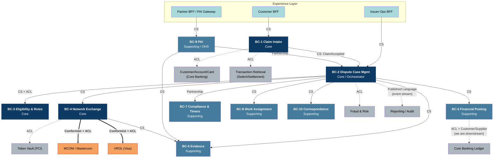

### 4.2 Relationship catalogue — every edge, with its pattern and its justification

| # | Upstream (U) → Downstream (D) | Pattern | Why this pattern | Mechanism |
|---|---|---|---|---|
| R1 | Claim Intake → Dispute Case | **Customer/Supplier** | Intake is upstream and must satisfy Case Mgmt's contract; both teams are internal and can negotiate | Async event `ClaimAccepted` on MSK, versioned Avro |
| R2 | Dispute Case ↔ Eligibility & Rules | **Customer/Supplier + ACL** | Case Mgmt drives the requirement; ACL prevents scheme rule vocabulary (MC "message reason code" vs Visa "condition") leaking into the case model | Sync REST `POST /assessments` returning a canonical `ChargebackRight` |
| R3 | Dispute Case → Network Exchange | **Customer/Supplier** | Case Mgmt is the client; Network Exchange publishes a stable canonical command interface | Command `SubmitNetworkCycle` via SQS FIFO (ordered per case) |
| R4 | **Network Exchange → MCOM** | **Conformist + ACL** | Mastercard dictates the model absolutely; we conform on the wire but translate at the boundary so no Mastercom type reaches BC-2 | `mcom-adapter` service = the ACL |
| R5 | **Network Exchange → VROL** | **Conformist + ACL** | Same reasoning; Visa's VCR/VROL model differs materially from Mastercom's | `vrol-adapter` service = the ACL |
| R6 | Dispute Case ↔ Compliance & Timers | **Partnership** | Neither can succeed without the other: a case transition without its regulatory clock is a compliance failure; changes are co-released | Bidirectional events + shared `TimerPolicy` published language |
| R7 | Dispute Case → Financial Posting | **Customer/Supplier** | Case decisions drive postings; Financial Posting exposes a stable command API | Command `IssuePosting` with idempotency key |
| R8 | Financial Posting → Core Banking Ledger | **Conformist + ACL** (we are downstream of a fixed system) | Core banking will not change its posting API for the dispute platform | Adapter with retry + reconciliation ledger |
| R9 | PAI ↔ Dispute Case | **Partnership** | Merchant/acquirer engagement changes case state and vice versa; contract evolves together | Sync commands + webhook fan-out |
| R10 | PAI → Merchant / Acquirer | **Open Host Service + Published Language** | Many partners, one published contract; we cannot bespoke-integrate per merchant | Public OpenAPI 3.1 + JSON Schema events, semantic versioning, mTLS |
| R11 | Claim Intake → Customer/Account/Card | **Anticorruption Layer**, upstream is *Conformist-imposed* | Core banking CIF model is legacy and hostile (COBOL copybook shapes); must not pollute the domain | Read-only adapter, cached projections |
| R12 | Claim Intake → Transaction Retrieval | **Anticorruption Layer** | Switch/settlement record formats vary by product | Adapter producing canonical `DisputedTransaction` |
| R13 | Dispute Case → Fraud & Risk | **Anticorruption Layer** | Fraud platform speaks scores/rules, not disputes | Request-reply with timeout + degraded fallback |
| R14 | Network Exchange → Token Vault | **ACL, PCI boundary** | PAN must be dereferenced only inside the PCI-scoped adapter, at the last possible moment | Vault SDK inside adapter's isolated subnet |
| R15 | All contexts → Reporting/Audit | **Published Language** | One canonical event schema consumed by many read models | Avro on MSK → Firehose → S3/Redshift |
| R16 | Correspondence, Work Assignment ← Dispute Case | **Customer/Supplier** | Downstream reactive consumers | Domain events |
| R17 | Legacy Pega (during migration) ↔ new platform | **Anticorruption Layer, bidirectional** | Coexistence period; neither model should infect the other | `pega-bridge` service, dual-write + reconciliation |

### 4.3 Patterns explicitly *rejected*

| Pattern | Where it was tempting | Why rejected |
|---|---|---|
| **Shared Kernel** | Between Dispute Case and Eligibility & Rules ("just share the ReasonCode enum") | A shared kernel across two independently-releasing core contexts recreates the Pega coupling in miniature. Reason codes are *scheme* vocabulary — they belong to Rules, and Case Mgmt receives them as opaque, validated values. |
| **Conformist (internal)** | Financial Posting conforming to core banking's model everywhere | Would push GL vocabulary into the dispute domain. ACL confined to the adapter instead. |
| **Big Ball of Mud / shared DB** | "One dispute DB is simpler" | This is exactly the Pega failure mode being escaped. |
| **Separate Ways** | Correspondence (buy a comms platform, disconnect it) | Reg E notices are legally coupled to case timers — cannot be separate ways. |

---

## 5. Part D — The BIN routing decision (FE vs BE)

### 5.1 The question, stated precisely

> When a dispute is raised on a card, who decides whether the case is filed under **VISA** (via the VROL platform) or **MASTERCARD** (via the MCOM platform) — the front end, or the backend?

*(Scheme vs platform: see [§0.1](#01-the-three-layers-people-conflate). The decision resolves a **scheme**; routing to a platform is the adapter's job, one layer down.)*

### 5.2 Answer: **the backend. Unambiguously. The front end must never know.**

The FE does not receive a PAN, does not receive a BIN, and does not receive a scheme-routing decision it can act on. It receives a **card reference token** and, at most, a *display-only* network brand for iconography.

### 5.3 The eight reasons (ordered by how much they'd hurt you)

| # | Reason | Consequence of putting it in the FE |
|---|---|---|
| 1 | **PCI-DSS scope** | For the browser/mobile app to derive a network from a BIN, it must hold the first 6–8 digits of the PAN. That pulls the entire web tier, CDN, mobile binary and its build pipeline into PCI scope. Cost: an order of magnitude in audit and control burden. |
| 2 | **BIN tables are volatile and licensed** | Visa and Mastercard BIN/account-range files update **weekly**; ISO 8583 8-digit BIN migration is still shaking out. Shipping that table to a mobile app means users on an old app version route to the wrong network. Backend = one deploy, instant consistency. |
| 3 | **Co-badged and multi-network cards** | A card can be Mastercard + a domestic scheme (Cartes Bancaires, Bancontact, RuPay, Elo, or a US debit network under Reg II). The routing decision depends on *how the transaction was actually routed at authorisation* — data the FE has never seen. Only the backend, holding the settlement record, can decide. |
| 4 | **Routing depends on transaction data, not just the card** | The correct scheme for a dispute is determined by the **network the original transaction settled on** (from the settlement/clearing record), not by the card's headline brand. Debit transactions especially. The FE has no access to this. |
| 5 | **Multi-channel consistency** | Disputes arrive from web, iOS, Android, IVR, contact-centre desktop, branch, and API partners. FE-side routing = the same rule implemented seven times, drifting immediately. |
| 6 | **Tamperability** | A client-supplied routing hint is attacker-controlled input. An attacker forcing a Visa-branded case onto the Mastercard rail creates rejected filings, time-bar expiry, and real financial loss. |
| 7 | **Auditability** | Regulators and scheme compliance audits ask "why was this case filed under condition 13.1 on VROL?" The answer must come from a server-side, versioned, logged decision — not from a JS bundle. |
| 8 | **Future networks** | Adding Amex/Discover/JCB/domestic schemes must be a backend ruleset change, not a coordinated app-store release. |

### 5.4 Where the decision *does* live: the Scheme Resolution Service

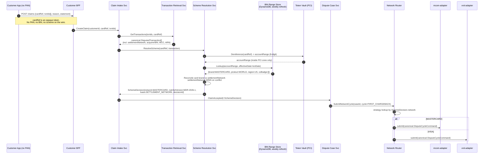

### 5.5 The resolution algorithm (precedence order)

```
resolveScheme(cardRef, transaction, asOfDate):
  1. If transaction.settlementNetwork is present and recognised
        -> network = settlementNetwork            [HIGHEST PRECEDENCE]
           basis   = SETTLEMENT_NETWORK
  2. Else if transaction.arn / acquirerReferenceNumber encodes a scheme
        -> network = decodeFromARN(arn)
           basis   = ARN_DERIVED
  3. Else dereference cardRef -> accountRange (8-digit, PCI zone)
        binRecord = binStore.lookup(accountRange, effectiveOn = transaction.date)
        3a. If binRecord.coBadge is empty
              -> network = binRecord.brand;  basis = BIN_TABLE
        3b. If co-badged
              -> apply CoBadgeRoutingPolicy(issuerCountry, MCC, POS entry mode,
                                            domestic-scheme regulation)
              -> if still ambiguous: network = UNRESOLVED
  4. If network == UNRESOLVED
        -> raise ManualSchemeReviewRequired -> Work Assignment queue
           (never guess: a wrong filing burns the time bar)
  5. Emit SchemeResolved event with {network, basis, decisionId, ruleSetVersion,
     binFileVersion, resolvedAt} -> immutable audit
```

**Design notes**

- `basis` is persisted on the case. In an audit, "why VROL?" is answered by a single field plus the BIN file version.
- The BIN store is keyed by **effective date**, so a dispute raised in 2027 on a 2026 transaction resolves against the 2026 account-range file. This mirrors the effective-dated ruleset principle in BC-3.
- `UNRESOLVED` routes to a human. Silent fallback to a default network is the single most expensive bug this design prevents.

### 5.6 What the front end legitimately does

| FE responsibility | FE explicitly NOT responsible for |
|---|---|
| Collect reason, statement, evidence, contact preference | Deriving the network |
| Render a scheme logo from a `displayBrand` field the BFF returns | Holding a BIN table |
| Show reason-code options **fetched from the BFF** (which got them from BC-3, already scheme-filtered) | Knowing which reason codes belong to which scheme |
| Show deadlines the BFF returns | Computing time bars |
| Progressive disclosure of dynamic evidence questions driven by a server-returned form schema | Knowing scheme evidence requirements |

**Corollary for the UI decomposition:** because reason codes, evidence questions, and deadlines all arrive as *server-driven schemas*, the Pega monolith's hard-coded sections can be replaced by a **dynamic form renderer**. This is what lets one Customer app serve both Mastercard and Visa without any scheme branching in the client.

### 5.7 Network Router — the strategy/adapter pattern

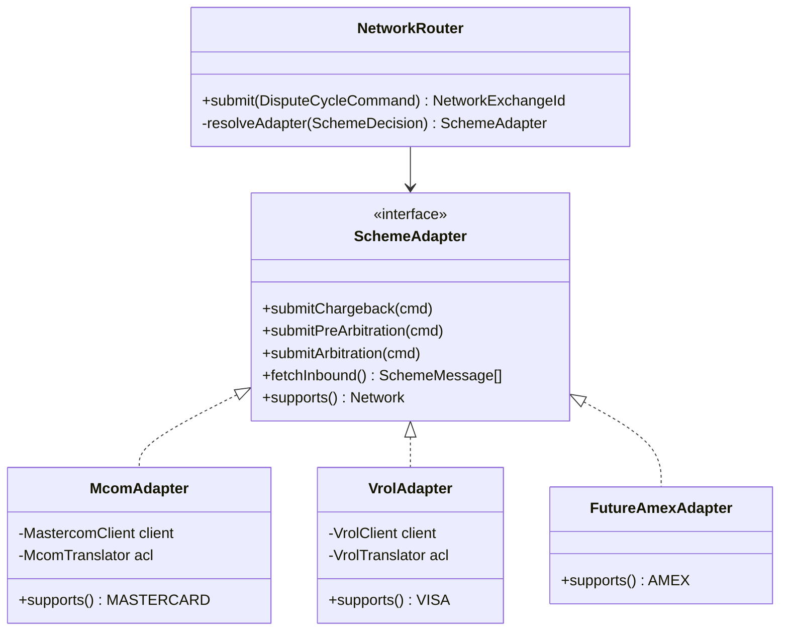

Adding Visa after Mastercard is then: deploy `vrol-adapter`, load the Visa ruleset into BC-3, enable the Visa account ranges in the BIN store. **Zero changes to Claim Intake, Dispute Case, the BFFs, or any client app.**

---

## 6. Part E — Microservice catalog

### 6.1 Service inventory

Legend — **Sync** = REST/gRPC · **Async** = MSK topic / SQS / EventBridge · DB per service.

| # | Service | Bounded context | Responsibility (one sentence) | Datastore | Key sync API | Publishes | Consumes |
|---|---|---|---|---|---|---|---|
| 1 | `customer-bff` | Experience | Aggregates and shapes the customer digital-banking dispute journey | ElastiCache (session) | GraphQL / BFF REST | — | — |
| 2 | `issuer-ops-bff` | Experience | Aggregates the issuer back-office agent workspace | ElastiCache | BFF REST | — | — |
| 3 | `partner-bff` (PAI Gateway) | BC-9 | The only externally reachable API into our platform for acquirers & merchants — deflection & evidence, alongside the scheme rails | DynamoDB (rate/idempotency) | Public OpenAPI 3.1 | `PartnerEngagementRecorded` | `CaseStatusChanged` |
| 4 | `claim-intake-svc` | BC-1 | Creates, validates, deduplicates claims; orchestrates intake enrichment | Aurora PG | `POST /claims`, `GET /claims/{id}` | `ClaimSubmitted`, `ClaimAccepted`, `ClaimRejected` | `TransactionEnriched` |
| 5 | `transaction-retrieval-svc` | BC-13 (generic) | ACL over switch/settlement; returns canonical `DisputedTransaction` | Aurora PG + Redis cache | `POST /transactions:lookup` | `TransactionEnriched` | — |
| 6 | `scheme-resolution-svc` | BC-4 | **Owns the BIN→network decision** (D1) | DynamoDB (account ranges, effective-dated) | `POST /scheme:resolve` | `SchemeResolved` | BIN file drops (S3 event) |
| 7 | `dispute-case-svc` | BC-2 | The case aggregate + saga orchestrator; the system of record for case state | Aurora PG + Step Functions | `GET/POST /cases`, `POST /cases/{id}/decisions` | `CaseOpened`, `CaseStageChanged`, `CaseDecided`, `CaseClosed` | `ClaimAccepted`, `NetworkResponseReceived`, `PostingCompleted`, `TimerFired`, `PartnerResponseReceived` |
| 8 | `dispute-rules-svc` | BC-3 | Effective-dated, versioned scheme rulesets; eligibility & rights assessment | Aurora PG + DMN engine | `POST /assessments`, `GET /reason-codes?scheme=&asOf=`, `GET /evidence-requirements` | `RuleSetPublished` | — |
| 9 | `network-router-svc` | BC-4 | Strategy dispatch to the correct scheme adapter; outbox + ordering per case | DynamoDB (outbox) | `POST /network/cycles` | `NetworkSubmissionQueued` | `CaseStageChanged` |
| 10 | `mcom-adapter-svc` | BC-4 | ACL to Mastercom: chargeback, 2nd presentment, pre-arb, arbitration, retrieval | Aurora PG (journal) + S3 | internal only | `NetworkMessageSent`, `NetworkResponseReceived` | `NetworkSubmissionQueued` |
| 11 | `vrol-adapter-svc` | BC-4 | ACL to VROL/VCR: dispute, pre-arb, arbitration, Order Insight/CE3.0 | Aurora PG (journal) + S3 | internal only | `NetworkMessageSent`, `NetworkResponseReceived` | `NetworkSubmissionQueued` |
| 12 | `evidence-svc` | BC-6 | Upload, AV-scan, classify, redact, bundle, retain | S3 + Aurora PG metadata | `POST /evidence`, `POST /bundles` | `EvidenceBundled`, `EvidenceRejected` | `EvidenceRequested` |
| 13 | `financial-posting-svc` | BC-5 | Idempotent posting commands to core banking; recovery & write-off | Aurora PG | `POST /postings` | `PostingRequested`, `PostingCompleted`, `PostingFailed` | `CaseDecided`, `TimerFired` |
| 14 | `compliance-timer-svc` | BC-7 | Every regulatory and scheme clock; breach detection | DynamoDB + EventBridge Scheduler | `POST /timers`, `GET /obligations/{caseId}` | `TimerStarted`, `TimerFired`, `TimerBreached` | `CaseOpened`, `CaseStageChanged`, `PostingCompleted` |
| 15 | `work-assignment-svc` | BC-8 | Queues, skills-based routing, ownership, escalation | Aurora PG | `GET /worklist`, `POST /workitems/{id}:claim` | `WorkItemAssigned`, `WorkItemEscalated` | `CaseStageChanged`, `ManualReviewRequired` |
| 16 | `correspondence-svc` | BC-10 | Templated Reg E letters, emails, push, statement inserts | Aurora PG + SES/SNS | `POST /communications` | `CommunicationSent` | `CaseStageChanged`, `PostingCompleted`, `TimerFired` |
| 17 | `fraud-gateway-svc` | BC-14 (generic) | ACL to the fraud platform; score + case linkage | none (stateless) | `POST /fraud:assess` | `FraudAssessmentCompleted` | — |
| 18 | `party-reference-svc` | BC-12 (generic) | ACL over CIF/core banking for customer, account, card, entitlement | Aurora PG (projection) | `GET /cards/{cardRef}`, `GET /accounts/{id}` | `CardProjectionUpdated` | CDC from core banking |
| 19 | `notification-fanout-svc` | Cross-cutting | Webhook delivery to partners with retry/DLQ and signature | DynamoDB | internal | — | all `Case*` events |
| 20 | `audit-svc` | Cross-cutting | Append-only, tamper-evident case audit trail | S3 Object Lock + QLDB-style hash chain | `GET /audit/{caseId}` | — | all events |
| 21 | `reporting-projection-svc` | Cross-cutting | CQRS read models: dispute inventory, aging, network SLA, loss | OpenSearch + Redshift | `GET /reports/*` | — | all events |
| 22 | `pega-bridge-svc` | Migration only | Bidirectional ACL to legacy Pega during coexistence | Aurora PG (correlation) | internal | `LegacyCaseSynced` | `Case*` events |

### 6.2 Service granularity rationale

| Grouping decision | Why not finer | Why not coarser |
|---|---|---|
| One `dispute-case-svc` (not one per stage) | The case aggregate's invariants (stage transitions) must be enforced transactionally in one place | It would otherwise become a distributed state machine with no consistency boundary |
| Separate adapter per scheme | Scheme release cycles, certification cycles, and outage domains are independent | A single "network-svc" would couple Mastercard and Visa release trains — the exact Pega problem |
| `scheme-resolution-svc` split from adapters | Resolution needs the PCI token-vault boundary and a weekly-refreshed BIN store; adapters need scheme certification | Embedding resolution in each adapter duplicates the decision and breaks auditability |
| `dispute-rules-svc` separate from case | Rules change on the network's schedule; the case engine changes on ours | Embedding rules in the case service reproduces Pega's flow/rule entanglement |
| `compliance-timer-svc` separate | Timers are a distinct availability concern — they must fire even when the case service is degraded | — |
| `financial-posting-svc` separate | Different compliance controls (SoD, four-eyes, reconciliation) and different change cadence | — |

### 6.3 Canonical domain events (the Published Language)

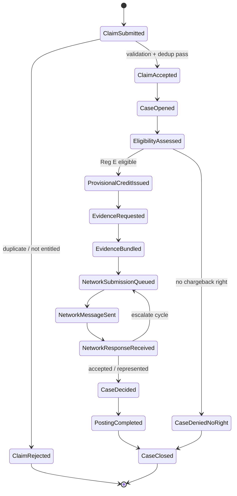

Every event carries a standard envelope:

```json
{
  "eventId": "01J9...ULID",
  "eventType": "CaseStageChanged",
  "eventVersion": "1.3.0",
  "occurredAt": "2026-08-07T09:14:22.117Z",
  "correlationId": "claim-8f3a...",
  "causationId": "01J9...previous",
  "tenant": "ISSUER-BANK-01",
  "subject": { "caseId": "DC-2026-0000481922", "claimId": "CL-..." },
  "scheme": { "network": "MASTERCARD", "ruleSetVersion": "MDR-2026.1" },
  "payload": { "fromStage": "AWAIT_NETWORK", "toStage": "ADJUDICATE", "cycle": 2 },
  "dataClassification": "CONFIDENTIAL_NO_PAN"
}
```

`dataClassification: CONFIDENTIAL_NO_PAN` is enforced by a schema-registry rule: **no event schema may contain a PAN field.** This keeps the event backbone out of PCI scope.

---

## 7. Part F — C4 model (L1 / L2 / L3)

### 7.1 Level 1 — System Context

> **Presentation master:** [`source/C4_L1_SystemContext_DisputePlatform.drawio`](../source/C4_L1_SystemContext_DisputePlatform.drawio) · rendered at [`diagrams/C4_L1_SystemContext_DisputePlatform.svg`](../diagrams/C4_L1_SystemContext_DisputePlatform.svg).
>
> The Mermaid below is the **inline approximation**. Mermaid auto-layouts and cannot hold fixed bands or connection points, so the draw.io version is authoritative for presentation. See [`prompts/mermaid-diagram-rules.md`](../prompts/mermaid-diagram-rules.md) Appendix C.

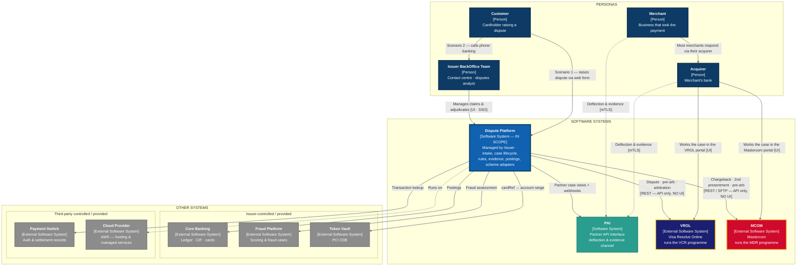

*Colour and line-style key: [§0.11 Diagram conventions](#011-diagram-conventions--the-shared-legend).*

#### 7.1.1 The four things this diagram asserts

1. **Acquirer and Merchant do not work disputes in our platform.** They work them in **VROL's and Mastercom's own portals**. The scheme relays the result to us machine-to-machine. This is the single most important boundary on the page.
2. **PAI is a secondary channel, not the door.** It exists for **deflection and evidence** — letting a merchant accept or defend before a network cycle is consumed. A partner who never touches PAI still participates fully in every dispute via the scheme.
3. **VROL and MCOM have no UI relationship with us.** They have excellent UIs; our platform never renders or embeds them. Analysts may hold separate scheme logins for exception handling — that is a *different system*, not a feature of ours.
4. **Two intake scenarios, one platform.** Scenario 1 is customer self-service; Scenario 2 is assisted, through the contact centre. They converge after intake.

> **Correction from an earlier draft.** This diagram previously showed Acquirer and Merchant reaching the platform *only* through PAI, and labelled them "No direct access". That overstated PAI: it modelled a proposed deflection channel as the primary partner path, when in reality the scheme rails are. Decision **D5** and §8.1 are restated accordingly.

### 7.2 Level 2 — Containers inside "Claims"

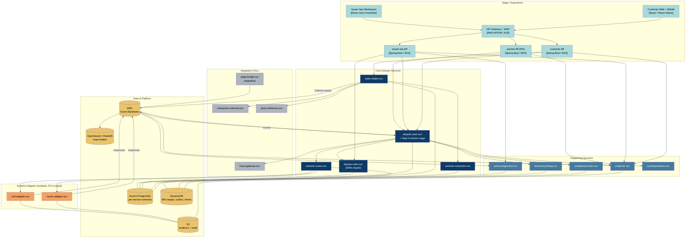

### 7.3 Level 3 — Components inside `dispute-case-svc` (the core aggregate)

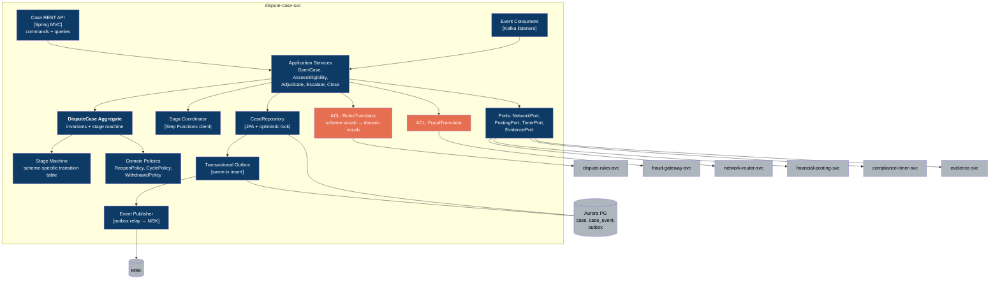

### 7.4 Level 3 — Components inside `mcom-adapter-svc` (the ACL in detail)

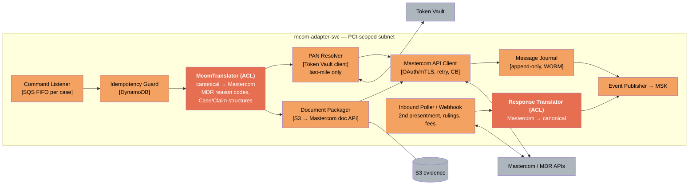

**Why the ACL is drawn as two components (`McomTranslator` + `ResponseTranslator`):** the corruption risk is bidirectional. Mastercom's `Case`/`Claim` nouns, its fee structures, and its cycle naming must not travel inward; equally, our internal stage names must not leak outward into filings.

---

## 8. Part G — Persona journeys & the PAI (Partner API Interface)

### 8.1 Persona access model

| Persona | Access | Identity | Entry point | Trust level | Data visibility |
|---|---|---|---|---|---|
| **Customer** (cardholder) | Direct, authenticated digital banking, **or** unauthenticated web form (Scenario 1) | Cognito / bank IdP, step-up MFA for claim submission | `customer-bff` | Authenticated, low privilege | Own claims only; masked card; no network internals |
| **Issuer BackOffice Team** (analyst / supervisor / QA) | Direct, corporate SSO | Corporate IdP (SAML/OIDC) + RBAC + ABAC on queue & amount | `issuer-ops-bff` | Trusted internal | Full case, subject to SoD (no self-approval of postings) |
| **Acquirer** | **Primary: the scheme's own portal** (VROL / Mastercom) — *not our system*. **Secondary: PAI**, optional | Scheme credentials for the portal; OAuth2 client-credentials + mTLS for PAI | Scheme portal · `partner-bff` | Semi-trusted external | Via scheme: whatever the scheme shows. Via PAI: only cases where their acquirer ID is a party |
| **Merchant** | **Primary: via their acquirer**, or a scheme portal if they hold direct access. **Secondary: PAI**, optional | Delegated by acquirer, or scheme credentials; OAuth2 + mTLS for PAI | Acquirer · scheme portal · `partner-bff` | Least-trusted external | Only cases against their own merchant ID(s); no cardholder PII beyond scheme minimum |

**Two access questions, often confused:**

| Question | Answer |
|---|---|
| How does an acquirer *participate in a dispute*? | Through **VROL / Mastercom**. That is the system of record for the filing, and it works with or without us. |
| How does an acquirer *reach our platform*? | Only through **PAI** — and only if they choose to. It is optional. |

**Design principle for PAI:** the acquirer/merchant view is a **projection**, not the case aggregate. `partner-bff` never returns the internal case model. It returns a `PartnerCaseView` — a deliberately narrower published language with its own lifecycle vocabulary (*Received → Awaiting Response → Response Submitted → Decided*), which stays stable even when internal stages change.

**Why PAI is worth building even though it is optional:** a merchant who accepts liability through PAI *before* the cycle is sent saves the filing fee, the analyst time and the time bar. That is the cheapest possible outcome (see the lifecycles doc §3.1, stage 2 — pre-dispute). PAI is a cost-avoidance channel, not an access requirement.

### 8.2 Journey 1 — Customer raises a dispute (happy path, Mastercard e-commerce fraud)


### 8.3 Journey 2 — Acquirer / Merchant respond via PAI (second presentment)

The journey that makes the partner boundary concrete: *acquirer and merchant never get a UI in our platform*. **Path A is how this normally happens** — the acquirer works the case in the scheme's own portal and the scheme relays it to us. **Path B is the optional PAI channel** that can pre-empt Path A.

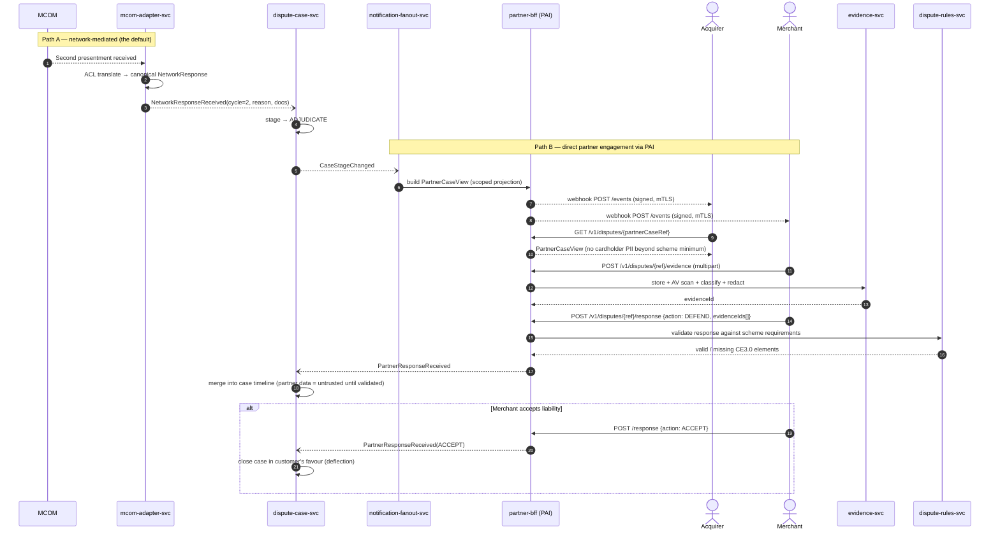

**Two paths, one case.** Path A is authoritative (the scheme is the system of record for the filing). Path B is *pre-emptive* — it lets a merchant accept or defend before the network cycle is consumed, which is how deflection programmes (RDR/CDRN-style, Order Insight, Consumer Clarity) reduce chargeback volume. `dispute-case-svc` reconciles the two: **a Path B response never overrides a Path A network fact**; it can only pre-empt an unsent cycle or supply evidence.

### 8.4 Journey 3 — Issuer analyst adjudicates

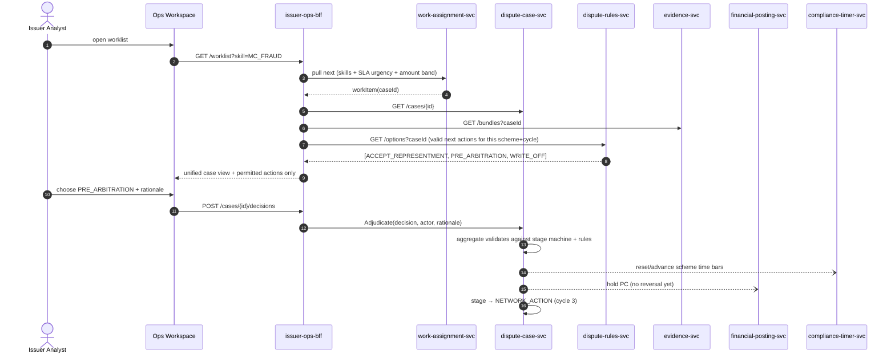

Note the pattern: **the UI never computes permitted actions.** `dispute-rules-svc` returns them. That is what allows the same workspace to handle Mastercard and Visa cases side by side with zero scheme branching in the front end — the same principle as D1.

### 8.5 The PAI contract (Open Host Service)

| Endpoint | Method | Purpose | Consumer |
|---|---|---|---|
| `/v1/disputes` | GET | List disputes scoped to the caller's acquirer/merchant IDs | Acquirer, Merchant |
| `/v1/disputes/{ref}` | GET | `PartnerCaseView` | Acquirer, Merchant |
| `/v1/disputes/{ref}/evidence` | POST | Upload compelling evidence (multipart, ≤ scheme limits) | Merchant, Acquirer |
| `/v1/disputes/{ref}/response` | POST | `ACCEPT` \| `DEFEND` \| `REQUEST_INFO` | Merchant, Acquirer |
| `/v1/disputes/{ref}/documents/{id}` | GET | Retrieve issuer-supplied documentation | Acquirer |
| `/v1/webhooks/subscriptions` | POST/GET/DELETE | Manage event subscriptions | Acquirer |
| `/v1/reference/reason-codes` | GET | Scheme reason codes + evidence requirements, effective-dated | All partners |
| `/v1/health`, `/v1/openapi.json` | GET | Contract discovery | All partners |

**Governance of the published language**

- OpenAPI 3.1 + JSON Schema, semantic versioning, `/v1` … `/v2` coexist for a **12-month** deprecation window.
- **Consumer-driven contract tests** (Pact) run in CI for the top partners; breaking a partner build blocks the release.
- Webhook delivery: HMAC-SHA256 signature, timestamp + nonce replay protection, exponential retry to 24h, then DLQ + partner alert.
- Per-partner rate limits and quotas at API Gateway; idempotency required on all POSTs (`Idempotency-Key` header).

### 8.6 Persona → context access matrix

| | Claim Intake | Dispute Case | Rules | Network Exchange | Evidence | Financial Posting | Work Assignment | Timers |
|---|---|---|---|---|---|---|---|---|
| **Customer** | Create, read own | Read own (simplified view) | Read (filtered options) | ✗ | Create, read own | Read (credit status only) | ✗ | Read (deadline display) |
| **Issuer** | Read all | Full (RBAC-gated) | Read + propose rule change | Read + trigger | Full | Request (4-eyes above threshold) | Full | Read |
| **Acquirer** *(via PAI)* | ✗ | `PartnerCaseView` only, scoped | Read reference only | ✗ | Create + read own submissions | ✗ | ✗ | Read response deadline |
| **Merchant** *(via PAI)* | ✗ | `PartnerCaseView` only, own MID | Read reference only | ✗ | Create + read own submissions | ✗ | ✗ | Read response deadline |

---

## 9. Part H — Network integration: MCOM & VROL

### 9.1 Capability comparison driving the two-adapter decision

Column headers name the **scheme**; the platform each is reached through is on the first row. See [§0.1](#01-the-three-layers-people-conflate).

| Dimension | **MASTERCARD** | **VISA** |
|---|---|---|
| Platform (the system we integrate with) | **MCOM** — Mastercom | **VROL** — Visa Resolve Online |
| Programme (the rulebook) | Mastercard Dispute Resolution (MDR) | Visa Claims Resolution (VCR) |
| Cycles | 1st Chargeback → 2nd Presentment → Pre-Arbitration → Arbitration | Dispute (Allocation or Collaboration) → Pre-Arbitration → Arbitration |
| Reason vocabulary | Message reason codes (4837, 4853, 4855, 4863, 4808…) | Dispute conditions (10.x fraud, 11.x auth, 12.x processing, 13.x consumer) |
| Workflow split | Single flow, evidence-driven | **Allocation** (fraud/auth — Visa decides) vs **Collaboration** (processing/consumer) |
| Pre-dispute tooling | Ethoca-style alerts, Consumer Clarity | Order Insight, Rapid Dispute Resolution, CE3.0 |
| Doc transport | Mastercom document API / bulk file | VROL attachment API |
| Integration modes | REST APIs + bulk file (SFTP) | REST APIs + bulk file |
| Time bars | Typically 120 days from txn/expected-delivery (code-dependent) | 30/75/120 days by condition |

These differ enough — especially **Allocation vs Collaboration**, which has no Mastercard analogue — that a single "network service" would be a false abstraction. The canonical model expresses **cycles and rights**; each adapter maps its scheme's shape into that.

### 9.2 Canonical → scheme mapping (illustrative)

| Canonical | Mastercom | VROL |
|---|---|---|
| `DisputeCycle.FIRST` | First Chargeback (MDR) | Dispute (Allocation or Collaboration) |
| `DisputeCycle.SECOND` | Second Presentment | Dispute Response |
| `DisputeCycle.PRE_ARB` | Pre-Arbitration | Pre-Arbitration |
| `DisputeCycle.ARBITRATION` | Arbitration Case Filing | Arbitration |
| `DisputeRight.reasonCode` | `messageReasonCode` | `disputeCondition` |
| `EvidenceBundle` | Mastercom document set | VROL attachments (+ CE3.0 structured fields) |
| `NetworkRuling` | Arbitration ruling + fees | Arbitration ruling + fees |

### 9.3 Reliability pattern for every network call

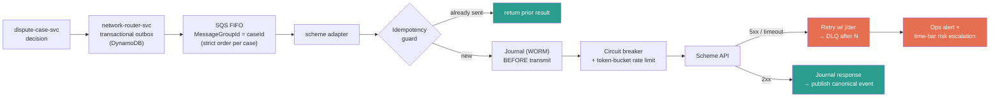

**Time-bar-aware DLQ:** a failed submission is not just an ops incident — it burns a regulatory/scheme clock. The DLQ handler queries `compliance-timer-svc`; if the remaining time bar is under threshold, it escalates to a human queue immediately rather than waiting out the retry budget. This is a behaviour Pega implementations typically bolt on late; here it is a first-class design element.

---

## 10. Part I — AWS deployment architecture

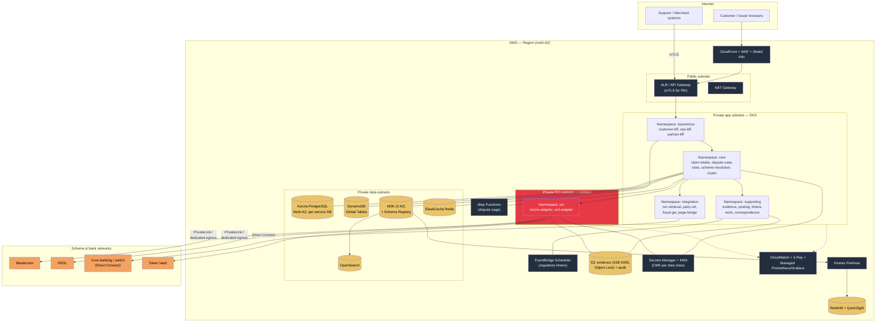

### 10.1 Service-to-AWS mapping

| Concern | AWS service | Note |
|---|---|---|
| Compute | **EKS** (Fargate for bursty adapters, managed nodegroups for steady core) | Namespace-per-tier with NetworkPolicy isolation |
| Saga orchestration | **Step Functions** (Standard, 1-year max duration) | Matches dispute lifecycles that legitimately run 120+ days |
| Event backbone | **MSK** + Glue Schema Registry | Avro, `FULL_TRANSITIVE` compatibility enforced in CI |
| Ordered commands | **SQS FIFO**, `MessageGroupId = caseId` | Guarantees per-case ordering without global bottleneck |
| Timers | **EventBridge Scheduler** + DynamoDB TTL journal | Replaces Pega SLA agents; scales to millions of open clocks |
| Transactional data | **Aurora PostgreSQL** (per-service DB, IAM auth) | Blue/green for schema changes |
| High-volume key/value | **DynamoDB** (BIN ranges, outbox, idempotency) | On-demand; Global Tables for DR |
| Evidence | **S3** + Object Lock (compliance mode) + Macie scan | Retention = max(scheme, Reg E, local law) |
| Secrets/keys | **Secrets Manager**, **KMS CMK per data classification** | Separate CMK for PCI zone |
| Observability | CloudWatch, X-Ray, Managed Prometheus/Grafana | Trace ID propagated from BFF to scheme adapter |
| Analytics | Firehose → S3 → **Redshift**, QuickSight, OpenSearch | CQRS read models |
| DR | Warm standby in a second region; RPO 5 min / RTO 1 h for core, RPO 0 for the network journal | Journal is the reconciliation source of truth |

---

## 11. Part J — Cross-cutting concerns & NFRs

### 11.1 PCI-DSS scope containment

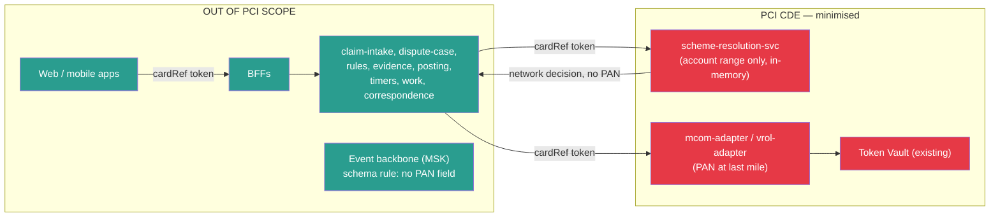

Three services in scope instead of an entire platform. This is the single largest operational-cost saving versus the Pega monolith, where the case engine, its database and its UI all sit inside the CDE.

### 11.2 NFR targets

| NFR | Target | How it is met |
|---|---|---|
| Claim submission latency (p95) | < 800 ms to `202 Accepted` | Async enrichment; intake commits only the claim |
| Case query (p95) | < 300 ms | CQRS read model in OpenSearch |
| Throughput | 50k claims/day sustained, 5x seasonal peak | HPA on EKS; SQS buffering |
| Network submission SLA | 99.5% submitted within 1 business day of decision | Outbox + time-bar-aware DLQ |
| Availability — intake & case | 99.95% | Multi-AZ, no single-AZ dependency |
| Availability — adapters | 99.5% (bounded by scheme uptime) | Outbox absorbs scheme outages |
| Durability of network journal | 11 nines, WORM | S3 Object Lock |
| Auditability | Every state change attributable to actor + rule version + input | Append-only `case_event` + hash-chained audit |
| Reg E compliance | 100% of PC deadlines met or breach-logged | Dedicated timer service with independent availability |
| RTO / RPO | 1 h / 5 min (core); 0 for journal | Warm standby + Global Tables |

### 11.3 Security controls

| Layer | Control |
|---|---|
| Edge | WAF (OWASP + bot), Shield Advanced, per-partner rate limits |
| Partner auth | mTLS + OAuth2 client-credentials, short-lived tokens, IP allowlist, request signing |
| Customer auth | OIDC + step-up MFA for claim submit and evidence upload |
| Internal | mTLS service mesh (Istio/App Mesh), SPIFFE identities, deny-by-default NetworkPolicy |
| Data | KMS CMK per classification, field-level encryption for PII, tokenized PAN only |
| Authorization | OPA sidecar; partner scoping enforced as a policy, not application code |
| Evidence | AV scan + Macie PII detection + mandatory redaction before network transmission |
| Segregation of duties | Four-eyes on postings above threshold; analyst cannot adjudicate own-account cases |
| Audit | Immutable, hash-chained, exportable to the regulator |

### 11.4 Data consistency model

| Boundary | Consistency | Mechanism |
|---|---|---|
| Within `DisputeCase` aggregate | Strong | Single-row optimistic locking in Aurora |
| Case ↔ Postings | Eventual, compensating | Saga with `ReversePosting` compensation |
| Case ↔ Network | Eventual, **non-compensable** | Once filed, a chargeback cannot be un-filed — the saga must therefore *pre-validate*, never roll back. All validation (rights, evidence, time bar) happens **before** `NetworkSubmissionQueued`. |
| Case ↔ Read models | Eventual (< 2 s) | MSK → projection |
| Case ↔ Partner view | Eventual (< 5 s) | Webhook fan-out |

The non-compensable network boundary is the most important consistency constraint in the whole design and is why D2 chose orchestration: the saga must be able to *refuse to advance*, with full state visibility, rather than discover a problem after emission.

---

## 12. Part K — Strangler-fig migration roadmap

```mermaid
flowchart LR
    subgraph P0["Phase 0 — Foundation (0-3m)"]
        A1["AWS landing zone, EKS,<br/>MSK, schema registry"]
        A2["Canonical event model<br/>+ published language"]
        A3["pega-bridge-svc<br/>(bidirectional ACL)"]
    end
    subgraph P1["Phase 1 — Read-side strangle (3-6m)"]
        B1["reporting-projection-svc<br/>off Pega CDC"]
        B2["party-reference +<br/>transaction-retrieval ACLs"]
        B3["Customer status-tracking UI<br/>leaves Pega"]
    end
    subgraph P2["Phase 2 — Intake strangle (6-10m)"]
        C1["claim-intake-svc live<br/>for all channels"]
        C2["scheme-resolution-svc<br/>+ BIN store"]
        C3["evidence-svc<br/>(Pega attachments migrated)"]
    end
    subgraph P3["Phase 3 — MC fraud vertical (10-16m)"]
        D1["dispute-case-svc +<br/>dispute-rules-svc (MDR ruleset)"]
        D2["mcom-adapter-svc<br/>+ Mastercard certification"]
        D3["financial-posting +<br/>compliance-timer"]
        D4["Cut over MC fraud<br/>reason codes only"]
    end
    subgraph P4["Phase 4 — Widen (16-24m)"]
        E1["MC non-fraud codes"]
        E2["vrol-adapter + VCR ruleset"]
        E3["partner-bff / PAI GA"]
        E4["Issuer ops workspace<br/>replaces Pega desktop"]
    end
    subgraph P5["Phase 5 — Decommission (24-30m)"]
        F1["Legacy case backfill /<br/>run-off in place"]
        F2["Retire pega-bridge"]
        F3["Decommission Pega SD"]
    end
    P0 --> P1 --> P2 --> P3 --> P4 --> P5

    classDef p fill:#457b9d,color:#fff
    classDef last fill:#2a9d8f,color:#fff
    class P0,P1,P2,P3,P4 p
    class P5 last
```

### 12.1 Coexistence rules during Phases 2–4

| Rule | Detail |
|---|---|
| **Single writer per case** | A given case is owned by *either* Pega or the new platform — never both. Ownership is decided at intake by a routing flag (scheme + reason group + pilot cohort). |
| **Bridge is read-mostly** | `pega-bridge-svc` projects legacy case state into the new read model so agents see one worklist; it writes back only status acknowledgements. |
| **Reason-code cohorting** | Cut over by (scheme, reason-code family), not by percentage of traffic — a partially-cut reason code creates inconsistent rule versions. |
| **No dual network filing** | Only one system holds the scheme connection for a given cohort. Dual connections risk duplicate chargebacks and scheme fines. |
| **Run-off, don't migrate** | Open Pega cases stay in Pega until closed. Migrating in-flight cases across a 120-day network clock is where these programmes fail. |
| **Reconciliation** | Daily three-way reconciliation: new platform journal ↔ Pega ↔ scheme raw report. Any break blocks the next cohort. |

### 12.2 Phase exit criteria

| Phase | Exit criteria |
|---|---|
| P1 | Read models match Pega reports to the cent for 30 consecutive days |
| P2 | 100% of new claims captured in `claim-intake-svc`; zero scheme-resolution `UNRESOLVED` above 0.5% |
| P3 | MC fraud cohort: chargeback acceptance rate ≥ Pega baseline; zero time-bar breaches for 60 days; Mastercard certification passed |
| P4 | Visa certification passed; PAI onboarded top-5 acquirers with green contract tests |
| P5 | Zero open Pega cases; regulator-facing audit export reproduced from the new platform for a 7-year sample |

---

## 13. Appendix — Decision log (ADR summary)

| ADR | Decision | Status | Consequence |
|---|---|---|---|
| ADR-001 | BIN→network routing lives in the backend (`scheme-resolution-svc`), not the FE | Accepted | FE stays out of PCI scope; adding a scheme is a backend-only change |
| ADR-002 | Precedence: settlement network > ARN > BIN table; unresolved → human | Accepted | Correct handling of co-badged & debit-routed transactions |
| ADR-003 | One adapter microservice per scheme, ACL both directions | Accepted | Independent certification and release trains |
| ADR-004 | Conformist toward MCOM/VROL, ACL inward | Accepted | Scheme vocabulary never reaches the core model |
| ADR-005 | Orchestrated saga (Step Functions) for the case lifecycle | Accepted | Auditable long-running state; network step is pre-validated, not compensated |
| ADR-006 | Rules externalized, versioned, effective-dated | Accepted | Network releases become data deployments |
| ADR-007 | Acquirer/Merchant access only via PAI (OHS + Published Language) | Accepted | Scales partner onboarding; enforces the trust boundary in your C4 |
| ADR-008 | `PartnerCaseView` projection, not the case aggregate, exposed externally | Accepted | Internal stage changes don't break partner contracts |
| ADR-009 | Timers in a dedicated service with independent availability | Accepted | Reg E compliance survives case-service degradation |
| ADR-010 | Database per service; no shared schema | Accepted | Removes the Pega single-schema coupling |
| ADR-011 | No PAN in any event schema (registry-enforced) | Accepted | Event backbone out of PCI scope |
| ADR-012 | Strangler fig by (scheme, reason-code family); run off legacy cases in place | Accepted | Avoids migrating cases across live network clocks |
| ADR-013 | Rejected: Shared Kernel between Dispute Case and Rules | Rejected | Would recreate Pega's flow/rule entanglement |
| ADR-014 | Rejected: single unified `network-svc` | Rejected | Would couple Mastercard and Visa release trains |

---

### Open questions to close before build

1. **Acquirer edition scope** — is this issuer-side only, or does the same platform serve the acquiring side (merchant chargeback management)? That materially changes BC-9's weight.
2. **Token vault ownership** — does an existing PCI vault expose an account-range dereference API, or must `scheme-resolution-svc` hold the BIN mapping itself?
3. **Core banking posting API** — synchronous or batch? Batch posting changes the Reg E provisional-credit timer design.
4. **Domestic schemes** — any co-badged domestic network in scope (which would promote the co-badge routing policy from an edge case to a core rule)?
5. **Existing deflection contracts** — are Ethoca / Verifi / RDR feeds already in place? They belong upstream of Claim Intake, not inside it.
6. **Multi-entity / multi-BIN** — one issuing entity or several (drives tenancy model in the event envelope).
