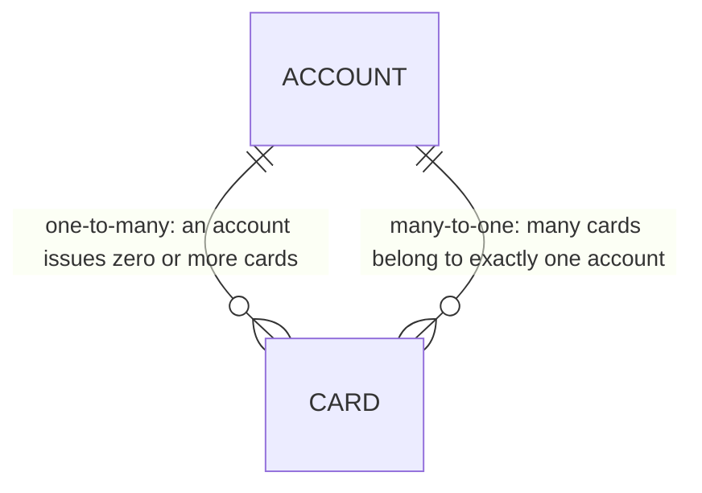
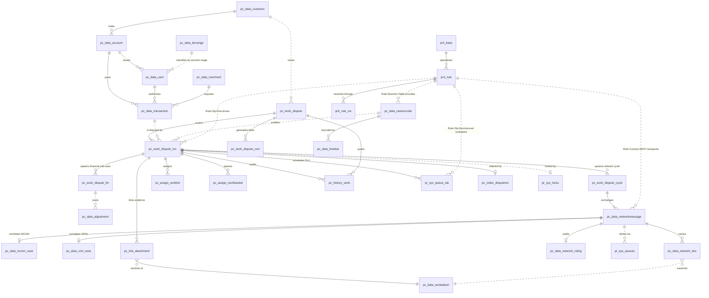

# Pega Smart Dispute — "Lite" AS-IS Database Schema & ERD

**Scope:** the existing (as-is) Pega OOTB Smart Dispute physical data model for the card/e-commerce dispute system, including the tables through which it integrates with **VROL (Visa Resolve Online / VCR)** and **MCOM (Mastercom / Mastercard MDR)**.

**Companion document:** [`dispute-claims-resolution-architecture.md`](./dispute-claims-resolution-architecture.md) — the target-state DDD/microservices architecture. This document is the *source* side of that migration; §2.4 of the architecture document maps these Pega classes to target aggregates, and §8 below reproduces that mapping at table granularity.

---

## Table of contents

0. [**Naming conventions — read this first**](#0-naming-conventions--read-this-first)
1. [Provenance & how to read this](#1-provenance--how-to-read-this)
2. [Pega's physical storage model in 90 seconds](#2-pegas-physical-storage-model-in-90-seconds)
3. [Schema partitions and table inventory](#3-schema-partitions-and-table-inventory)
4. [Mermaid ERD notation — legend & conventions](#4-mermaid-erd-notation--legend--conventions)
5. [ERD-0 — Master overview (entities only)](#5-erd-0--master-overview-entities-only)
6. [ERD-1 — Dispute case core & party/transaction reference](#6-erd-1--dispute-case-core--partytransaction-reference)
7. [ERD-2 — Network integration: MCOM & VROL](#7-erd-2--network-integration-mcom--vrol)
8. [ERD-3 — Pega platform plumbing & PegaRULES](#8-erd-3--pega-platform-plumbing--pegarules)
9. [Table dictionary](#9-table-dictionary)
10. [Integration commentary — how MCOM and VROL actually land in these tables](#10-integration-commentary--how-mcom-and-vrol-actually-land-in-these-tables)
11. [Schema-level coupling hot-spots](#11-schema-level-coupling-hot-spots)
12. [Table → target bounded context mapping](#12-table--target-bounded-context-mapping)

**Diagram source files:** every ERD in this document is also available standalone under [`diagrams/ERD/`](../diagrams/ERD/) — see §4.8.

---

## 0. Naming conventions — read this first

> **Domain vocabulary** — scheme vs platform vs programme, MCOM/VROL/VCR/MDR, and the terms that mean two different things by scheme — is in [`dispute-claims-resolution-architecture.md` §0](./dispute-claims-resolution-architecture.md#0-terminology--read-this-first). This section covers **Pega's** naming only.

Pega's naming is rigid and load-bearing. **You can infer what a table holds, and what a column is for, from its prefix alone.** Nothing else in this document will make sense until this section does.

### 0.1 Table prefixes

| Prefix | Stands for | Contains | Who writes it | Examples in this doc |
|---|---|---|---|---|
| **`pc_`** | **P**ega **c**ustomer / **c**oncrete class table | Application-level instances — work objects, data objects, assignments, history, links. **This is where dispute data lives.** | Your application | `pc_work_dispute`, `pc_data_networkmessage`, `pc_assign_worklist` |
| **`pr_`** | **P**ega **r**untime / platform | Platform-owned system tables — locks, queues, agent schedules, admin config. Domain-meaningless but operationally critical. | Pega Platform | `pr_sys_locks`, `pr_sys_queues`, `pr_sys_queue_sla`, `pr_data_admin_table` |
| **`pr4_`** | **P**ega **r**ules, schema generation **4** | **PegaRULES** — the rules themselves: flows, decision tables, SLAs, connectors. Usually a *physically separate schema*, sometimes a separate database. | Pega Platform | `pr4_base`, `pr4_rule`, `pr4_rule_vw` |
| `pega_` / `pegadata.` / `pegarules.` | schema qualifier | Not a table prefix — the **schema name** you may see qualifying the above | DBA | `pegadata.pc_work_dispute` |

**The `pc_` vs `pr_` distinction is the single most useful one:** `pc_` tables migrate (they hold your business data), `pr_` and `pr4_` tables mostly do **not** (they hold Pega's own machinery — see §12, "eliminated").

### 0.2 The second segment — what kind of `pc_` table it is

`pc_` tables carry a second segment naming the Pega base class:

| Pattern | Pega base class | Meaning | Example |
|---|---|---|---|
| `pc_work_*` | `Work-` | A **case** — has a lifecycle, stages, a status, an ID, and can be assigned | `pc_work_dispute_txn` |
| `pc_data_*` | `Data-` | A **data instance** — reference or supporting data, no lifecycle | `pc_data_transaction` |
| `pc_assign_*` | `Assign-` | An **open assignment** — a task waiting for a human. Deleted when completed | `pc_assign_worklist` |
| `pc_history_*` | `History-` | **Append-only audit** of a case | `pc_history_work` |
| `pc_link_*` | `Link-` | A **many-to-many association** between two instances | `pc_link_attachment` |
| `pc_index_*` | `Index-` | A **Declare Index** — embedded page-list rows flattened into real rows so SQL can query them | `pc_index_disputetxn` |
| `pr_sys_*` | `System-` | Platform system queue / lock / schedule | `pr_sys_queue_sla` |

So `pc_work_dispute_cycle` decodes, without opening it, as: *application table · case (has a lifecycle) · dispute domain · network cycle grain.*

### 0.3 Column prefixes — `px`, `py`, `pz`

Every Pega property carries a two-letter prefix that states **who owns it and whether you may change it**. This is not cosmetic — it determines upgrade safety.

| Prefix | Owner | Mutability | Meaning | Examples |
|---|---|---|---|---|
| **`px`** | Pega Platform | **Read-only.** Set by the engine; never write these | System-maintained metadata: audit stamps, class, keys, case containment | `pxObjClass`, `pxCreateDateTime`, `pxCreateOpName`, `pxUpdateDateTime`, `pxCoverInsKey`, `pxCurrentStage`, `pxUrgencyWork`, `pxRefObjectInsKey` |
| **`py`** | Pega + application | **Read/write.** Standard properties you set, and where **your custom fields go** | Business data: status, IDs, amounts, reason codes | `pyID`, `pyStatusWork`, `pyReasonCode`, `pyDisputedAmount`, `pyCardholderStatement` |
| **`pz`** | Pega Platform | **Read-only, internal.** Do not touch, do not rely on the format | Engine internals — keys and the serialised blob | `pzInsKey`, `pzPvStream`, `pzInsKey` |
| *(no prefix)* | Application | Read/write | Properties created by your developers without a prefix convention | `DisputeReferenceNumber` |

**Practical consequences:**

- A column starting `px` that looks wrong in the data **cannot be fixed with an UPDATE** — it is engine-maintained and will be recomputed.
- `pz` columns are **not a stable contract**. `pzPvStream`'s internal format changes between Pega versions; you cannot parse it outside a Pega JVM. This is the crux of the migration difficulty (§2.1).
- Custom dispute fields should be `py`-prefixed. If you find un-prefixed columns on `pc_work_dispute_txn`, they are local customisations — flag them, they will not be in any Pega documentation.

### 0.4 Naming used in *this* document

| Convention | Applied as |
|---|---|
| Table names | lower_snake_case with the real Pega prefix — `pc_work_dispute_txn` |
| Column names | Pega camelCase with prefix preserved — `pySchemeNetwork`, not `scheme_network` |
| Class names | Pega dash notation — `PegaCS-Work-Dispute-Txn` |
| Key markers in ERDs | `PK` / `FK` / `UK` — where `FK` means a **logical** reference, not a database constraint (§2.2) |
| Data types | Generic SQL families (`varchar`, `numeric`, `timestamp`, `smallint`, `clob`, `blob`) — actual DDL differs by RDBMS |

### 0.5 Quick decoder

```
pc_work_dispute_txn . pySchemeNetwork
│  │    │       │      │└─ business property name
│  │    │       │      └── py = application-writable
│  │    │       └───────── grain: per transaction
│  │    └───────────────── domain: dispute
│  └────────────────────── Work-  → it is a CASE (lifecycle, status, assignable)
└───────────────────────── pc_    → application data, PegaDATA schema, MIGRATES

pr4_rule . pzPVStream
│    │      └── pz = engine-internal blob → the rule logic itself
│    └───────── concrete rule instances (flows, decision tables, SLAs, connectors)
└────────────── pr4_ → PegaRULES schema, separate from data, DOES NOT MIGRATE as-is
```

---

## 1. Provenance & how to read this

**Read this first — it matters for how much you trust the detail below.**

This is a **reconstructed, representative** model, not a DDL dump from a live instance. It is assembled from:

- Pega Platform's **fixed, documented** physical tables (`pc_work*`, `pc_assign_*`, `pc_history_work`, `pc_link_attachment`, `pr4_*`, `pr_sys_*`) — these column names are stable across Pega 7/8/'23–'24 and can be relied on.
- The **Smart Dispute / PegaFS class model** (`PegaCS-Work-Dispute`, `PegaCS-Work-Dispute-Txn`, `PegaFS-Data-Transaction`, `PegaCS-Data-NetworkMessage`, …) — the classes are OOTB; the **exact physical table name they are mapped to is an implementation choice** made at install time, and the exposed-column set is almost always customised.
- The MCOM/VROL correlation attributes required by the two scheme programmes (MDR and VCR).

**Therefore:**

| Confidence | What |
|---|---|
| **High** | Pega platform tables and their `px*`/`py*`/`pz*` column names; the two-level `Dispute Claim` → `Dispute Transaction` case structure; the blob-plus-exposed-columns storage pattern. |
| **Medium** | Smart Dispute work/data table *names* (`pc_work_dispute`, `pc_data_networkmessage`, …). Yours may be prefixed with your application short-name, e.g. `pc_work_sd_dispute`. |
| **Indicative** | The exposed-column lists on dispute and network tables, and the split of `pc_data_mcom_case` / `pc_data_vrol_case`. Many installs keep these inside the `pzPvStream` blob rather than exposing them — see §11. |

> **Action to confirm against your instance:** run the table-mapping report below (§9, closing note) in Dev Studio. It replaces every "Medium/Indicative" row above with fact in about ten minutes.

**"Lite" means:** the ~35 tables that carry dispute meaning. A real PegaDATA schema has 400–700 tables and PegaRULES another 100+; the omitted ones are Pega infrastructure (`pr_perf_stats`, `pr_data_admin_*`, `pr_index_*`, decisioning, Pulse, DevOps) that carry no dispute domain semantics.

---

## 2. Pega's physical storage model in 90 seconds

Understanding three things makes the ERD readable — and explains most of the migration pain.

### 2.1 The blob (`pzPvStream`)

Every Pega object is serialised into a single BLOB column, `pzPvStream`. Columns like `pyStatusWork` are **"exposed" properties** — copies of blob values promoted into real columns so SQL can filter on them.

```
┌──────────────────────────────────────────────────────────────┐
│ pc_work_dispute_txn                                          │
├──────────────┬───────────────────────────────────────────────┤
│ pzInsKey     │ PEGACS-WORK-DISPUTE-TXN DTX-4819              │  ← real column
│ pyStatusWork │ Pending-Network                               │  ← exposed copy
│ pyReasonCode │ 4837                                          │  ← exposed copy
│ pzPvStream   │ <compressed XML/JSON: 400+ properties incl.   │  ← the truth
│              │  the full Mastercom payload, cycle history,   │
│              │  cardholder statement, embedded page lists>   │
└──────────────┴───────────────────────────────────────────────┘
```

**Consequence:** anything *not* exposed is invisible to SQL, to reporting, to CDC, and to any migration tool that isn't a Pega JVM. Exposing a column later requires a Pega bulk re-index over the whole table. This single fact drives most of the "database per service" decision (D7) in the target architecture.

### 2.2 `pzInsKey` — the universal primary key

Not a surrogate integer. It is a concatenation:

```
pzInsKey = UPPER(pxObjClass) || ' ' || <business key>
e.g.  "PEGACS-WORK-DISPUTE-TXN DTX-2026-0000481922"
      "PEGACS-DATA-NETWORKMESSAGE NM-88213-OUT-01"
```

All "foreign keys" in Pega are therefore **`varchar(255)` instance keys**, and — critically — **almost none of them are declared as database foreign-key constraints.** Referential integrity is enforced by the application layer, not the RDBMS. In the ERDs below this is why so many relationships are drawn *dashed* (non-identifying).

### 2.3 Class → table mapping, and how one table holds many "types"

Pega classes map to tables via **Data-Admin-DB-Table** records. A class hierarchy commonly shares one table, discriminated by `pxObjClass`:

```
pc_work_dispute_cycle  holds ALL of:
   PegaCS-Work-Dispute-Retrieval
   PegaCS-Work-Dispute-Chargeback
   PegaCS-Work-Dispute-Representment
   PegaCS-Work-Dispute-PreArb
   PegaCS-Work-Dispute-Arbitration
```

So an "entity" in the ERD below is a **table**, and one table may represent several case types. Where that happens it is called out in the entity's `pxObjClass` comment.

---

## 3. Schema partitions and table inventory

A Pega install has (at least) two physical schemas. Dispute data straddles both, which is itself a coupling problem.

| Schema | Purpose | Dispute-relevant tables |
|---|---|---|
| **PegaDATA** | Work objects, assignments, history, attachments, data instances | 27 tables (§3.1–§3.3) |
| **PegaRULES** | Rules — flows, decision tables, SLAs, Connect-REST definitions | 3 tables (§3.4) |
| **PegaLOG** *(optional)* | Perf/alert logs | not modelled |

### 3.1 Work (case) tables — 5

| # | Table | Pega class(es) | Grain |
|---|---|---|---|
| W1 | `pc_work_dispute` | `PegaCS-Work-Dispute` | 1 row per customer claim |
| W2 | `pc_work_dispute_txn` | `PegaCS-Work-Dispute-Txn` | 1 row per disputed transaction |
| W3 | `pc_work_dispute_cycle` | `-Retrieval`, `-Chargeback`, `-Representment`, `-PreArb`, `-Arbitration` | 1 row per network cycle instance |
| W4 | `pc_work_dispute_fin` | `-ProvisionalCredit`, `-WriteOff`, `-GoodFaith`, `-Recovery` | 1 row per financial sub-case |
| W5 | `pc_work_dispute_corr` | `PegaCS-Work-Correspondence` | 1 row per outbound letter/notice |

### 3.2 Domain data tables — 14

| # | Table | Pega class | Grain |
|---|---|---|---|
| D1 | `pc_data_customer` | `PegaFS-Data-Party-Customer` | 1 per cardholder |
| D2 | `pc_data_account` | `PegaFS-Data-Account` | 1 per card account |
| D3 | `pc_data_card` | `PegaFS-Data-Card` | 1 per plastic/token |
| D4 | `pc_data_transaction` | `PegaFS-Data-Transaction` | 1 per auth/settlement record |
| D5 | `pc_data_merchant` | `PegaFS-Data-Merchant` | 1 per MID |
| D6 | `pc_data_binrange` | `PegaFS-Data-BINRange` | 1 per account range, effective-dated |
| D7 | `pc_data_adjustment` | `PegaCS-Data-Adjustment` | 1 per GL posting instruction |
| D8 | `pc_data_networkmessage` | `PegaCS-Data-NetworkMessage` | 1 per outbound/inbound scheme message |
| D9 | `pc_data_mcom_case` | `PegaCS-Data-NetworkMessage-MCOM` | 1 per Mastercom case correlation |
| D10 | `pc_data_vrol_case` | `PegaCS-Data-NetworkMessage-VROL` | 1 per VROL case correlation |
| D11 | `pc_data_network_doc` | `PegaCS-Data-NetworkDocument` | 1 per document transmitted to a scheme |
| D12 | `pc_data_network_ruling` | `PegaCS-Data-NetworkRuling` | 1 per arbitration/compliance ruling |
| D13 | `pc_data_reasoncode` | `PegaCS-Data-ReasonCode` | 1 per scheme reason code / condition, effective-dated |
| D14 | `pc_data_timebar` | `PegaCS-Data-TimeBar` | 1 per (reason code × cycle), effective-dated |

### 3.3 Pega platform plumbing — 8

| # | Table | Pega class | Grain |
|---|---|---|---|
| P1 | `pc_assign_worklist` | `Assign-Worklist` | 1 per open assignment held by an operator |
| P2 | `pc_assign_workbasket` | `Assign-WorkBasket` | 1 per open assignment in a queue |
| P3 | `pc_history_work` | `History-Work-*` | 1 per audited case event |
| P4 | `pc_link_attachment` | `Link-Attachment` | 1 per case↔document link |
| P5 | `pc_data_workattach` | `Data-WorkAttach-File` | 1 per stored document body |
| P6 | `pr_sys_queue_sla` | `System-Queue-ServiceLevel` | 1 per pending SLA/tickler |
| P7 | `pc_index_disputetxn` | `Index-DisputeTxn` (Declare Index) | 1 per exposed embedded row — the dedup index |
| P8 | `pr_sys_locks` | `System-Locks` | 1 per held pessimistic lock |
| P9 | `pr_sys_queues` | `System-Queue-DefaultEntry` | 1 per queued/failed async item (Connect-REST retries) |

### 3.4 PegaRULES — 3

| # | Table | Holds |
|---|---|---|
| R1 | `pr4_base` | Rule base records — ruleset, version, availability, circumstance |
| R2 | `pr4_rule` | Concrete rule instances for most rule types, discriminated by `pxObjClass`: `Rule-Obj-Flow`, `Rule-Decision-Table`, `Rule-Obj-ServiceLevel`, `Rule-Connect-REST`, `Rule-Declare-Expression` |
| R3 | `pr4_rule_vw` | The rules-resolution view Pega queries at runtime |

> **Important accuracy note:** Pega does **not** give each rule type its own table. Only a handful (`pr4_rule_property`, `pr4_rule_message`, `pr4_rule_html`, `pr4_rule_java`, `pr4_rule_sysgen`) are broken out. Decision tables, flows, SLAs and Connect-REST rules all live in **`pr4_rule`**, with their logic inside `pzPVStream`. That is the technical reason a Mastercard reason-code change is a *rule instance* change requiring a ruleset version, branch, merge and deploy — rather than a data update. See §11.

---

## 4. Mermaid ERD notation — legend & conventions

Everything below applies to Mermaid's `erDiagram` type. Read this before the diagrams.

### 4.1 Anatomy of a relationship line

```
        ┌── left cardinality (describes ENTITY_A)
        │   ┌── line style
        │   │  ┌── right cardinality (describes ENTITY_B)
        │   │  │
ENTITY_A ||--o{ ENTITY_B : "label"
                            └── relationship label (mandatory in Mermaid)
```

**Reading rule:** the marker *nearest* an entity states how many of **that** entity participate. So `A ||--o{ B` reads:

- left `||` → **exactly one** `A`
- right `o{` → **zero or more** `B`
- i.e. *"one A has zero or more B; each B belongs to exactly one A."*

### 4.2 Cardinality markers

| Left form | Right form | Meaning | Crow's-foot |
|---|---|---|---|
| `\|o` | `o\|` | **Zero or one** (optional, at most one) | ○─ |
| `\|\|` | `\|\|` | **Exactly one** (mandatory, exactly one) | ─┼─ |
| `}o` | `o{` | **Zero or more** (optional many) | ○─< |
| `}\|` | `\|{` | **One or more** (mandatory many) | ─┼< |

Mnemonic: `o` = *optional / zero*, `|` = *one*, `{` / `}` = *many* (the crow's foot). The braces always point **away** from the entity they describe.

### 4.3 Line style — identifying vs non-identifying

| Syntax | Name | Meaning | Used in this document for |
|---|---|---|---|
| `--` | **Identifying** (solid) | The child cannot exist without the parent; the parent's key is part of the child's identity | True Pega case containment (`pxCoverInsKey`) and enforced parent/child links |
| `..` | **Non-identifying** (dashed) | The child can exist independently; the reference is a plain attribute | Pega's **unenforced** `varchar` instance-key references, runtime rule bindings, and cross-schema links |

Because Pega declares almost no database FK constraints (§2.2), **dashed lines are the honest default** for most references. Solid lines are reserved for the case-containment hierarchy, which Pega *does* enforce in the application layer via `pxCoverInsKey` / `pxCoveredCount`.

### 4.4 The eight combinations you will actually see

| Syntax | Reads as | Example in this schema |
|---|---|---|
| `A \|\|--\|\| B` | one-to-one, both mandatory | — (rare; Pega prefers optional) |
| `A \|\|--o\| B` | one to zero-or-one | `pc_work_dispute_txn` → `pc_index_disputetxn` |
| `A \|\|--o{ B` | **one-to-many** (the workhorse) | `pc_work_dispute_txn` → `pc_work_dispute_cycle` |
| `A \|\|--\|{ B` | one to **one-or-more** (child mandatory) | `pc_work_dispute` → `pc_work_dispute_txn` |
| `A }o--\|\| B` | **many-to-one** | `pc_data_card` → `pc_data_account` |
| `A }\|--\|\| B` | one-or-more to exactly one | `pc_data_networkmessage` → `pc_work_dispute_cycle` |
| `A }o--o{ B` | many-to-many, both optional | resolved via link tables in this schema |
| `A }\|--\|{ B` | many-to-many, both mandatory | — |

### 4.5 Direction matters — one-to-many vs many-to-one

`A ||--o{ B` and `B }o--|| A` describe the **same** constraint. The difference is only which entity you name first, and therefore how the sentence reads:



Convention used in this document: **parent first, `||--o{` form**, except where the child-side obligation is the point being made.

### 4.6 Attribute block syntax

```
ENTITY_NAME {
    varchar   pzInsKey      PK "comment shown on hover/print"
    varchar   pyAccountID   FK "reference, NOT a DB constraint"
    varchar   pyID          UK "business key"
    numeric   pyAmount
    timestamp pyCreateDate
    blob      pzPvStream       "the property blob"
}
```

| Marker | Meaning |
|---|---|
| `PK` | Primary key |
| `FK` | Foreign key (in this document: a *logical* reference — see §2.2) |
| `UK` | Unique key / alternate business key |

Types are kept to generic SQL families (`varchar`, `numeric`, `timestamp`, `smallint`, `clob`, `blob`) because Pega's DDL differs by RDBMS — Oracle `VARCHAR2`/`CLOB`, PostgreSQL `text`/`bytea`, SQL Server `nvarchar`/`varbinary`.

### 4.7 Colour / grouping convention

Mermaid `erDiagram` does **not** support `classDef` styling — there is no way to colour entities. Grouping in the diagrams below is therefore carried entirely by the **table-name prefix**, which is why [§0](#0-naming-conventions--read-this-first) comes first. At a glance in any ERD:

| Prefix | Partition | Migrates? |
|---|---|---|
| `pc_work_*` | Work objects (cases) | Yes — core business data |
| `pc_data_*` | Data instances | Yes (or re-sourced from upstream) |
| `pc_assign_*` | Assignments | No — transient, drained in place |
| `pc_index_*` | Declare-index (flattened embedded rows) | Rebuilt as a real constraint |
| `pc_history_*`, `pc_link_*` | Audit & attachment linkage | Yes — regulatory retention |
| `pr_sys_*` | Platform system tables | No — Pega machinery |
| `pr4_*` | PegaRULES | Re-authored, not migrated |

### 4.8 Diagram source files

Each ERD below is also stored standalone for reuse in draw.io, Confluence or mermaid.live:

| § | Diagram | Source file |
|---|---|---|
| §5 | ERD-0 — Master overview | [`diagrams/ERD/01-pega-lite-erd-master.mmd`](../diagrams/ERD/01-pega-lite-erd-master.mmd) |
| §6 | ERD-1 — Case core & reference data | [`diagrams/ERD/02-pega-lite-erd-case-core.mmd`](../diagrams/ERD/02-pega-lite-erd-case-core.mmd) |
| §7 | ERD-2 — Network integration (MCOM & VROL) | [`diagrams/ERD/03-pega-lite-erd-network-mcom-vrol.mmd`](../diagrams/ERD/03-pega-lite-erd-network-mcom-vrol.mmd) |
| §8 | ERD-3 — Platform plumbing & PegaRULES | [`diagrams/ERD/04-pega-lite-erd-platform-rules.mmd`](../diagrams/ERD/04-pega-lite-erd-platform-rules.mmd) |

The 18 target-architecture diagrams live separately under [`diagrams/architecture/`](../diagrams/architecture/).

---

## 5. ERD-0 — Master overview (entities only)

The whole dispute schema on one page, without attributes. Use this to navigate; use §6–§8 for detail.



**Three things to notice on this page:**

1. **`pr4_rule` reaches into four different runtime tables with dashed lines.** Rules are not data — they are versioned, deployable artifacts that *drive* the case, the timers, the network calls and the reason codes. That is the Pega coupling in one picture.
2. **Everything hangs off `pc_work_dispute_txn`.** It is simultaneously the case, the network anchor, the financial anchor, the assignment anchor and the SLA anchor. It is the monolith's centre of gravity — and why the target architecture splits it into five bounded contexts.
3. **The only solid (identifying) lines are case containment and a handful of link tables.** Everything else is a `varchar` reference with no database-level integrity.

---

## 6. ERD-1 — Dispute case core & party/transaction reference

```mermaid
erDiagram
    pc_data_customer {
        varchar   pzInsKey            PK "PEGAFS-DATA-PARTY-CUSTOMER <id>"
        varchar   pxObjClass             "PegaFS-Data-Party-Customer"
        varchar   pyCustomerID        UK "CIF customer number"
        varchar   pyFullName
        varchar   pyEmailAddress
        varchar   pyPhoneNumber
        varchar   pySegment              "MASS / AFFLUENT / PRIVATE"
        varchar   pyPreferredLanguage
        timestamp pxCreateDateTime
        blob      pzPvStream
    }

    pc_data_account {
        varchar   pzInsKey            PK
        varchar   pxObjClass             "PegaFS-Data-Account"
        varchar   pyAccountID         UK
        varchar   pyCustomerID        FK "-> pc_data_customer (unenforced)"
        varchar   pyProductCode          "CREDIT / DEBIT / PREPAID"
        varchar   pyAccountStatus        "OPEN / BLOCKED / CLOSED"
        varchar   pyCurrencyCode         "ISO 4217"
        timestamp pyOpenDate
        blob      pzPvStream
    }

    pc_data_card {
        varchar   pzInsKey            PK
        varchar   pxObjClass             "PegaFS-Data-Card"
        varchar   pyCardID            UK "internal card reference"
        varchar   pyAccountID         FK "-> pc_data_account"
        varchar   pyPANToken             "vault token - NEVER the PAN"
        varchar   pyMaskedPAN            "4111 xxxx xxxx 1234"
        varchar   pyBIN                  "6 or 8 digit account range"
        varchar   pyCardBrand            "MASTERCARD / VISA / co-badge"
        varchar   pyProductType          "WORLD / PLATINUM / STANDARD"
        varchar   pyCardStatus           "ACTIVE / BLOCKED / REISSUED"
        varchar   pyIssueCountry
        timestamp pyExpiryDate
        blob      pzPvStream
    }

    pc_data_binrange {
        varchar   pzInsKey            PK
        varchar   pxObjClass             "PegaFS-Data-BINRange"
        varchar   pyRangeLow          UK "low account range"
        varchar   pyRangeHigh            "high account range"
        varchar   pyCardBrand            "drives VROL vs MCOM routing"
        varchar   pyProductCode
        varchar   pyIssuerCountry
        varchar   pyCoBadgeBrand         "domestic scheme, if any"
        varchar   pyBINFileVersion       "weekly scheme file version"
        timestamp pyEffectiveFrom
        timestamp pyEffectiveTo
    }

    pc_data_merchant {
        varchar   pzInsKey            PK
        varchar   pxObjClass             "PegaFS-Data-Merchant"
        varchar   pyMerchantID        UK "MID"
        varchar   pyMerchantName
        varchar   pyMerchantDBAName      "descriptor as seen by cardholder"
        varchar   pyAcquirerID
        varchar   pyAcquirerBIN
        varchar   pyMCC                  "ISO 18245"
        varchar   pyCountryCode
    }

    pc_data_transaction {
        varchar   pzInsKey            PK
        varchar   pxObjClass             "PegaFS-Data-Transaction"
        varchar   pyTransactionID     UK
        varchar   pyAccountID         FK
        varchar   pyCardID            FK
        varchar   pyMerchantID        FK
        timestamp pyTransactionDate      "clock start for most time bars"
        timestamp pyPostingDate
        numeric   pyTransactionAmount
        varchar   pyCurrencyCode
        varchar   pyMCC
        varchar   pyARN                  "acquirer reference number"
        varchar   pySettlementNetwork    "AUTHORITATIVE for scheme routing"
        varchar   pyAcquirerBIN
        varchar   pyAuthCode
        varchar   pyPOSEntryMode         "ecom / chip / contactless"
        varchar   pyECommerceIndicator
        varchar   py3DSResult            "drives liability shift"
        blob      pzPvStream
    }

    pc_work_dispute {
        varchar   pzInsKey            PK "PEGACS-WORK-DISPUTE CLM-<n>"
        varchar   pxObjClass             "PegaCS-Work-Dispute"
        varchar   pyID                UK "CLM-2026-0000481922"
        varchar   pyStatusWork           "New / Open / Pending / Resolved-*"
        varchar   pxCurrentStage         "Capture / Validate / ... / Close"
        varchar   pyCustomerID        FK
        varchar   pyAccountID         FK
        varchar   pyIntakeChannel        "WEB / MOBILE / IVR / BRANCH / API"
        varchar   pyReasonGroup          "FRAUD / AUTH / PROCESSING / CONSUMER"
        clob      pyCardholderStatement  "mandatory for fraud groups"
        numeric   pyTotalDisputedAmount
        varchar   pyCurrencyCode
        varchar   pyDuplicateOfID        "set by dedup check"
        numeric   pxCoveredCount         "number of child txn cases"
        numeric   pxUrgencyWork
        varchar   pxCreateOpName
        timestamp pxCreateDateTime
        timestamp pxUpdateDateTime
        timestamp pyResolvedTimestamp
        varchar   pxLockHandle
        blob      pzPvStream
    }

    pc_work_dispute_txn {
        varchar   pzInsKey            PK "PEGACS-WORK-DISPUTE-TXN DTX-<n>"
        varchar   pxObjClass             "PegaCS-Work-Dispute-Txn"
        varchar   pyID                UK "DTX-2026-0000481922"
        varchar   pxCoverInsKey       FK "-> pc_work_dispute (case containment)"
        varchar   pyTransactionID     FK "-> pc_data_transaction"
        varchar   pyCardID            FK
        varchar   pyStatusWork
        varchar   pxCurrentStage         "the 9 OOTB stages"
        varchar   pxFlowName             "Rule-Obj-Flow currently executing"
        varchar   pyReasonCode        FK "-> pc_data_reasoncode (4837 / 13.1)"
        varchar   pySchemeNetwork        "MASTERCARD | VISA (routes to MCOM | VROL)"
        varchar   pySchemeBasis          "SETTLEMENT_NETWORK / ARN / BIN / MANUAL"
        varchar   pyRuleSetVersionUsed   "ruleset effective at pyTransactionDate"
        numeric   pyDisputedAmount
        varchar   pyCurrencyCode
        smallint  pyCycleCurrent         "1=CB 2=2nd pres 3=pre-arb 4=arb"
        varchar   pyChargebackRightFlag  "Y / N / UNRESOLVED"
        timestamp pyTimeBarDate          "scheme deadline"
        timestamp pyRegEProvCreditDue    "Reg E 10 business days"
        timestamp pyRegEFinalDue         "Reg E 45 / 90 days"
        varchar   pyOutcome              "UPHELD / DENIED / WRITTEN_OFF"
        varchar   pyLiability            "ISSUER / ACQUIRER / MERCHANT"
        numeric   pxUrgencyWork
        timestamp pxCreateDateTime
        timestamp pxUpdateDateTime
        timestamp pyResolvedTimestamp
        varchar   pxLockHandle
        blob      pzPvStream             "holds full cycle + network history"
    }

    pc_work_dispute_cycle {
        varchar   pzInsKey            PK
        varchar   pxObjClass             "-Retrieval|-Chargeback|-Representment|-PreArb|-Arbitration"
        varchar   pyID                UK
        varchar   pxCoverInsKey       FK "-> pc_work_dispute_txn"
        varchar   pyCycleType            "canonical cycle name"
        smallint  pyCycleNumber
        varchar   pyReasonCode        FK
        numeric   pyCycleAmount          "may be partial"
        varchar   pyCurrencyCode
        timestamp pyFiledDate
        timestamp pyResponseDueDate
        varchar   pyNetworkStatus        "FILED / ACKED / RESPONDED / RULED"
        varchar   pyStatusWork
        blob      pzPvStream
    }

    pc_work_dispute_fin {
        varchar   pzInsKey            PK
        varchar   pxObjClass             "-ProvisionalCredit|-WriteOff|-GoodFaith|-Recovery"
        varchar   pyID                UK
        varchar   pxCoverInsKey       FK "-> pc_work_dispute_txn"
        varchar   pyPostingType          "PROV_CREDIT / PC_REVERSAL / FINAL / WRITE_OFF"
        numeric   pyAmount
        varchar   pyCurrencyCode
        varchar   pyStatusWork
        varchar   pyApprovedByOpID       "four-eyes: approver 1"
        varchar   pySecondApproverOpID   "four-eyes: approver 2 above threshold"
        timestamp pyApprovedDateTime
        blob      pzPvStream
    }

    pc_work_dispute_corr {
        varchar   pzInsKey            PK
        varchar   pxObjClass             "PegaCS-Work-Correspondence"
        varchar   pyID                UK
        varchar   pxCoverInsKey       FK "-> pc_work_dispute"
        varchar   pyCorrespondenceType   "ACK / PROV_CREDIT_NOTICE / RESOLUTION / REG_E"
        varchar   pyTemplateName      FK "-> pr4_rule (Rule-Obj-Corr)"
        varchar   pyChannel              "EMAIL / LETTER / PUSH / SMS"
        timestamp pySentDateTime
        varchar   pyStatusWork
    }

    pc_data_adjustment {
        varchar   pzInsKey            PK
        varchar   pxObjClass             "PegaCS-Data-Adjustment"
        varchar   pyAdjustmentID      UK
        varchar   pyWorkIDRef         FK "-> pc_work_dispute_fin.pyID"
        varchar   pyAdjustmentType       "PROV_CREDIT / REVERSAL / FINAL / FEE"
        numeric   pyAmount
        varchar   pyCurrencyCode
        varchar   pyDebitCreditFlag      "D / C"
        varchar   pyGLAccount
        varchar   pyCoreBankingRef       "posting reference returned by ledger"
        varchar   pyReversalOfID         "self-reference for reversals"
        varchar   pyPostingStatus        "REQUESTED / POSTED / FAILED"
        timestamp pyPostingDate
    }

    pc_data_reasoncode {
        varchar   pzInsKey            PK
        varchar   pxObjClass             "PegaCS-Data-ReasonCode"
        varchar   pyReasonCodeID      UK
        varchar   pyNetwork              "MASTERCARD / VISA"
        varchar   pyCode                 "MC 4837 | Visa 13.1"
        varchar   pyDescription
        varchar   pyReasonGroup          "FRAUD / AUTH / PROCESSING / CONSUMER"
        varchar   pyRuleSetVersion       "MDR-2026.1 / VCR-2026.1"
        varchar   pyEvidenceRequired     "delimited requirement list"
        varchar   pyAllowedCycles
        timestamp pyEffectiveFrom
        timestamp pyEffectiveTo
    }

    pc_data_timebar {
        varchar   pzInsKey            PK
        varchar   pxObjClass             "PegaCS-Data-TimeBar"
        varchar   pyTimeBarID         UK
        varchar   pyReasonCodeID      FK "-> pc_data_reasoncode"
        varchar   pyNetwork
        varchar   pyCycleType
        smallint  pyDays                 "30 / 75 / 120 ..."
        varchar   pyClockStartEvent      "TXN_DATE / EXPECTED_DELIVERY / SETTLEMENT"
        timestamp pyEffectiveFrom
        timestamp pyEffectiveTo
    }

    pc_data_customer     ||--o{ pc_data_account       : "holds"
    pc_data_account      ||--o{ pc_data_card          : "issues"
    pc_data_binrange     ||..o{ pc_data_card          : "classifies"
    pc_data_account      ||--o{ pc_data_transaction   : "posts"
    pc_data_card         ||--o{ pc_data_transaction   : "authorises"
    pc_data_merchant     ||--o{ pc_data_transaction   : "acquires"

    pc_data_customer     ||..o{ pc_work_dispute       : "raises"
    pc_data_account      ||..o{ pc_work_dispute       : "is disputed on"
    pc_work_dispute      ||--|{ pc_work_dispute_txn   : "covers 1..n"
    pc_data_transaction  ||..o{ pc_work_dispute_txn   : "is disputed by"
    pc_data_card         ||..o{ pc_work_dispute_txn   : "identifies scheme for"

    pc_work_dispute_txn  ||--o{ pc_work_dispute_cycle : "spawns"
    pc_work_dispute_txn  ||--o{ pc_work_dispute_fin   : "spawns"
    pc_work_dispute      ||--o{ pc_work_dispute_corr  : "generates"
    pc_work_dispute_fin  ||..o{ pc_data_adjustment    : "posts"

    pc_data_reasoncode   ||..o{ pc_work_dispute_txn   : "justifies"
    pc_data_reasoncode   ||..o{ pc_work_dispute_cycle : "filed under"
    pc_data_reasoncode   ||--o{ pc_data_timebar       : "bounded by"
```



### 6.1 Key invariants the schema does *not* enforce

These are enforced in Pega flows/activities, **not** by constraints — every one is a migration risk and a data-quality audit item.

| Invariant | Where it lives today | Failure mode if violated |
|---|---|---|
| A transaction may have at most one **open** dispute | `pc_index_disputetxn` + a dedup activity | Double provisional credit; duplicate scheme filing |
| `pySchemeNetwork` must match `pc_data_transaction.pySettlementNetwork` | Decision table at intake | Filing on the wrong rail; time bar burns |
| `pyReasonCode` must be valid for `pySchemeNetwork` **at `pyTransactionDate`** | Effective-dated decision table | Scheme rejects the filing |
| `pyCycleCurrent` must advance monotonically | Flow guardrails | Out-of-sequence filing, scheme rejection |
| A PC reversal cannot exceed the PC amount | Activity validation | Ledger imbalance |
| `pxCoveredCount` must equal the count of child txn cases | Pega case management | Orphaned children, wrong claim status |

---

## 7. ERD-2 — Network integration: MCOM & VROL

This is the section that matters most for the VROL/MCOM question. The pattern in OOTB Pega is: **one generic message table (`pc_data_networkmessage`) plus a scheme-specific correlation table per network.**

```mermaid
erDiagram
    pc_work_dispute_cycle {
        varchar   pzInsKey            PK
        varchar   pxObjClass             "cycle case types"
        varchar   pyID                UK
        varchar   pxCoverInsKey       FK "-> pc_work_dispute_txn"
        varchar   pyCycleType
        smallint  pyCycleNumber
        varchar   pyNetworkStatus
        timestamp pyFiledDate
        timestamp pyResponseDueDate
    }

    pc_data_networkmessage {
        varchar   pzInsKey            PK "PEGACS-DATA-NETWORKMESSAGE NM-<n>"
        varchar   pxObjClass             "PegaCS-Data-NetworkMessage"
        varchar   pyNetworkMessageID  UK
        varchar   pyCycleInsKey       FK "-> pc_work_dispute_cycle"
        varchar   pyWorkIDRef         FK "-> pc_work_dispute_txn.pyID (denormalised)"
        varchar   pyNetwork              "MASTERCARD | VISA (routes to MCOM | VROL)"
        varchar   pyDirection            "OUTBOUND / INBOUND"
        varchar   pyMessageType          "CHARGEBACK / SECOND_PRES / PRE_ARB / ARB / RETRIEVAL / RULING"
        varchar   pyCorrelationID        "scheme-assigned correlation"
        varchar   pyIdempotencyKey    UK "guards double submission"
        varchar   pyConnectRuleName   FK "-> pr4_rule (Rule-Connect-REST/SOAP)"
        varchar   pyEndpointURL
        clob      pyRequestPayload       "raw scheme wire payload"
        clob      pyResponsePayload      "raw scheme wire response"
        varchar   pyHTTPStatus
        varchar   pyErrorCode
        smallint  pyRetryCount
        varchar   pyMessageStatus        "QUEUED / SENT / ACKED / FAILED / DLQ"
        timestamp pySentDateTime
        timestamp pyAckDateTime
        blob      pzPvStream
    }

    pc_data_mcom_case {
        varchar   pzInsKey            PK
        varchar   pxObjClass             "PegaCS-Data-NetworkMessage-MCOM"
        varchar   pyMcomCaseID        UK "Mastercom Case ID"
        varchar   pyNetworkMessageID  FK "-> pc_data_networkmessage"
        varchar   pyMcomClaimID          "Mastercom Claim ID"
        varchar   pyMessageReasonCode    "MDR: 4837 4853 4855 4863 4808"
        varchar   pyChargebackRefNum     "Mastercom chargeback reference"
        varchar   pyMcomCycle            "FIRST_CB / SECOND_PRES / PRE_ARB / ARB"
        varchar   pyMcomQueueName        "Mastercom work queue"
        varchar   pyDocumentIndicator    "Y if doc set attached"
        varchar   pyMcomStatus           "scheme-side status"
        numeric   pyMcomFeeAmount        "filing / arbitration fee"
        varchar   pyMcomFeeCurrency
        timestamp pyMcomFilingDate
        timestamp pyMcomDueDate          "scheme response deadline"
        varchar   pyBulkFileName         "when submitted via SFTP bulk"
    }

    pc_data_vrol_case {
        varchar   pzInsKey            PK
        varchar   pxObjClass             "PegaCS-Data-NetworkMessage-VROL"
        varchar   pyVrolCaseID        UK "VROL Case ID"
        varchar   pyNetworkMessageID  FK "-> pc_data_networkmessage"
        varchar   pyVisaClaimID          "VROL Claim ID"
        varchar   pyDisputeCondition     "VCR: 10.4 11.3 12.5 13.1 13.7"
        varchar   pyWorkflowType         "ALLOCATION / COLLABORATION - no MC analogue"
        varchar   pyVrolCycle            "DISPUTE / DISPUTE_RESPONSE / PRE_ARB / ARB"
        varchar   pyVrolQueueName
        varchar   pyCE3Indicator         "Compelling Evidence 3.0 present"
        varchar   pyOrderInsightRef      "Visa Order Insight enquiry ref"
        varchar   pyRDRIndicator         "Rapid Dispute Resolution deflection"
        varchar   pyVrolStatus
        numeric   pyVrolFeeAmount
        varchar   pyVrolFeeCurrency
        timestamp pyVrolFilingDate
        timestamp pyResponseDueDate
        varchar   pyBulkFileName
    }

    pc_data_network_doc {
        varchar   pzInsKey            PK
        varchar   pxObjClass             "PegaCS-Data-NetworkDocument"
        varchar   pyNetworkDocID      UK
        varchar   pyNetworkMessageID  FK "-> pc_data_networkmessage"
        varchar   pyAttachDataKey     FK "-> pc_data_workattach (document body)"
        varchar   pyDocType              "CARDHOLDER_LETTER / RECEIPT / TAV / CE3_BUNDLE"
        varchar   pySchemeDocRef         "Mastercom docId / VROL attachmentId"
        smallint  pyPageCount
        numeric   pyFileSizeBytes
        varchar   pyMimeType
        varchar   pyRedactedFlag         "PAN/PII redaction applied"
        timestamp pyTransmittedDateTime
        varchar   pyTransmitStatus
    }

    pc_data_network_ruling {
        varchar   pzInsKey            PK
        varchar   pxObjClass             "PegaCS-Data-NetworkRuling"
        varchar   pyRulingID          UK
        varchar   pyNetworkMessageID  FK "-> pc_data_networkmessage"
        varchar   pyNetwork
        varchar   pyRulingOutcome        "ISSUER_FAVOUR / ACQUIRER_FAVOUR / SPLIT"
        varchar   pyLiableParty          "ISSUER / ACQUIRER"
        numeric   pyRulingAmount
        numeric   pyFeeAmount            "arbitration / technical fee"
        varchar   pyCurrencyCode
        varchar   pyRulingReasonText
        timestamp pyRulingDate
    }

    pc_data_binrange {
        varchar   pzInsKey            PK
        varchar   pyRangeLow          UK
        varchar   pyRangeHigh
        varchar   pyCardBrand            "the routing decision input"
        varchar   pyCoBadgeBrand
        varchar   pyBINFileVersion
        timestamp pyEffectiveFrom
        timestamp pyEffectiveTo
    }

    pr_sys_queues {
        varchar   pzInsKey            PK
        varchar   pyClassName            "queued item class"
        varchar   pyQueueName            "Connect retry queue"
        varchar   pyItemStatus           "Scheduled / Broken-Process / Done"
        varchar   pyEntryRef          FK "-> pc_data_networkmessage.pzInsKey"
        smallint  pyAttempts
        clob      pyLastMessage          "last failure text"
        timestamp pyMinimumDateTimeForProcessing
    }

    pr4_rule {
        varchar   pzInsKey            PK
        varchar   pxObjClass             "Rule-Connect-REST / Rule-Connect-SOAP"
        varchar   pyRuleName          UK
        varchar   pyClassName
        varchar   pyRuleSet
        varchar   pyRuleSetVersion
        blob      pzPVStream             "endpoint, mapping, auth profile"
    }

    pc_data_workattach {
        varchar   pzInsKey            PK
        varchar   pxObjClass             "Data-WorkAttach-File"
        varchar   pyAttachName
        clob      pyAttachStream         "base64 document body"
        varchar   pyAttachExtension
        varchar   pyTopic
        timestamp pxCreateDateTime
    }

    pc_work_dispute_cycle   ||--|{ pc_data_networkmessage  : "exchanges 1..n messages"
    pc_data_networkmessage  ||--o| pc_data_mcom_case       : "correlates when network = MASTERCARD"
    pc_data_networkmessage  ||--o| pc_data_vrol_case       : "correlates when network = VISA"
    pc_data_networkmessage  ||--o{ pc_data_network_doc     : "carries evidence documents"
    pc_data_networkmessage  ||--o| pc_data_network_ruling  : "yields ruling"
    pc_data_network_doc     }o..|| pc_data_workattach      : "transmits stored body"
    pc_data_networkmessage  ||..o{ pr_sys_queues           : "retried via async queue"
    pr4_rule                ||..o{ pc_data_networkmessage  : "Rule-Connect-REST transports"
    pc_data_binrange        ||..o{ pc_data_networkmessage  : "brand determines target scheme"
```



### 7.1 Why two correlation tables and not one

| Dimension | `pc_data_mcom_case` | `pc_data_vrol_case` | Consequence for a single shared table |
|---|---|---|---|
| Programme | Mastercard Dispute Resolution (MDR) | Visa Claims Resolution (VCR) | — |
| Reason vocabulary | `pyMessageReasonCode` — 4 digits (4837, 4853…) | `pyDisputeCondition` — dotted (10.4, 13.1…) | Different domain, length, validation |
| Workflow split | none | `pyWorkflowType` = **ALLOCATION** vs **COLLABORATION** | **No Mastercard analogue.** A shared table needs a nullable column that is mandatory for one scheme and meaningless for the other |
| Cycles | First CB → 2nd Presentment → Pre-Arb → Arb | Dispute → Dispute Response → Pre-Arb → Arb | Names differ; count coincidentally matches |
| Deflection tooling | Ethoca alerts, Consumer Clarity | `pyOrderInsightRef`, `pyRDRIndicator`, `pyCE3Indicator` | Three Visa-only columns |
| Doc transport | Mastercom document API / bulk SFTP | VROL attachment API | Different `pySchemeDocRef` semantics |
| Fees | filing + arbitration fee | filing + arbitration + technical fee | Different fee taxonomies |

A single `pc_data_networkmessage` with 20 nullable scheme-specific columns is what many implementations end up with, and it is the source of the "add a column for the Visa release, regression-test Mastercard" problem. Splitting the correlation tables is the minimum honest normalisation — and it is the schema-level ancestor of the **`mcom-adapter` / `vrol-adapter`** split (D3) in the target architecture.

### 7.2 The scheme-routing path through the schema

```
pc_work_dispute_txn.pySchemeNetwork
        ▲
        │  set once at Validate stage, then never re-derived
        │
        ├── 1st precedence: pc_data_transaction.pySettlementNetwork   (authoritative)
        ├── 2nd precedence: pc_data_transaction.pyARN                 (scheme-encoded)
        └── 3rd precedence: pc_data_card.pyBIN
                                 └─ lookup pc_data_binrange
                                        WHERE pyRangeLow <= pyBIN <= pyRangeHigh
                                          AND pyEffectiveFrom <= pyTransactionDate < pyEffectiveTo
                                    → pyCardBrand  (+ pyCoBadgeBrand → ambiguous → manual queue)

then:  pySchemeNetwork = MASTERCARD → Rule-Connect-REST "MastercomAPI" → pc_data_mcom_case
       pySchemeNetwork = VISA       → Rule-Connect-REST "VROLAPI"      → pc_data_vrol_case
```

**Two schema-level weaknesses to note:**

1. `pySchemeBasis` (why this network was chosen) and `pyBINFileVersion` (which BIN file was used) are frequently **not exposed columns** in OOTB installs — they sit in the blob or nowhere. When a scheme compliance audit asks *"why was this filed on VROL under condition 13.1?"*, the answer must be reconstructed from Pega history rather than queried. Both are exposed in the model above deliberately.
2. `pc_data_binrange` is effective-dated in this model, but many installs load a **single current** BIN file with no `pyEffectiveFrom`/`pyEffectiveTo`. A 2027 dispute on a 2026 transaction then resolves against a 2027 account-range file — silently wrong for reissued/migrated ranges.

### 7.3 Message lifecycle across the tables

| Step | Table written | Key columns set |
|---|---|---|
| 1. Cycle case created | `pc_work_dispute_cycle` | `pyCycleType`, `pyCycleNumber`, `pyReasonCode` |
| 2. Message journalled **before** transmit | `pc_data_networkmessage` | `pyIdempotencyKey`, `pyRequestPayload`, `pyMessageStatus='QUEUED'` |
| 3. Documents packaged | `pc_data_network_doc` → `pc_data_workattach` | `pyRedactedFlag`, `pySchemeDocRef` |
| 4. Connect-REST fires | `pc_data_networkmessage` | `pySentDateTime`, `pyHTTPStatus`, `pyMessageStatus='SENT'` |
| 5. Scheme acknowledges | `pc_data_mcom_case` **or** `pc_data_vrol_case` | `pyMcomCaseID` / `pyVrolCaseID`, `pyMcomDueDate` / `pyResponseDueDate` |
| 6. Failure | `pr_sys_queues` | `pyItemStatus='Broken-Process'`, `pyAttempts`, `pyLastMessage` |
| 7. Inbound response | new `pc_data_networkmessage` row, `pyDirection='INBOUND'` | `pyCorrelationID` matched back to the outbound row |
| 8. Ruling | `pc_data_network_ruling` | `pyRulingOutcome`, `pyLiableParty`, `pyFeeAmount` |
| 9. Case advances | `pc_work_dispute_txn` | `pyCycleCurrent++`, `pxCurrentStage`, `pyOutcome` |

> **Idempotency gap to check in your instance:** `pyIdempotencyKey` is not an OOTB Smart Dispute column. Without a **unique index** on it, a Pega agent retry after a socket timeout can file the same chargeback twice on Mastercom — which the scheme accepts and then rejects as a duplicate, consuming a cycle. This is the single highest-value index to add to the as-is schema before migration.

---

## 8. ERD-3 — Pega platform plumbing & PegaRULES

```mermaid
erDiagram
    pc_work_dispute_txn {
        varchar   pzInsKey            PK
        varchar   pyID                UK
        varchar   pyStatusWork
        varchar   pxCurrentStage
        varchar   pxFlowName          FK "-> pr4_rule (Rule-Obj-Flow)"
        varchar   pxLockHandle        FK "-> pr_sys_locks"
    }

    pc_assign_worklist {
        varchar   pzInsKey            PK "ASSIGN-WORKLIST <handle>"
        varchar   pxObjClass             "Assign-Worklist"
        varchar   pxRefObjectInsKey   FK "-> pc_work_dispute_txn.pzInsKey"
        varchar   pxRefObjectKey         "denormalised work ID"
        varchar   pxRefObjectClass
        varchar   pxAssignedOperatorID   "the analyst holding it"
        varchar   pyAssignmentStatus     "New / Open / Pending"
        varchar   pxTaskLabel            "Review Evidence / Adjudicate"
        varchar   pxFlowName
        numeric   pxUrgencyAssign        "drives pull ordering"
        timestamp pxGoalTime
        timestamp pxDeadlineTime         "SLA deadline"
        timestamp pxCreateDateTime
    }

    pc_assign_workbasket {
        varchar   pzInsKey            PK
        varchar   pxObjClass             "Assign-WorkBasket"
        varchar   pxRefObjectInsKey   FK
        varchar   pxRefObjectKey
        varchar   pxAssignedOperatorID   "holds the WORKBASKET name"
        varchar   pyAssignmentStatus
        varchar   pxTaskLabel
        varchar   pxFlowName
        numeric   pxUrgencyAssign
        timestamp pxGoalTime
        timestamp pxDeadlineTime
        timestamp pxCreateDateTime
    }

    pc_history_work {
        varchar   pzInsKey            PK
        varchar   pxObjClass             "History-Work-Dispute-*"
        varchar   pxHistoryForReference FK "-> work object pzInsKey"
        numeric   pxInsHistoryID         "sequence within the case"
        varchar   pyPerformer            "operator ID"
        timestamp pyPerformDateTime
        varchar   pxHistoryClass
        varchar   pxHistoryDataType      "Assignment / Status / Flow / Field"
        varchar   pyMessageKey           "localised audit message key"
        clob      pyMemo                 "free-text rationale"
    }

    pc_link_attachment {
        varchar   pzInsKey            PK
        varchar   pxObjClass             "Link-Attachment"
        varchar   pxLinkedRefTo       FK "-> work object pzInsKey"
        varchar   pxAttachDataKey     FK "-> pc_data_workattach.pzInsKey"
        varchar   pyAttachName
        varchar   pyCategory             "Evidence / Correspondence / NetworkDoc"
        clob      pyNote
        varchar   pxCreateOperator
        timestamp pxCreateDateTime
    }

    pc_data_workattach {
        varchar   pzInsKey            PK
        varchar   pxObjClass             "Data-WorkAttach-File"
        varchar   pyAttachName
        clob      pyAttachStream         "base64 body - bloats the DB"
        varchar   pyAttachExtension
        varchar   pyTopic
        timestamp pxCreateDateTime
    }

    pr_sys_queue_sla {
        varchar   pzInsKey            PK
        varchar   pyObjClass             "System-Queue-ServiceLevel"
        varchar   pxRefObjectInsKey   FK "-> work object or assignment"
        varchar   pyServiceLevelName  FK "-> pr4_rule (Rule-Obj-ServiceLevel)"
        varchar   pyItemStatus           "Scheduled / Done / Broken"
        varchar   pyEscalationAction     "notify / raise urgency / route"
        timestamp pyMinimumDateTimeForProcessing "when the tickler fires"
        timestamp pxCreateDateTime
    }

    pc_index_disputetxn {
        varchar   pzInsKey            PK
        varchar   pxObjClass             "Index-DisputeTxn (Declare Index)"
        varchar   pxInsIndexedKey     FK "-> pc_work_dispute_txn.pzInsKey"
        varchar   pyTransactionID     UK "the dedup key"
        varchar   pyCardID
        varchar   pyStatusWork           "open-status filter for dedup"
        numeric   pyDisputedAmount
        timestamp pyTransactionDate
    }

    pr_sys_locks {
        varchar   pzInsKey            PK "the lock handle"
        varchar   pyLockHandle        UK
        varchar   pxUpdateOpName         "who holds it"
        varchar   pySystemName           "which node"
        timestamp pxExpireDateTime       "default 30 min"
    }

    pr_sys_queues {
        varchar   pzInsKey            PK
        varchar   pyClassName
        varchar   pyQueueName
        varchar   pyItemStatus
        varchar   pyEntryRef          FK
        smallint  pyAttempts
        clob      pyLastMessage
        timestamp pyMinimumDateTimeForProcessing
    }

    pr4_base {
        varchar   pzInsKey            PK
        varchar   pxObjClass             "Rule-"
        varchar   pyRuleSet           FK "PegaCS-SmartDispute / PegaFS / custom"
        varchar   pyRuleSetVersion       "01-05-17"
        varchar   pyClassName            "applies-to class"
        varchar   pyRuleName
        varchar   pyRuleAvailable        "Available / Blocked / Withdrawn"
        varchar   pyCircumstanceProp     "e.g. pySchemeNetwork"
        varchar   pyCircumstanceVal      "e.g. MASTERCARD"
        timestamp pyStartDate            "date-circumstanced rules"
        timestamp pyEndDate
    }

    pr4_rule {
        varchar   pzInsKey            PK
        varchar   pxObjClass             "Rule-Obj-Flow | Rule-Decision-Table | Rule-Obj-ServiceLevel | Rule-Connect-REST"
        varchar   pyRuleName          UK
        varchar   pyClassName
        varchar   pyRuleSet
        varchar   pyRuleSetVersion
        varchar   pyCircumstanceProp
        varchar   pyCircumstanceVal
        varchar   pyRuleAvailable
        timestamp pxUpdateDateTime
        varchar   pxUpdateOpName
        blob      pzPVStream             "THE RULE LOGIC - reason codes, time bars, flows"
    }

    pr4_rule_vw {
        varchar   pzInsKey            PK
        varchar   pyRuleName
        varchar   pyClassName
        varchar   pyRuleSet
        varchar   pyRuleSetVersion
        varchar   pzRuleResolutionRank   "assembled resolution ordering"
    }

    pc_work_dispute_txn ||--o{ pc_assign_worklist   : "assigns to operator"
    pc_work_dispute_txn ||--o{ pc_assign_workbasket : "queues to workbasket"
    pc_work_dispute_txn ||--o{ pc_history_work      : "audits every transition"
    pc_work_dispute_txn ||--o{ pc_link_attachment   : "links documents"
    pc_link_attachment  }o--|| pc_data_workattach   : "resolves to body"
    pc_work_dispute_txn ||--o{ pr_sys_queue_sla     : "schedules ticklers"
    pc_work_dispute_txn ||--o| pc_index_disputetxn  : "exposed for dedup"
    pc_work_dispute_txn ||..o| pr_sys_locks         : "pessimistically locked by"

    pr4_base ||--o{ pr4_rule    : "specialises into concrete rules"
    pr4_rule ||--o{ pr4_rule_vw : "resolved through"

    pr4_rule ||..o{ pc_work_dispute_txn : "Rule-Obj-Flow drives stage machine"
    pr4_rule ||..o{ pc_assign_worklist  : "Rule-Obj-Flow creates assignment"
    pr4_rule ||..o{ pr_sys_queue_sla    : "Rule-Obj-ServiceLevel schedules"
    pr4_rule ||..o{ pr_sys_queues       : "Rule-Connect-REST failure queued"
```



### 8.1 Why the plumbing is in scope

It would be tidier to leave these eight tables out. They are included because **four of the six coupling hot-spots in §11 are visible only here**:

- `pr4_rule` holding flows, decision tables, SLAs and REST connectors in **one blob column** is the "rules embedded in flows" problem, physically.
- `pr_sys_queue_sla` growing to tens of millions of rows is the "SLA agent contention" problem.
- `pc_data_workattach.pyAttachStream` storing base64 document bodies **in the relational database** is why Smart Dispute databases reach multi-terabyte size and why restores take days.
- `pr_sys_locks` is why long-running network calls inside a case flow block the analyst's screen.

---

## 9. Table dictionary

Column-level detail is in the ERDs. This table is the index: purpose, volume behaviour, and the target home.

| Table | Purpose | Row-count driver | Growth | Target context (see architecture §3.2) |
|---|---|---|---|---|
| `pc_work_dispute` | Customer claim header; 1..n transactions | claims raised | Moderate | BC-1 Claim Intake → `Claim` |
| `pc_work_dispute_txn` | The dispute case; one per transaction | disputed transactions | Moderate | BC-2 Dispute Case Mgmt → `DisputeCase` |
| `pc_work_dispute_cycle` | Network cycle instances | ×1–4 per dispute | Moderate | BC-4 Network Exchange → `NetworkExchange` |
| `pc_work_dispute_fin` | Provisional credit, write-off, recovery sub-cases | ×1–3 per dispute | Moderate | BC-5 Financial Posting → `PostingInstruction` |
| `pc_work_dispute_corr` | Outbound letters and Reg E notices | ×2–5 per claim | Moderate | BC-10 Correspondence → `CommunicationRequest` |
| `pc_data_customer` | Cardholder snapshot | CIF size | Static | BC-12 Party Reference (ACL, read-only) |
| `pc_data_account` | Account snapshot | portfolio size | Static | BC-12 Party Reference |
| `pc_data_card` | Card + token + BIN | cards in issue | Static | BC-12 Party Reference / BC-16 Token Vault |
| `pc_data_transaction` | Disputed transaction snapshot | ×1 per dispute (+ lookups) | Moderate | BC-13 Transaction Retrieval (ACL) |
| `pc_data_merchant` | MID / descriptor reference | acquirer feed | Static | BC-12 Party Reference |
| `pc_data_binrange` | Account-range → brand table | weekly scheme file | Static, churns weekly | `scheme-resolution-svc` (DynamoDB) |
| `pc_data_adjustment` | GL posting instruction | ×1–4 per dispute | Moderate | BC-5 Financial Posting → `Adjustment` |
| `pc_data_networkmessage` | Every scheme request/response, with raw payload | ×2–10 per dispute | **High** | BC-4 → `mcom-adapter` / `vrol-adapter` journal |
| `pc_data_mcom_case` | Mastercom correlation & MDR codes | ×1 per MC message | High | `mcom-adapter-svc` |
| `pc_data_vrol_case` | VROL correlation & VCR conditions | ×1 per Visa message | High | `vrol-adapter-svc` |
| `pc_data_network_doc` | Document manifest sent to a scheme | ×1–10 per cycle | High | BC-6 Evidence → `SchemeDocumentManifest` |
| `pc_data_network_ruling` | Arbitration / compliance outcome + fees | ×0–1 per escalation | Low | BC-4 → `NetworkRuling` |
| `pc_data_reasoncode` | Scheme reason code / condition catalogue | ~200 rows per scheme version | Static | BC-3 Dispute Rules → `RuleSet` |
| `pc_data_timebar` | Days + clock-start per reason code & cycle | ~800 rows | Static | BC-3 Dispute Rules → `TimeBar` |
| `pc_assign_worklist` | Open assignment held by an operator | open cases in progress | Moderate, self-purging | BC-8 Work Assignment → `WorkItem` |
| `pc_assign_workbasket` | Open assignment in a queue | queue depth | Moderate, self-purging | BC-8 Work Assignment |
| `pc_history_work` | Immutable case audit trail | ×20–100 per case | **Very high** | `audit-svc` (S3 Object Lock) |
| `pc_link_attachment` | Case ↔ document link | ×1 per document | High | BC-6 Evidence |
| `pc_data_workattach` | Document body as base64 CLOB | ×1 per document | **Very high (bytes)** | BC-6 Evidence → S3 |
| `pr_sys_queue_sla` | Pending SLA / tickler | ×5–15 per open case | **Very high** | BC-7 Compliance & Timers (EventBridge Scheduler) |
| `pc_index_disputetxn` | Declare-index for duplicate detection | ×1 per dispute | Moderate | BC-1 dedup index |
| `pr_sys_locks` | Pessimistic case locks | concurrent users | Transient | (eliminated — optimistic locking) |
| `pr_sys_queues` | Async / Connect-REST retry queue | failures + async items | Spiky | `network-router-svc` outbox + SQS DLQ |
| `pr4_base` | Rule base record | ruleset size | Static | BC-3 (rules become data) |
| `pr4_rule` | Flows, decision tables, SLAs, connectors — logic in blob | ruleset size | Static | BC-3 / Step Functions / config |
| `pr4_rule_vw` | Rules-resolution view | derived | Static | (eliminated) |

**Confirm this against your instance** — run in Dev Studio → *Records → SysAdmin → Database Table*, or query:

```sql
-- every class mapped to a physical table, with row counts
SELECT  pyClassName,
        pyTableName,
        pyDatabase
FROM    pr_data_admin_table
WHERE   pyClassName LIKE 'PegaCS-%Dispute%'
   OR   pyClassName LIKE 'PegaFS-Data-%'
ORDER BY pyTableName;

-- which properties are actually exposed as columns on the dispute case table
SELECT  column_name, data_type, character_maximum_length
FROM    information_schema.columns
WHERE   table_name = 'pc_work_dispute_txn'
ORDER BY ordinal_position;
```

The second query is the important one: **the delta between the columns above and the columns in §6 is exactly the data you cannot migrate with SQL** — it is inside `pzPvStream` and needs a Pega-side extract.

---

## 10. Integration commentary — how MCOM and VROL actually land in these tables

### 10.1 Outbound (issuer → scheme)

```
pc_work_dispute_txn                 stage = "Network Action"
   │  Rule-Obj-Flow (pr4_rule) creates the cycle case
   ▼
pc_work_dispute_cycle               pyCycleType = FIRST_CHARGEBACK
   │  Rule-Decision-Table (pr4_rule) resolves reason code + time bar
   │  → writes pyReasonCode, pyResponseDueDate
   ▼
pc_data_network_doc  ──────────►  pc_data_workattach     (bundle the evidence)
   │
   ▼
pc_data_networkmessage              pyDirection = OUTBOUND, status = QUEUED
   │  Rule-Connect-REST (pr4_rule) "MastercomAPI" or "VROLAPI"
   │  ├─ success → status = SENT, pyHTTPStatus = 200
   │  └─ failure → pr_sys_queues (Broken-Process, retried by agent)
   ▼
pc_data_mcom_case  OR  pc_data_vrol_case     (scheme-assigned IDs land here)
```

### 10.2 Inbound (scheme → issuer)

Both schemes deliver inbound traffic two ways, and **both paths write the same tables**:

| Path | Mastercom | VROL | Lands in |
|---|---|---|---|
| **Poll / pull** | Mastercom queue retrieval API, polled by a Pega agent | VROL case query API | new `pc_data_networkmessage` row, `pyDirection='INBOUND'` |
| **Bulk file** | MDR bulk file over SFTP | VROL bulk file | same, with `pyBulkFileName` set on the correlation row |

Correlation back to the case is by `pyCorrelationID` → `pc_data_mcom_case.pyMcomCaseID` / `pc_data_vrol_case.pyVrolCaseID` → `pyNetworkMessageID` → `pyCycleInsKey` → `pxCoverInsKey` → the dispute case. **Four hops, none of them a database foreign key.** A single mis-set `pyCorrelationID` orphans a scheme response, and the case silently times out against the network deadline.

> This chain is the strongest single argument in the whole schema for the target architecture's `NetworkExchange` aggregate (BC-4), which collapses the four hops into one aggregate with an enforced correlation invariant.

### 10.3 What is genuinely different between the two integrations

| Concern | MCOM | VROL | Schema impact |
|---|---|---|---|
| Case identity | one Mastercom **Case ID** per dispute, reused across cycles | VROL **Case ID** + separate **Claim ID** | `pc_data_vrol_case` needs two identity columns; MCOM one |
| Workflow branch | none | Allocation (Visa decides) vs Collaboration (parties exchange) | `pyWorkflowType` is Visa-only and drives an entirely different flow in `pr4_rule` |
| Evidence model | free-form document set | structured **CE3.0** fields *plus* documents | `pyCE3Indicator` + structured fields that have no MCOM equivalent |
| Pre-dispute deflection | Ethoca alerts (separate feed) | RDR / Order Insight (inside VROL) | `pyRDRIndicator`, `pyOrderInsightRef` are Visa-only |
| Time bars | typically 120 days, code-dependent | 30 / 75 / 120 by condition | `pc_data_timebar.pyDays` must be keyed by network **and** condition |
| Fees | filing + arbitration | filing + arbitration + technical | different fee taxonomies on the ruling row |

### 10.4 PCI note

`pc_data_card.pyPANToken` and `pyMaskedPAN` are modelled deliberately — **no table in this schema holds a PAN**. In OOTB Smart Dispute installs this is *not* guaranteed: `pyRequestPayload` on `pc_data_networkmessage` holds the **raw scheme wire payload**, and Mastercom/VROL filings contain the PAN. That single CLOB column pulls the entire Pega database, its backups, its replicas and its non-production refreshes into PCI scope.

**Check this first.** It is the highest-consequence finding available from a five-minute query:

```sql
SELECT COUNT(*)
FROM   pc_data_networkmessage
WHERE  pyRequestPayload LIKE '%"primaryAccountNumber"%'
   OR  pyRequestPayload LIKE '%"accountNumber"%';
```

---

## 11. Schema-level coupling hot-spots

Each row maps a **physical schema fact** to the architecture decision that removes it.

| # | Schema fact | Symptom | Target-state remedy |
|---|---|---|---|
| 1 | Rule logic lives in `pr4_rule.pzPVStream` | A Mastercard reason-code change is a rule-instance change → ruleset version → branch → merge → full regression → deploy | **D8** — externalised, effective-dated DMN ruleset; `pc_data_reasoncode` / `pc_data_timebar` become the system of record |
| 2 | One schema serves work, rules, audit, attachments and reporting | Reporting queries contend with case processing; you cannot scale them independently | **D7** — database per service + CQRS read models |
| 3 | `pc_data_networkmessage` sits in the same database as `pc_work_dispute_txn` | A Mastercom outage fills the retry queue in the same database that serves the analyst desktop | **D3** — adapter services with their own journal + circuit breaker |
| 4 | `pc_data_workattach.pyAttachStream` stores document bodies as base64 CLOBs | Multi-TB database, multi-day restores, expensive non-prod refreshes | **D7** — S3 with SSE-KMS + Object Lock; database holds metadata only |
| 5 | `pr_sys_queue_sla` is a single shared tickler table | SLA agent contention at volume; timers fire late; Reg E breach risk | **BC-7** — EventBridge Scheduler + DynamoDB TTL journal |
| 6 | `pr_sys_locks` pessimistic locking around long network calls | Analyst screen blocks on a Mastercom timeout | Optimistic locking + async saga (**D2**) |
| 7 | No FK constraints; correlation via 4-hop `varchar` chain (§10.2) | Orphaned scheme responses, silent time-bar expiry | **BC-4** `NetworkExchange` aggregate with an enforced correlation invariant |
| 8 | Raw scheme payload CLOB may contain PAN | Whole database in PCI scope | **D1 / §17** — PAN dereferenced only inside the PCI-scoped adapter; `dataClassification: CONFIDENTIAL_NO_PAN` enforced by schema registry |
| 9 | `pySchemeBasis` and `pyBINFileVersion` often unexposed | Cannot answer "why this network?" in an audit without replaying history | `SchemeResolved` event with `basis`, `decisionId`, `binFileVersion` — immutable |
| 10 | `pc_data_binrange` often not effective-dated | Old transactions resolve against today's BIN file | Effective-dated DynamoDB account-range store keyed by transaction date |

---

## 12. Table → target bounded context mapping

The migration view. Contexts are as defined in [architecture §3.2](./dispute-claims-resolution-architecture.md#32-bounded-context-definitions).

| Target context | Owns (from this schema) | New datastore | Migration note |
|---|---|---|---|
| **BC-1 Claim Intake** | `pc_work_dispute`, `pc_index_disputetxn` | Aurora PG | Dedup index rebuilt as a proper unique constraint on (txnId, openStatus) |
| **BC-2 Dispute Case Mgmt** | `pc_work_dispute_txn` | Aurora PG + Step Functions | Blob properties must be extracted Pega-side; SQL alone is insufficient |
| **BC-3 Eligibility & Rules** | `pc_data_reasoncode`, `pc_data_timebar`, decision-table rows inside `pr4_rule` | Aurora PG + DMN | **The hard one** — rules must be lifted out of `pzPVStream` and re-authored as DMN |
| **BC-4 Network Exchange** | `pc_work_dispute_cycle`, `pc_data_networkmessage`, `pc_data_mcom_case`, `pc_data_vrol_case`, `pc_data_network_ruling`, `pc_data_binrange` | Aurora PG (journal) + DynamoDB (BIN, outbox) | Split by scheme into `mcom-adapter` / `vrol-adapter`; journal becomes WORM |
| **BC-5 Financial Posting** | `pc_work_dispute_fin`, `pc_data_adjustment` | Aurora PG | Add idempotency key on (caseId, postingType, cycle) |
| **BC-6 Evidence** | `pc_link_attachment`, `pc_data_workattach`, `pc_data_network_doc` | S3 + Aurora PG metadata | Bodies move to S3; this is also the biggest single database-size reduction |
| **BC-7 Compliance & Timers** | `pr_sys_queue_sla`, the Reg E columns on `pc_work_dispute_txn` | DynamoDB + EventBridge Scheduler | Timers become deterministic from events |
| **BC-8 Work Assignment** | `pc_assign_worklist`, `pc_assign_workbasket` | Aurora PG | Transient data — **do not migrate**; drain in place |
| **BC-10 Correspondence** | `pc_work_dispute_corr` | Aurora PG + SES/SNS | — |
| **BC-12 Party Reference** | `pc_data_customer`, `pc_data_account`, `pc_data_card`, `pc_data_merchant` | Aurora PG projection | Read-only ACL projection from core banking — **not** a migration, a re-source |
| **BC-13 Transaction Retrieval** | `pc_data_transaction` | Aurora PG + Redis | Re-source from the switch; historical snapshots migrate for open cases only |
| **Audit** | `pc_history_work` | S3 Object Lock + hash chain | Regulatory retention — migrate in full, immutable |
| *(eliminated)* | `pr_sys_locks`, `pr_sys_queues`, `pr4_rule_vw`, `pr4_base` | — | Platform artifacts with no domain meaning |

### 12.1 Migration sequencing implication

Reading the table above against the strangler-fig roadmap (architecture §12): the **only** tables that must be dual-written during coexistence are `pc_work_dispute`, `pc_work_dispute_txn` and `pc_data_networkmessage`. Everything else is either reference data (re-sourced), transient (drained), or append-only audit (copied once at cutover). That is a materially smaller dual-write surface than it first appears — and it is the reason `pega-bridge-svc` (R17) is a tractable component rather than a full schema mirror.

---

## Open questions to resolve against the live instance

1. What are the **actual** table names for the Smart Dispute classes? (`pr_data_admin_table` query in §9.)
2. Which dispute properties are **exposed** vs blob-only — specifically `pySchemeBasis`, `pyBINFileVersion`, `pyCorrelationID`?
3. Does `pc_data_networkmessage.pyRequestPayload` contain PANs? (§10.4 — answer this first.)
4. Is `pc_data_binrange` effective-dated, or a single current snapshot?
5. Is there a unique index enforcing idempotency on outbound scheme submissions?
6. How many rows in `pc_history_work` and `pc_data_workattach`, and what is the byte size of each? (Drives the migration window.)
7. Are MCOM and VROL correlation attributes in separate tables, one shared table, or only in the blob?
