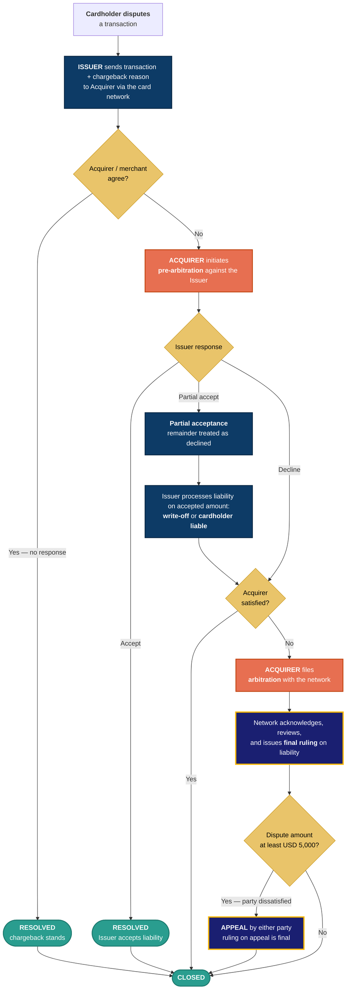
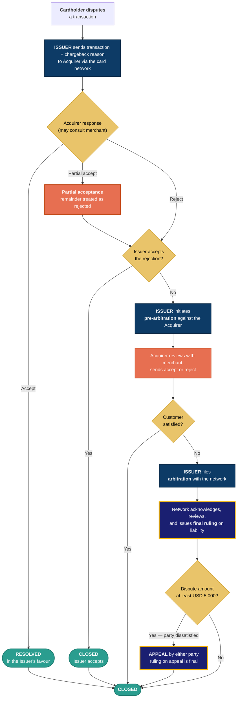
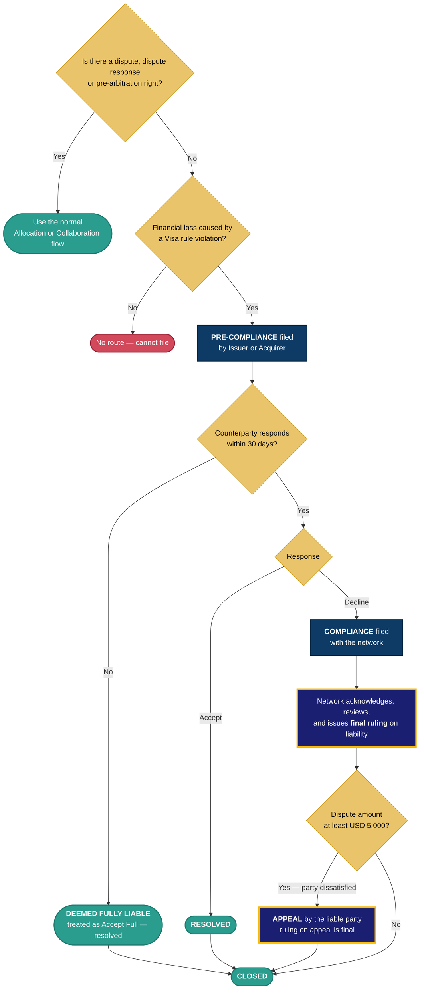

# Pega Smart Dispute — the product's own flow (as documented by Pega)

**What this is.** The dispute flow **as Pega documents it** for *Pega Smart Dispute™ Agentic Automation 24.2*, taken from Pega Academy. This is the vendor's model of how the product works — useful as the AS-IS behavioural reference, and as a cross-check on our own lifecycle model.

**Read alongside**

| Doc | Relationship |
|---|---|
| [`scheme-lifecycles-and-customer-journeys.md`](./scheme-lifecycles-and-customer-journeys.md) | Our scheme lifecycles, validated against Visa and Mastercard's own publications. §7 below reconciles the two. |
| [`pega-lite-db-schema.md`](./pega-lite-db-schema.md) | The AS-IS data model these flows write to. |
| [`dispute-claims-resolution-architecture.md` §0](./dispute-claims-resolution-architecture.md#0-terminology--read-this-first) | Shared glossary. |

---

## 0. Provenance and confidence

**Source:** [Pega Academy — *Pega Smart Dispute Agentic Automation* mission (v1, 24.2)](https://academy.pega.com/mission/pega-smart-dispute-agentic-automation/v1), published Jan–Apr 2025. Specifically the *Dispute lifecycles* module and its six topics.

| What | Confidence |
|---|---|
| Flow logic, party roles, thresholds, fund movement | **High** — quoted verbatim from Pega's "Key points" text below each topic |
| Dispute categories and subcategories | **High** — reproduced from Pega's tables |
| Feature list in §6 | **Medium** — derived from module *learning objectives*, not from the topic bodies |
| Sequencing within each flow | **Medium** — reconstructed from prose. **Pega publishes flowchart images I could not read**; if their diagram and my reconstruction disagree, theirs wins |
| Anything about *your* implementation | **None** — this is OOTB product documentation. Your instance is customised |

> **Scope note.** Pega's material here is **Visa-only**. Mastercard/MDR is not covered in the *Dispute lifecycles* module. Nothing below should be assumed to apply to MCOM.

> **Product scope is wider than ours.** Pega states Smart Dispute handles *"credit and debit card billing disputes, as well as non-plastic payment methods such as Zelle and ACH payment dispute processing, and fraud dispute processes."* Our architecture is scoped to card and e-commerce only. If Zelle/ACH disputes run through the same Pega instance, that is migration scope we have not accounted for — see §8.

---

## 1. What Pega says the product is for

Pega's stated value proposition, verbatim:

> Pega Smart Dispute Agentic Automation provides value by helping issuers:
> - Manage the customer conversation to provide exceptional customer service.
> - Improve the productivity of their customer-facing and back office operators.
> - Ensure compliance with bank policies, government regulations, and card scheme rules.

Note the ordering — **customer conversation first, operator productivity second, compliance third**. The product is positioned as a servicing application that happens to file disputes, not as a network-integration engine. That framing shows up in the flows: they are written from the operator's seat.

---

## 2. Dispute classification

Pega classifies every Visa dispute into one of **four categories**, then a subcategory. The category determines which of the two flows runs.

| Category | Pega's description | Flow |
|---|---|---|
| **10 · Fraud** | Unauthorized or fraudulent transactions — stolen cards, counterfeit, identity theft, phishing | **Allocation** |
| **11 · Authorization** | Errors in the authorization process — expired cards, invalid cards, declined transactions | **Allocation** |
| **12 · Processing Errors** | Discrepancies in amount, date, currency, location, or duplicates | **Collaboration** |
| **13 · Consumer Disputes** | Problems with the product or service — defective, damaged, non-delivery, late delivery, cancellation. **Also includes credit issues** — refunds and adjustments requested but not received or applied incorrectly | **Collaboration** |

### 2.1 Subcategories, as Pega lists them

| 10 · Fraud | 11 · Authorization | 12 · Processing Errors | 13 · Consumer Disputes |
|---|---|---|---|
| 10.1 EMV Liability Shift Counterfeit | 11.1 Card Recovery Bulletin | 12.1 Late Presentment | 13.1 Merchandise/Services Not Received |
| 10.2 EMV Liability Shift Non-Counterfeit | 11.2 Declined Authorization | 12.2 Incorrect Transaction Code | 13.2 Cancelled Recurring Transaction |
| 10.3 Card Present Environment | 11.3 No Authorization | 12.3 Incorrect Currency | 13.3 Not as Described/Defective |
| 10.4 Card Absent Environment | | 12.4 Incorrect Account Number | 13.4 Counterfeit Merchandise |
| 10.5 Visa Fraud Monitoring Program | | 12.5 Incorrect Amount | 13.5 Misrepresentation |
| | | 12.6.1 Duplicate Processing | 13.6 Credit Not Processed |
| | | 12.6.2 Paid by Other Means | 13.7 Cancelled Merchandise/Services |
| | | 12.7 Invalid Data | 13.8 Original Credit Not Accepted |
| | | | 13.9 Non-Receipt of Cash/Load |

> ⚠ **An inconsistency in Pega's own material.** `12.1 Late Presentment` appears in the classification table but is **absent from the Collaboration flow's subcategory list**. Either it is handled outside the standard Collaboration flow, or their table has an omission. Worth a question to Pega or your SME — it is a real reason code with real volume.

Pega also notes that time constraints and documentation requirements vary by subcategory and *"are available on the Visa Core Rules and Visa Product and Service Rules"* — i.e. **the product does not publish the time bars; it reads them from the rulebook.** That matches our §14.7 finding that time bars are the least-documented part of the domain.

---

## 3. Early resolution — before any dispute is filed

Pega positions this as *"hands-free, front-office processing"* aimed at first-contact resolution. Three mechanisms:

| Mechanism | What it does |
|---|---|
| **Duplicate processing** | A standard **duplicate scoring rule**, plus operator options to mark a new dispute as a duplicate of another, **linked** to another, a **reassertion** of a prior dispute, or genuinely new |
| **Low value write-off** | Write off below a threshold rather than pursue |
| **Review merchant credit** | Check whether the merchant has already credited the cardholder |

**The duplicate guard is more sophisticated than a simple dedup check.** Pega:

> Warnings appear if the total amount resolved in a customer's favor on a posted transaction exceeds the transaction amount. This is applicable even if the customer has raised multiple disputes for part amounts on the same transaction.

That is a **cumulative** control across partial disputes on one transaction — the same invariant Mastercom enforces on the amount chain ([lifecycles §6.3](./scheme-lifecycles-and-customer-journeys.md#63-the-amount-invariants--a-chain-mastercard-enforces-at-every-cycle)), here applied on the customer-credit side rather than the scheme side.

> **Note it is a *warning*, not a block.** An operator can proceed past it. That is a control-design choice worth confirming in your instance.

---

## 4. The Allocation flow — Fraud (10) and Authorization (11)

Reconstructed from Pega's "Key points". **The acquirer initiates pre-arbitration** — the finding that corrected our earlier drafts.

*Dark blue = issuer acts · orange = acquirer acts · Visa blue = network acts. Full key: [architecture §0.11](./dispute-claims-resolution-architecture.md#011-diagram-conventions--the-shared-legend).*

### 4.1 Where the money sits — Allocation

> *"In Allocation cases, Visa sends the funds to the Issuer on chargeback submission, and the funds stay with the Issuer until liability is decided."*

**The issuer holds the funds for the whole dispute.** That is materially different from Collaboration (§5.1), and it is not in any of our other documents.

---

## 5. The Collaboration flow — Processing Errors (12) and Consumer Disputes (13)

**The issuer initiates pre-arbitration**, after receiving and rejecting the acquirer's response.

### 5.1 Where the money sits — Collaboration

> *"In a Collaboration case, Visa settles the funds to Issuer on chargeback submission and **if Acquirer declines the chargeback the funds are moved back to Acquirer**. The funds would be with the Acquirer until liability is decided."*

**The funds bounce back to the acquirer the moment the chargeback is declined.**

| | Allocation | Collaboration |
|---|---|---|
| On chargeback submission | Funds → Issuer | Funds → Issuer |
| If the acquirer declines | **Funds stay with the Issuer** | **Funds return to the Acquirer** |
| Who is out of pocket during the dispute | Acquirer | **Issuer** |

This is a real treasury and risk difference, and it interacts badly with provisional credit: in a **Collaboration** dispute where the acquirer declines, the issuer has credited the cardholder *and* returned the funds to the acquirer — carrying the exposure on both sides until the ruling. In **Allocation**, it does not.

> Nothing in our architecture models the fund position during a dispute. See §8, gap 2.

---

## 6. The alternate flows

### 6.1 Pre-compliance and compliance

An **independent** route, not a stage of the two flows above.

Entry conditions, verbatim: *"There is no dispute, dispute response, or pre-arbitration right"* **and** *"There is a financial loss due to the violation."*

**The 30-day silence rule is unusually punitive and worth noting:** *"If the Acquirer fails to respond to the pre-compliance request within a specified timeframe of 30 days, the Acquirer is deemed fully liable… considering the pre-compliance response as Accept Full."* Non-response is not neutral — it is total loss. The same principle as Visa's Response Certification, applied to compliance.

### 6.2 Good faith

> *"The good faith processing option is available when the timeline of the specified transaction has expired."*

**This is the post-time-bar route.** Once the dispute right is dead, good faith lets the issuer ask the acquirer to pay anyway, voluntarily. It has no enforcement — hence "good faith". Our lifecycle model treats an expired time bar as a terminal denial; Pega treats it as a branch to a weaker option.

### 6.3 Recall and withdraw

> *"Recall and withdraw options are available when the cardholder no longer wishes to pursue the dispute or if the cardholder has filed the dispute in error. The party which has raised the pre-arbitration or arbitration cases can recall and withdraw the cases… These options are available throughout the dispute lifecycle whenever the party that has initiated the dispute is awaiting action from the other party."*

Two conditions govern it: **you must be the initiating party**, and **you must be awaiting the counterparty**. That is a precise guard, and it is a cross-cutting capability rather than a stage.

---

## 7. Processing features Pega ships

From the *Dispute processing features* module's learning objectives. **Capability names only — I could not read the topic bodies**, so treat these as a checklist to verify, not as documented behaviour.

| Feature | Pega's stated purpose | Maps to |
|---|---|---|
| **Straight-through processing** | Submit disputes without manual intervention | Auto-adjudication — our roadmap item |
| **Bulk processing** | Manage multiple cases simultaneously | Ops efficiency; no equivalent in our model |
| **Liability processing** | Apply liability options to resolve disputes | BC-5 Financial Posting |
| **Job scheduler / queue processor** | Batch queue processing | Pega agents — replaced by EventBridge + SQS in target |
| **Batch queue configurations and extension points** | Customisation hooks | Migration surface — see §8 |
| **Foreign Exchange accounting** | Manage currency fluctuations | **No equivalent anywhere in our architecture** |
| **Customer correspondence** | Automated, timely communication | BC-10 Correspondence |
| **Dispute accounting** | Accounting throughout the lifecycle | BC-5 Financial Posting |
| **Dispute auditing** | End-to-end tracking with audit trails | `audit-svc` |

---

## 8. What this changes for our architecture

Seven gaps, ordered by how much they'd hurt.

| # | Finding | Why it matters | Where it lands |
|---|---|---|---|
| 1 | **Appeal is a real stage** — either party, dispute ≥ **USD 5,000**, and the appeal ruling is final | Our canonical `DisputeCycle` stops at `ARBITRATION`. A case can continue past it. The stage machine would reject a legitimate event | BC-2 stage machine · BC-4 `DisputeCycle` enum |
| 2 | **Fund position differs by workflow** (§4.1, §5.1) | In Collaboration the issuer is out of pocket on both sides after a decline. Nothing models where the money sits mid-dispute | BC-5 Financial Posting |
| 3 | **Partial acceptance** with a liability split — write-off vs cardholder-liable on the accepted portion | We model accept/reject as binary. Partial acceptance creates two amounts with different downstream treatment | BC-2 · BC-5 |
| 4 | **Recall and withdraw**, available throughout whenever you are the initiator and awaiting the counterparty | A cross-cutting transition our state machine has no equivalent for | BC-2 stage machine |
| 5 | **Good faith** as the post-time-bar branch | We treat time-bar expiry as terminal. It is not | BC-3 Rules · BC-2 |
| 6 | **FX accounting** | Cross-currency disputes shift value between filing and settlement. Absent from our architecture entirely | BC-5 Financial Posting |
| 7 | **Zelle and ACH disputes** run in the same product | If in scope for your instance, that is migration volume and a non-card lifecycle we have not modelled | Migration scope |

### 8.1 What this material confirms

| Our claim | Pega's wording |
|---|---|
| **Allocation: acquirer files pre-arbitration** | *"the Acquirer initiates pre-arbitration against the Issuer"* |
| **Collaboration: issuer files pre-arbitration** | *"The Issuer initiates the pre-arbitration against the Acquirer… if the Issuer is not ready to accept the response"* |
| Allocation = categories 10 + 11; Collaboration = 12 + 13 | Stated explicitly in both topics |
| The network rules, not the parties | *"provides the final ruling deciding the liable party"* |
| Compliance is independent, either party | *"Issuers or Acquirers can choose to file pre-compliance"* |
| Time bars live in the rulebook, not the product | *"available on the Visa Core Rules and Visa Product and Service Rules"* |

Three independent sources — Visa's own VCR guide, Rivero, and now Pega — agree on the filer question. It can be treated as settled.

### 8.2 One thing to be careful about

**Pega's flows are drawn from the operator's seat, not the case's.** They begin at *"cardholder disputes a transaction"* and end at *"final ruling"*. There is no intake, no identity verification, no dedup, no eligibility assessment, no provisional credit, no Reg E clock, and no customer notification — even though the product does all of those.

So this document describes **the network-facing half** of the lifecycle. It is not the E2E flow, and it should not be used as one. Our [scheme-agnostic E2E lifecycle](./scheme-lifecycles-and-customer-journeys.md) covers the other half; Pega's Allocation and Collaboration flows sit inside its single scheme-aware stage.

---

## 9. Questions for Pega or your SME

1. **Is `12.1 Late Presentment` in the Collaboration flow?** It is in the classification table but absent from the flow's subcategory list (§2.1).
2. **Is the duplicate-warning a hard block or a soft warning?** Pega says *"Warnings appear"* — an operator can apparently proceed.
3. **Does the USD 5,000 appeal threshold hold in your region?** Pega states it without qualification; scheme thresholds are usually regional.
4. **Are Zelle and ACH disputes in scope for your instance?**
5. **Where is Mastercard?** This module is Visa-only. Is MDR covered elsewhere in the product, or handled by customisation?
6. **Which batch-queue extension points has your implementation used?** Pega ships them as customisation hooks — each one is migration surface.

---

**Sources**

- [Pega Academy — Pega Smart Dispute Agentic Automation (mission, v1, 24.2)](https://academy.pega.com/mission/pega-smart-dispute-agentic-automation/v1)
- [Dispute lifecycles (module)](https://academy.pega.com/module/dispute-lifecycles/v1/in/88971) · [Dispute classification](https://academy.pega.com/topic/dispute-classification/v1/in/88971/90901) · [Early resolution for disputes](https://academy.pega.com/topic/early-resolution-disputes/v1/in/88971/90901) · [Allocation in Visa disputes](https://academy.pega.com/topic/allocation-visa-disputes/v1/in/88971/90901) · [Collaboration in Visa disputes](https://academy.pega.com/topic/collaboration-visa-disputes/v1/in/88971/90901) · [Pre-compliance and compliance](https://academy.pega.com/topic/pre-compliance-and-compliance/v1/in/88971/90901)
- [Dispute processing features (module)](https://academy.pega.com/module/dispute-processing-features/v1/in/88971)
- A newer version exists: [Pega Smart Dispute Agentic Automation '25 (v2)](https://academy.pega.com/mission/pega-smart-dispute-agentic-automation/v2) — worth diffing before any build decision
