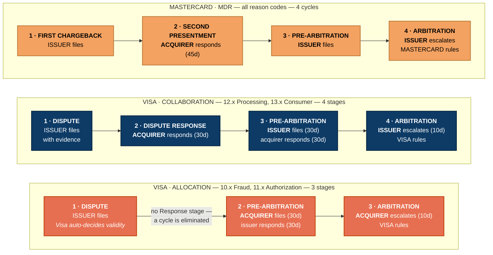
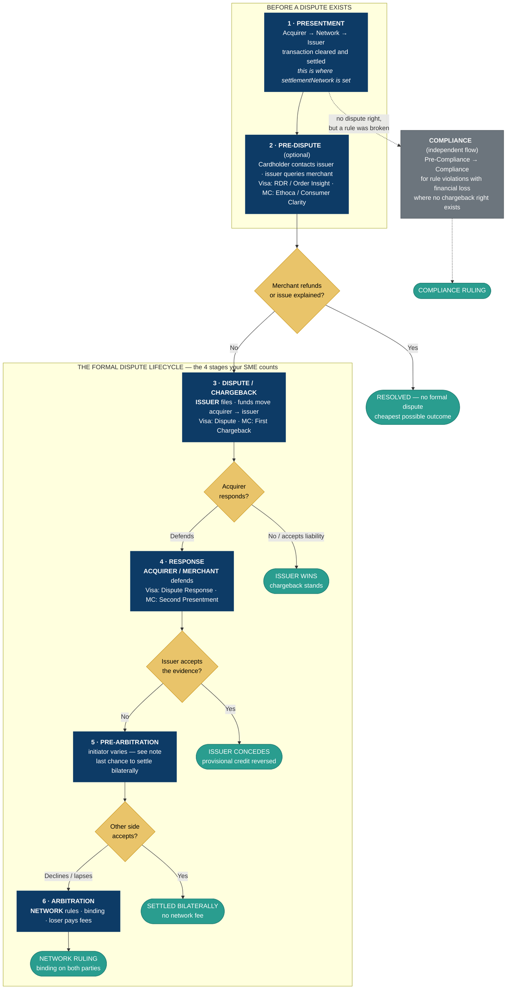
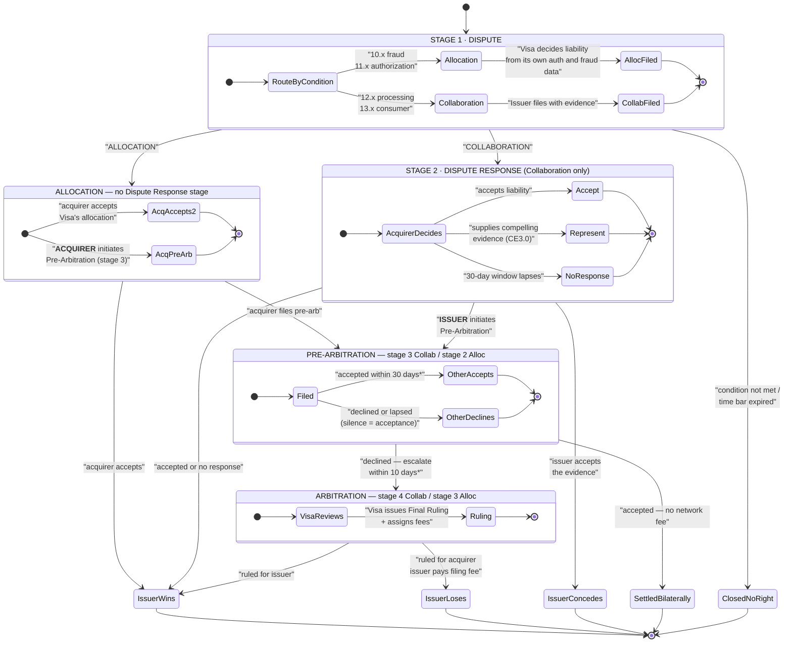
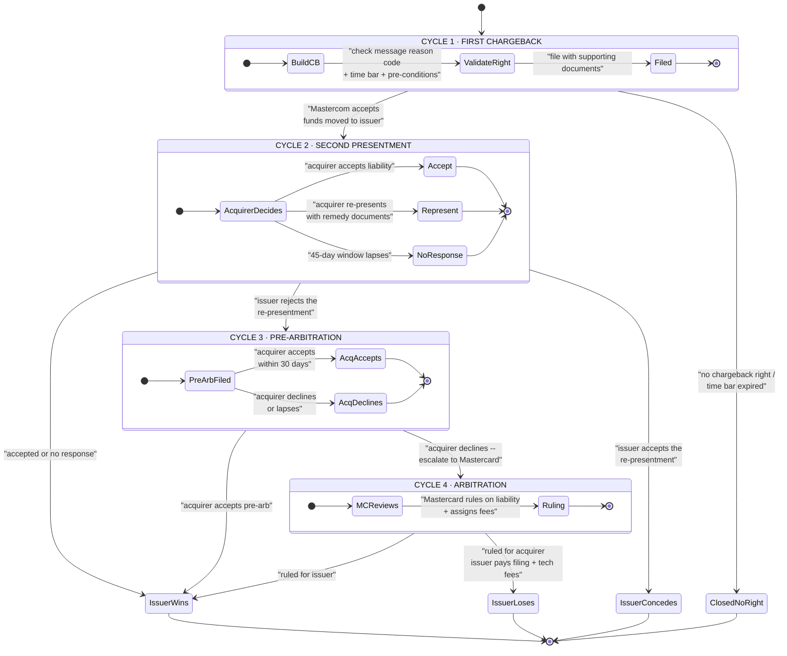
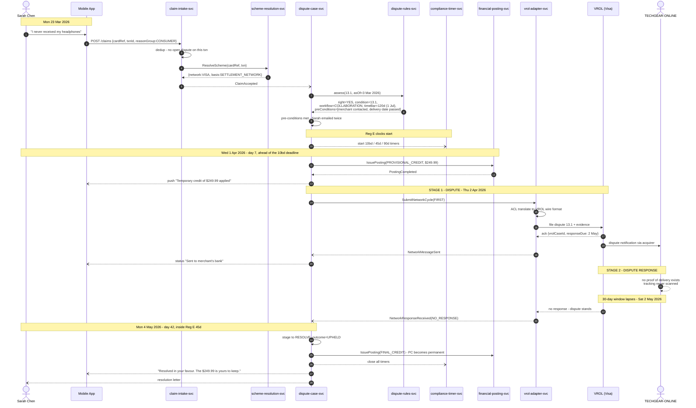
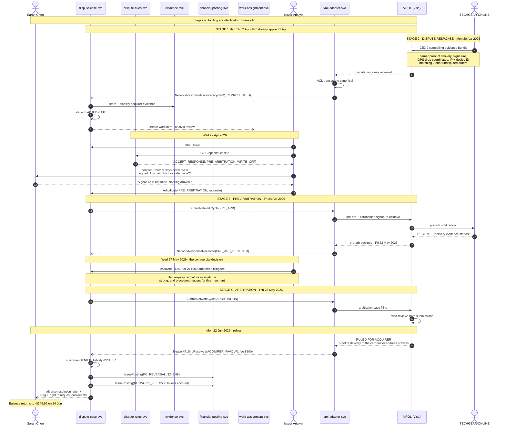
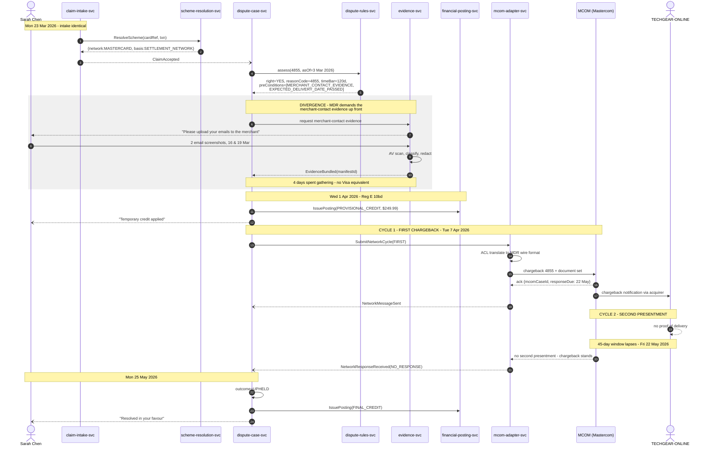
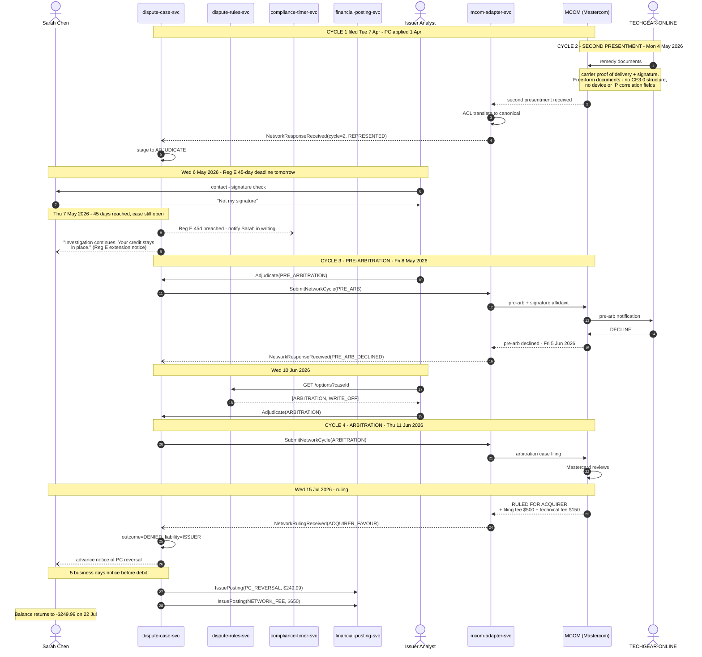

# Scheme Lifecycles & E2E Customer Journeys

**Start at [§1 — At a glance](#1-at-a-glance--the-simplified-view)** for the simplified view, then drill down.

**Purpose:** a simplified two-path view, a generalized lifecycle covering both schemes, one diagram per card network, then a single worked example run end-to-end through both — happy path first, negative path second.

**Validated against primary scheme sources** — see [§14](#14-validation-against-scheme-sources):

| Source | Used for |
|---|---|
| [Visa — *Visa Claims Resolution: Efficient Dispute Processing for Merchants*](https://usa.visa.com/dam/VCOM/download/merchants/visa-claims-resolution-efficient-dispute-processing-for-merchants-VBS-14.APR.16.pdf) | **Primary.** The two VCR workflows, who files at each stage, hard timeframes, the four dispute categories |
| [Mastercard — *Dispute Resolution Cycle*](https://developer.mastercard.com/mastercom/documentation/dispute-resolution-cycle/) · [Mastercom product](https://developer.mastercard.com/product/mastercom/) | **Primary.** MDR cycle definitions, amount invariants, compliance filing rules |
| [Rivero — *The dispute lifecycle explained*](https://rivero.tech/blog/dispute-lifecycle-explained) | Secondary. Cross-scheme framing and the six-stage view |

**Companion documents**

| Doc | Relationship |
|---|---|
| [`dispute-claims-resolution-architecture.md` **§0 Terminology**](./dispute-claims-resolution-architecture.md#0-terminology--read-this-first) | **The shared glossary.** Scheme vs platform vs programme, the parties, per-scheme vocabulary, and the terms that mean two different things — notably *Collaboration*. |
| [`dispute-claims-resolution-architecture.md`](./dispute-claims-resolution-architecture.md) | Target architecture. Part H §9.1–9.2 has the capability comparison; this document expands it into runnable lifecycles. |
| [`pega-lite-db-schema.md`](./pega-lite-db-schema.md) | AS-IS data model. Every step below names the table it writes. |

**Diagram source files:** all eight diagrams are also stored standalone under [`diagrams/lifecycle-journeys/`](../diagrams/lifecycle-journeys/).

---

## Table of contents

1. [**At a glance — the simplified view**](#1-at-a-glance--the-simplified-view)
2. [Why two lifecycles](#2-why-two-lifecycles)
3. [The stages — and which of them count](#3-the-stages--and-which-of-them-count)
4. [The generalized lifecycle — both schemes](#4-the-generalized-lifecycle--both-schemes-in-one-picture)
5. [Visa — VCR lifecycle (4 stages, 3 in Allocation)](#5-visa--vcr-lifecycle-4-stages-3-in-allocation)
6. [Mastercard — MDR lifecycle (4 cycles)](#6-mastercard--mdr-lifecycle-4-cycles)
7. [Side-by-side comparison](#7-side-by-side-comparison)
8. [The worked example](#8-the-worked-example)
9. [Journey A — Visa, happy path](#9-journey-a--visa-happy-path)
10. [Journey B — Visa, negative path](#10-journey-b--visa-negative-path)
11. [Journey C — Mastercard, happy path](#11-journey-c--mastercard-happy-path)
12. [Journey D — Mastercard, negative path](#12-journey-d--mastercard-negative-path)
13. [What the four journeys prove](#13-what-the-four-journeys-prove)
14. [**Validation against scheme sources**](#14-validation-against-scheme-sources)

---

## 1. At a glance — the simplified view

**Your understanding is correct.** Confirmed against Visa's own VCR merchant guide (§14.1).

| | **Visa — ALLOCATION** | **Visa — COLLABORATION** | **Mastercard — MDR** |
|---|---|---|---|
| Visa's own name for it | *"Fraud and Authorization"* | *"Consumer and Processing Errors"* | — |
| Dispute categories | **10** Fraud · **11** Authorization | **12** Processing Errors · **13** Consumer Disputes | all reason codes |
| Who decides at stage 1 | **Visa**, automatically from VisaNet data | The parties, by exchanging evidence | The parties |
| Is there a Response stage? | **No — a cycle is eliminated** | Yes — Dispute Response | Yes — Second Presentment |
| **Who files pre-arbitration** | **ACQUIRER** | **ISSUER** | **ISSUER** |
| **Who escalates to arbitration** | **ACQUIRER** | **ISSUER** | **ISSUER** |
| **Who rules** | **Visa** | **Visa** | **Mastercard** |
| **Who holds the funds on filing** | **ISSUER** | **ISSUER** | **ISSUER** |
| **Who holds the funds until the ruling** | **ISSUER** — never swaps | **ACQUIRER** once the chargeback is declined | **ACQUIRER** once a second presentment is made |
| Stages | **3** | **4** | **4** |



### 1.1 The one thing to get right

**The network always rules. The issuer or acquirer only *files*.**

"Arbitration → Issuer" and "Arbitration → Acquirer" in your model mean *who escalates the case*, not who decides it. Visa issues the Final Ruling in both paths. The rule underneath is simple:

> **Whoever files pre-arbitration is whoever escalates to arbitration** — because arbitration exists only when the other side declines your pre-arbitration.

So the filer follows from the workflow, and the workflow follows from the dispute category. Two hops, no exceptions.

### 1.2 Who holds the money while the dispute runs

**The general rule: filing pulls the funds to the issuer, and a decline pushes them back.** Each rejection swaps the holder.

| Event | Funds move | Source |
|---|---|---|
| Issuer files the chargeback | Acquirer → **Issuer** | MC: *"The chargeback transfers funds from the acquirer to the issuer"* |
| Acquirer declines / re-presents | Issuer → **Acquirer** | MC: *"A second presentment transfers funds from an issuer to an acquirer"* · Visa Collaboration: *"if Acquirer declines the chargeback the funds are moved back to Acquirer"* |
| Network rules | To whichever party wins | — |

**Visa Allocation is the exception — there is no swap.**

> *"In Allocation cases, Visa sends the funds to the Issuer on chargeback submission, and the funds stay with the Issuer until liability is decided."* — Pega

That follows from the structure: Visa has already ruled on validity at stage 1, so the acquirer's pre-arbitration is a challenge to a decision Visa has made, not a rejection of a claim the issuer made. The money doesn't move until Visa says so.

**Why this matters more than it looks — it compounds with provisional credit.** Under Reg E the issuer has already credited the cardholder, and it **cannot** reverse that while the investigation is open. So once the funds go back to the acquirer, the issuer is out of pocket twice over:

| | Cardholder's account | Disputed funds | Issuer's position |
|---|---|---|---|
| After provisional credit | Made whole | With the acquirer | **Out of pocket** |
| After the chargeback is filed | Made whole | With the issuer | Flat |
| **After the acquirer declines** | Made whole | **Back with the acquirer** | **Out of pocket again** |
| After the ruling | Depends on outcome | To the winner | Settled |

In **Journey B** that exposed period runs from day 30 to day 111 — **81 days** the bank funds someone else's money and cannot take it back. In an **Allocation** dispute the same case never reaches that state.

> **Architectural consequence.** Nothing in the current model tracks fund position during a dispute. `financial-posting-svc` (BC-5) records postings to the cardholder but has no notion of where the *disputed amount* sits between the parties. That is a treasury exposure the platform cannot currently report on — see the [Pega product-flow doc §8](./pega-smart-dispute-product-flow.md#8-what-this-changes-for-our-architecture), gap 2.

### 1.3 Why Allocation has one fewer stage

Visa's words: *"For fraud and authorization disputes, **a cycle has been eliminated** to streamline the process."*

In Allocation, Visa evaluates the dispute against VisaNet data and rules on validity itself at stage 1 — so there is nothing for the acquirer to "respond" to. The acquirer's only route to challenge is to file pre-arbitration. That is why the filer flips.

### 1.4 Where to drill down

| Question | Section |
|---|---|
| Why are there two lifecycles at all? | [§2](#2-why-two-lifecycles) |
| Is it 4 stages or 6? Which does my SME mean? | [§3](#3-the-stages--and-which-of-them-count) |
| One picture covering both schemes | [§4](#4-the-generalized-lifecycle--both-schemes-in-one-picture) |
| Full Visa state machine, both workflows | [§5](#5-visa--vcr-lifecycle-4-stages-3-in-allocation) |
| Full Mastercard state machine | [§6](#6-mastercard--mdr-lifecycle-4-cycles) |
| Side-by-side scheme comparison | [§7](#7-side-by-side-comparison) |
| A worked example with real dates and amounts | [§8](#8-the-worked-example) |
| What happens when the merchant can't defend | [§9](#9-journey-a--visa-happy-path), [§11](#11-journey-c--mastercard-happy-path) |
| What happens when the merchant wins | [§10](#10-journey-b--visa-negative-path), [§12](#12-journey-d--mastercard-negative-path) |
| Which claims here are sourced vs assumed | [§14](#14-validation-against-scheme-sources) |

---

## 2. Why two lifecycles

The dispute case has **two state machines running at once**, and confusing them is the most common modelling error:

| | Internal case lifecycle | Scheme lifecycle |
|---|---|---|
| **Owner** | You | Visa / Mastercard |
| **Where** | BC-2 Dispute Case Mgmt, `pxCurrentStage` | BC-4 Network Exchange, `pyCycleType` |
| **Stages** | Capture → Validate → Investigate → Provisional Credit → Network Action → Await Response → Adjudicate → Resolve → Close | Scheme-specific — §4 to §6 |
| **Changes when** | You decide to change it | The scheme publishes a release, twice a year |
| **If you get it wrong** | Internal rework | Rejected filing, burnt time bar, real financial loss |

This document draws the **right-hand column**. The left-hand column is in the architecture doc §2.3.

> **Stage counts confirmed with the project SME:** Visa VCR = **4 stages**, Mastercard MDR = **4 cycles**. They line up numerically, which is convenient — and misleading, because stages 2 and 3 behave differently in each scheme. §7 is the honest mapping; **§3 explains why four is the right count** and not the six you will see in most public material.

---

## 3. The stages — and which of them count

**Short answer: your SME is right. Four stages.** Rivero's six and your SME's four are not in conflict; they are drawing the boundary in different places, and for a dispute *platform* your SME's boundary is the correct one.

### 3.1 The six stages, mapped

| # | Generalized stage | Visa term | Mastercard term | Canonical cycle | Who acts | In SME's 4? |
|---|---|---|---|---|---|---|
| 1 | **Presentment** | Clearing via BASE II / VIP | Clearing via DMS or SMS | *(not a dispute cycle)* | Acquirer → Network → Issuer | **No** |
| 2 | **Pre-dispute** *(optional)* | RDR, Order Insight | Ethoca alerts, Consumer Clarity | `DEFLECTION` | Issuer queries, merchant may refund | **No** |
| 3 | **Dispute / Chargeback** | Dispute | First Chargeback | `FIRST` | **Issuer** | **Yes — stage 1** |
| 4 | **Response** | Dispute Response | Second Presentment / Representment | `SECOND` | **Acquirer / Merchant** | **Yes — stage 2** |
| 5 | **Pre-Arbitration** | Pre-Arbitration | Pre-Arbitration | `PRE_ARB` | **Varies — see §4.1** | **Yes — stage 3** |
| 6 | **Arbitration** | Arbitration | Arbitration | `ARBITRATION` | **Network** | **Yes — stage 4** |
| — | **Compliance** *(independent)* | Compliance | Compliance | `COMPLIANCE` | Either party | No — parallel flow |

### 3.2 So which is right — four or six?

There is an objective test. A stage of the *dispute lifecycle* should be a state that a **dispute case** can be in. Apply it:

| Test | Presentment | Pre-dispute | Stages 3–6 |
|---|---|---|---|
| Does a dispute case exist? | No | No — a complaint exists, not a case | **Yes** |
| Has the scheme assigned a case ID? | No | No | **Yes** |
| Is a scheme time bar running? | No | No | **Yes** |
| Have funds moved by dispute financials? | No | No | **Yes** |
| Does it write `pc_work_dispute_txn`? | No — writes `pc_data_transaction` | No | **Yes** |
| What fraction of transactions reach it? | 100% | ~1–2% | <1% |

**Presentment and pre-dispute fail every test.** Presentment happens to every transaction ever made, the overwhelming majority of which are never disputed — it is the *precondition* that produces a disputable artifact, not a stage of disputing it. Pre-dispute is an attempt to make sure the lifecycle never starts; if it succeeds, there is no case, no filing and no scheme record.

**So your SME is not omitting anything. They are scoping correctly.**

**Why does Rivero say six, then?** Because their article is written for "issuers, acquirers and merchants" as an end-to-end payments explainer. That framing lets them cover DMS/SMS and BASE II/VIP clearing, and lets them position pre-dispute deflection tooling — which is a product they sell. It is a legitimate scope, just a wider one than a dispute case management platform.

Notably, Rivero applies exactly this kind of scoping judgement themselves: they explicitly refuse to call Compliance a seventh stage, on the grounds that *"it doesn't require the previous steps to have happened but is a completely independent flow."* That is the same reasoning your SME is using one stage earlier.

**How to say it in a design review:** *"The dispute lifecycle has four stages. Presentment and pre-dispute sit outside it — presentment is an input to it, pre-dispute is an attempt to avoid it."*

### 3.3 What this does **not** mean

Excluding them from the *lifecycle* is right. Excluding them from *scope* would be a mistake — the platform must handle both, it just doesn't model them as case stages.

| Stage | Not a lifecycle stage, but the platform still… |
|---|---|
| **1 · Presentment** | …**consumes** it. `pySettlementNetwork` — the highest-precedence input to scheme resolution (architecture §5.5) — comes from the clearing record. Get presentment data wrong and every routing decision downstream is wrong. It belongs to BC-13 Transaction Retrieval as an ACL, not to BC-2. |
| **2 · Pre-dispute** | …**should own** it. A merchant refund here costs nothing: no filing fee, no analyst time, no time bar, no Reg E clock. It is the cheapest outcome available and currently has no home in the canonical model — see §14.3. |
| **Compliance** | …**needs** it, as a sibling aggregate rather than a cycle. It has its own entry conditions and does not require any prior stage. |

> **The practical rule:** four stages inside `DisputeCase`; presentment upstream as reference data; pre-dispute and compliance as separate flows that can pre-empt or bypass the lifecycle entirely.

---

## 4. The generalized lifecycle — both schemes in one picture

Before the scheme-specific diagrams, here is the **common skeleton**. Visa and Mastercard differ in vocabulary, windows and who acts — but the shape is the same.



### 4.1 Where the generalized model leaks — the pre-arbitration initiator

Stage 5 is the one place the "one shape, two vocabularies" abstraction genuinely breaks:

| Scheme / workflow | Who initiates Pre-Arbitration | Why |
|---|---|---|
| **Visa — Allocation** (10.x fraud, 11.x auth) | **Acquirer** | Visa already allocated liability at stage 3. There is no Dispute Response stage; the acquirer's only route to challenge is to file pre-arbitration. |
| **Visa — Collaboration** (12.x processing, 13.x consumer) | **Issuer** | The issuer files after receiving and rejecting the acquirer's Dispute Response. |
| **Mastercard** | **Issuer** | Always. The acquirer may accept, reject, or take no action. |

**Consequence for the canonical model:** `PRE_ARB` cannot assume the issuer is the filing party. The `NetworkExchange` aggregate needs an explicit `initiatingParty` — inferring it from the cycle type is wrong on Visa Allocation, which is roughly half of dispute volume at most issuers.

> This is a genuine gap found by validating against external material. See §14.3.

---

## 5. Visa — VCR lifecycle (4 stages, 3 in Allocation)

**Visa Claims Resolution (VCR).** The defining feature is the **workflow split at stage 1**: the dispute condition decides whether Visa allocates liability itself, or the parties collaborate on evidence.



### 5.1 Stage detail

Windows marked **\*** are **hard timeframes** in Visa's published VCR model — they do not flex, and the same window applies to both parties. Visa's stated goal is *"most disputes resolved within 31 days or less"*, against roughly 46 days pre-VCR.

**Collaboration — 4 stages** (12.x Processing Errors, 13.x Consumer Disputes)

| # | Stage | Who acts | Window | Canonical cycle | Writes |
|---|---|---|---|---|---|
| 1 | **Dispute** | **Issuer** files, with Dispute Questionnaire | 30 / 75 / 120 days by condition, from `pyTransactionDate` | `FIRST` | `pc_work_dispute_cycle`, `pc_data_vrol_case` |
| 2 | **Dispute Response** | **Acquirer / merchant** | 30 days | `SECOND` | new `pc_data_networkmessage` (`INBOUND`) |
| 3 | **Pre-Arbitration** | **Issuer** files (30 d\*), acquirer responds (30 d\*) | 30 + 30\* | `PRE_ARB` | `pc_work_dispute_cycle` |
| 4 | **Arbitration** | **Issuer** escalates; **Visa** rules | 10 days\* to file | `ARBITRATION` | `pc_data_network_ruling` |

**Allocation — 3 stages** (10.x Fraud, 11.x Authorization) — *"a cycle has been eliminated"*

| # | Stage | Who acts | Window | Canonical cycle | Writes |
|---|---|---|---|---|---|
| 1 | **Dispute** | **Issuer** files; **Visa** rules on validity automatically from VisaNet | by condition | `FIRST` | `pc_work_dispute_cycle`, `pc_data_vrol_case` |
| — | *(no Dispute Response stage)* | — | — | — | — |
| 2 | **Pre-Arbitration** | **Acquirer** files (30 d\*), issuer responds (30 d\*) | 30 + 30\* | `PRE_ARB` | `pc_work_dispute_cycle` |
| 3 | **Arbitration** | **Acquirer** escalates; **Visa** rules | 10 days\* to file | `ARBITRATION` | `pc_data_network_ruling` |

> **Response Certification.** In both workflows, failure to respond within the window is treated by Visa as **acceptance of liability and closure**. Silence is not neutral — it is a loss. `compliance-timer-svc` must therefore treat an approaching Visa response deadline as a hard escalation, not a soft SLA.

### 5.2 The Allocation vs Collaboration split — the thing with no Mastercard equivalent

| | Allocation | Collaboration |
|---|---|---|
| Visa's own name | *"Fraud and Authorization"* | *"Consumer and Processing Errors"* |
| Categories | **10** Fraud, **11** Authorization | **12** Processing Errors, **13** Consumer Disputes |
| Stages | **3** | **4** |
| Who decides at stage 1 | **Visa**, automatically from VisaNet auth and fraud data | The parties, by exchanging evidence |
| Issuer supplies evidence at stage 1? | No — Visa already holds the facts | Yes — via the enhanced Dispute Questionnaire |
| Is there a Dispute Response stage? | **No** | Yes |
| **Who files pre-arbitration** | **Acquirer** | **Issuer** |
| Acquirer's grounds to challenge | Narrow and enumerated — cardholder no longer disputes, compelling evidence, credit processed, invalid dispute | Full compelling evidence (CE3.0) |
| Typical outcome | Resolved at stage 1 | Runs to stage 2, sometimes 3 |

This is why `pc_data_vrol_case.pyWorkflowType` exists and has no column on `pc_data_mcom_case`.

**The 22 → 4 consolidation.** VCR collapsed 22 legacy reason codes into the four dispute categories above. `pc_data_reasoncode` must therefore be effective-dated across that boundary: a pre-VCR transaction disputed today resolves against legacy codes, a post-VCR one against 10.x–13.x. This is the same effective-dating requirement as time bars, applied to the code set itself.

---

## 6. Mastercard — MDR lifecycle (4 cycles)

**Mastercard Dispute Resolution (MDR).** One flow for every reason code, evidence-driven at every cycle. No allocation branch — Mastercard never decides liability from its own data at cycle 1.



### 6.1 Cycle detail

| # | Cycle | Who acts | Window | Canonical cycle | Writes |
|---|---|---|---|---|---|
| 1 | **First Chargeback** | Issuer files | typically 120 days, code-dependent | `FIRST` | `pc_work_dispute_cycle`, `pc_data_mcom_case` |
| 2 | **Second Presentment** | Acquirer / merchant | 45 days from filing | `SECOND` | new `pc_data_networkmessage` (`INBOUND`) |
| 3 | **Pre-Arbitration** | **Issuer** files, acquirer may accept / reject / ignore | 45 days to file, 30 to respond | `PRE_ARB` | `pc_work_dispute_cycle` |
| 4 | **Arbitration** | Mastercard rules | 45 days after pre-arb declined | `ARBITRATION` | `pc_data_network_ruling` |

### 6.2 Pre-arbitration is *generally* required — not always

Unlike Visa, where pre-arbitration must precede arbitration in both workflows, Mastercard treats it as **generally required but optional for specific categories** — ATM disputes and authorisation-related disputes in the Dual Message System among them.

The dashed edge in the diagram above is therefore real, not decorative. Two consequences:

| | Implication |
|---|---|
| **Case model** | The stage machine cannot hard-code `SECOND → PRE_ARB → ARBITRATION` on Mastercard. Whether `PRE_ARB` is skippable is a **ruleset answer** keyed on reason code and message system, returned by BC-3 as part of `permittedActions[]`. |
| **Filing party** | On Mastercard, pre-arbitration is **always** filed by the issuer. The acquirer may accept, reject, or take no action. Contrast Visa Allocation, where the acquirer initiates — see §4.1. |

### 6.3 The amount invariants — a chain Mastercard enforces at every cycle

Mastercard constrains the amount at **each** cycle, not just the first. Straight from the Mastercom documentation:

| Cycle | Rule (Mastercard's words) |
|---|---|
| First Chargeback | *"can be for the total transaction amount or a lesser amount… one clearing transaction can have multiple chargebacks for partial amounts, but the total amount charged back must not exceed the total transaction amount"* |
| Second Presentment | *"must be for the total chargeback amount or a lesser amount"* |
| Case Filing (pre-arb / arbitration) | *"must be for the total second presentment amount or a lesser amount"* |

Together these form a **monotonically non-increasing chain** that nothing in the AS-IS schema enforces:

```
transaction amount
   ≥ SUM(first chargebacks)        -- may be several partials
      ≥ second presentment
         ≥ case filing
```

As a check over the AS-IS tables:

```sql
-- must return zero rows
SELECT t.pyTransactionID
FROM   pc_data_transaction t
JOIN   pc_work_dispute_txn  d ON d.pyTransactionID = t.pyTransactionID
JOIN   pc_work_dispute_cycle c ON c.pxCoverInsKey  = d.pzInsKey
WHERE  c.pyCycleType = 'FIRST_CHARGEBACK'
GROUP BY t.pyTransactionID, t.pyTransactionAmount
HAVING SUM(c.pyCycleAmount) > t.pyTransactionAmount;
```

Breaching any link means a rejected filing and, if the time bar has run, an unrecoverable loss. In the target architecture this belongs as an invariant on the `DisputeCase` aggregate (BC-2), enforced transactionally — not as a validation activity that can be bypassed.

> **Visa has no equivalent published chain.** VCR constrains disputes through *dispute rights* and the Dispute Questionnaire rather than through an amount ladder. Do not assume symmetry here.

### 6.4 The mandatory pre-condition Mastercard adds

Under several MDR codes — **4855 Goods or Services Not Provided** among them — the issuer must evidence that the **cardholder attempted to resolve with the merchant first**, and must wait until the **expected delivery date** has passed. Visa's 13.1 has a comparable expectation but Mastercard enforces it more strictly at filing.

Consequence for the case model: `pyChargebackRightFlag` cannot be set to `Y` on a Mastercard 4855 until the merchant-contact evidence exists. This is a **pre-condition on the ruleset**, not a stage — which is exactly why BC-3 returns `preConditions[]` alongside the reason code.

---

## 7. Side-by-side comparison

**There are three lifecycles here, not two** — Visa runs two and Mastercard one. Only the last two stages line up cleanly.

| Stage | **Visa · ALLOCATION** (3) | **Visa · COLLABORATION** (4) | **Mastercard · MDR** (4) | Aligned? |
|---|---|---|---|---|
| 1 | **Dispute** — Visa rules on validity itself from VisaNet | **Dispute** — issuer files with Dispute Questionnaire | **First Chargeback** — issuer files with documents | **No** — only Visa Allocation has the network decide |
| 2 | *(none — a cycle is eliminated)* | **Dispute Response** — acquirer, 30 d | **Second Presentment** — acquirer, 45 d | **No** — one scheme skips the stage entirely; the other two differ by 15 days |
| 3 | **Pre-Arbitration** — **ACQUIRER** files | **Pre-Arbitration** — **ISSUER** files | **Pre-Arbitration** — **ISSUER** files | Structurally yes, **but the filer flips on Allocation** |
| 4 | **Arbitration** — acquirer escalates, **Visa** rules | **Arbitration** — issuer escalates, **Visa** rules | **Arbitration** — issuer escalates, **Mastercard** rules | Yes — differs only in fee taxonomy |

*Stage numbers above are per-workflow. Allocation's Pre-Arbitration is its stage 2 and Arbitration its stage 3; they are aligned by role here, not by number.*

| Dimension | Visa | Mastercard |
|---|---|---|
| Reason vocabulary | Dispute **conditions** — 10.4, 12.5, 13.1 | Message **reason codes** — 4837, 4855, 4863 |
| Goods-not-received code | **13.1** | **4855** |
| Workflow split by category | **Yes** — Allocation vs Collaboration | **No** — one flow for every code |
| Who files pre-arbitration | **Acquirer** (Allocation) · **Issuer** (Collaboration) | **Issuer**, always |
| Is pre-arbitration mandatory before arbitration? | **Yes**, in both workflows | Generally, but **optional** for some categories (ATM, auth-related in DMS) |
| Stage-2 response window | 30 days — a **hard** timeframe | 45 days |
| Escalation-to-arbitration window | 10 days — **hard** | 45 days |
| Missing a response deadline means | **Acceptance of liability and closure** (Response Certification) | Loss of the cycle |
| Structured evidence standard | **CE3.0** — machine-evaluable fields | None — documents only |
| Amount rules across cycles | No published amount ladder | **Non-increasing chain** enforced at every cycle (§6.3) |
| Pre-dispute deflection | Order Insight, RDR, Merchant Purchase Inquiry | Ethoca alerts, Consumer Clarity, **Mastercom Collaboration requests** |
| Liability decided by the network at stage 1 | **Yes**, in Allocation | **Never** |
| Does the fund holder swap on a decline? | **Allocation: no** — stays with the issuer throughout · **Collaboration: yes** — back to the acquirer | **Yes** — the second presentment moves funds issuer → acquirer |

> ⚠ **"Collaboration" appears in both columns above meaning different things.** Visa's is a *workflow*; Mastercard's is a *pre-dispute alert*. See §14.3 — this is the highest-risk naming collision in the domain.

**Design consequence.** The canonical `DisputeCycle.FIRST | SECOND | PRE_ARB | ARBITRATION` is a deliberate least-common-denominator. Stages 3–4 map cleanly; stages 1–2 do not, and each adapter absorbs the difference. Two specific things the canonical model cannot express without help:

- **A skipped stage.** Allocation has no `SECOND`. The stage machine must accept `FIRST → PRE_ARB` on that path.
- **A flipped filer.** `PRE_ARB` cannot assume the issuer is filing. `NetworkExchange` needs an explicit `initiatingParty` (§4.1).

That is the whole justification for **D3** — one adapter service per scheme.

---

## 8. The worked example

One purchase, four journeys. Same cardholder, same merchant, same amount — only the scheme and the merchant's behaviour change.

| | |
|---|---|
| **Cardholder** | Sarah Chen, personal current account, US-issued card |
| **Purchase** | Noise-cancelling headphones, **$249.99** |
| **Merchant** | *TECHGEAR-ONLINE* (descriptor: `TECHGEAR ONLINE 8005551212 DE`) |
| **Channel** | E-commerce, card-not-present, 3DS not attempted |
| **Transaction date** | **Tue 3 March 2026** |
| **Promised delivery** | **Fri 13 March 2026** |
| **The problem** | Nothing arrives. Tracking never leaves "label created". Sarah emails the merchant twice — 16 and 19 March — and gets no reply. |
| **She calls the bank** | **Mon 23 March 2026**, 20 days after the transaction |
| **Reason group** | `CONSUMER` — goods or services not received |
| **Visa condition** | **13.1** Merchandise / Services Not Received → **Collaboration** workflow |
| **Mastercard code** | **4855** Goods or Services Not Provided |

**Why this scenario.** It exercises the parts that matter: a real time bar, a mandatory merchant-contact pre-condition, provisional credit under Reg E, evidence exchange in both directions, and a clean fork where the merchant either can or cannot prove delivery.

**Reg E clocks that start on 23 March, regardless of scheme:**

| Clock | Deadline | Meaning |
|---|---|---|
| Provisional credit | **10 business days** → Mon 6 April | Credit Sarah's account if not resolved by then |
| Final resolution | **45 calendar days** → Thu 7 May | Standard investigation limit |
| Extended limit | **90 calendar days** → Sun 21 June | Applies to card-not-present / new accounts |

> The Reg E clock is **independent of the scheme clock** and usually shorter. Sarah may get her money back long before Visa or Mastercard has ruled — the bank carries the risk in between. This is the single most important thing to understand about the four journeys below.

---

## 9. Journey A — Visa, happy path

**Outcome:** merchant cannot prove delivery, does not respond. Sarah keeps the money. Resolved at **stage 2**.



### 9.1 Timeline

| Date | Day | Event | Case stage | Sarah's balance |
|---|---|---|---|---|
| Tue 3 Mar | 0 | Purchase | — | −$249.99 |
| Fri 13 Mar | 10 | Promised delivery missed | — | −$249.99 |
| 16 & 19 Mar | 13, 16 | Sarah emails merchant, no reply | — | −$249.99 |
| **Mon 23 Mar** | **20** | **Claim raised** | Capture → Validate | −$249.99 |
| Wed 1 Apr | 29 | Provisional credit | Provisional Credit | **$0.00** |
| Thu 2 Apr | 30 | Dispute filed with VROL | Network Action | $0.00 |
| Sat 2 May | 60 | Acquirer window lapses | Await Response | $0.00 |
| **Mon 4 May** | **62** | **Final credit — case closed** | Close | **$0.00 permanent** |

Resolved on day 62 of the scheme clock, **day 42 of the Reg E clock** — three days inside the 45-day limit.

### 9.2 What made it the happy path

| Factor | Why it mattered |
|---|---|
| Pre-conditions already satisfied | Sarah had emailed the merchant twice, and the delivery date had passed. No evidence-gathering delay. |
| Filed on day 30 of a 120-day time bar | 90 days of headroom. Comfortable. |
| Merchant had nothing to send | Tracking never scanned — no proof of delivery to produce. |
| Reg E and scheme outcomes agreed | Provisional credit became final. No reversal, no awkward conversation. |

---

## 10. Journey B — Visa, negative path

**Same case up to the filing.** Then the merchant produces a signed delivery confirmation. Runs all four stages and Sarah loses.



### 10.1 Timeline

| Date | Day | Event | Stage | Sarah's balance |
|---|---|---|---|---|
| Wed 1 Apr | 29 | Provisional credit | Provisional Credit | $0.00 |
| Thu 2 Apr | 30 | Dispute filed | Network Action | $0.00 |
| Mon 20 Apr | 48 | **Merchant sends CE3.0 evidence** | Await Response | $0.00 |
| Wed 22 Apr | 50 | Analyst reviews, Sarah disputes signature | Adjudicate | $0.00 |
| Fri 24 Apr | 52 | Pre-arbitration filed | Network Action | $0.00 |
| Fri 22 May | 80 | Acquirer declines pre-arb (day 28 of 30) | Await Response | $0.00 |
| Thu 28 May | 86 | Arbitration filed | Network Action | $0.00 |
| **Mon 22 Jun** | **111** | **Visa rules for acquirer** | Resolve | $0.00 |
| Wed 24 Jun | 113 | **PC reversed** | Close | **−$249.99** |

### 10.2 The Reg E problem this exposes

| Clock | Deadline | What actually happened |
|---|---|---|
| Reg E final resolution | Thu 7 May (45d) | **Missed** — case still open |
| Reg E extended limit | Sun 21 June (90d) | **Missed by one day** — ruling landed 22 June |
| Visa arbitration | Mon 22 June | Ruled |

**The scheme clock outran the regulatory clock.** Reg E does not pause because Visa is deliberating. Three consequences:

1. Sarah must be **notified in writing** at the 45-day point that the investigation continues, with the provisional credit remaining in place.
2. The provisional credit **cannot be reversed** before the investigation concludes, and reversal requires advance written notice.
3. The 90-day breach is **recorded permanently** in BC-7 even though it was caused by Visa's timetable, not the bank's. The invariant is *"a breach is recorded permanently even if later remediated."*

> This is the single strongest argument for `compliance-timer-svc` being a **separate service with its own availability guarantee**. The regulatory clock must keep running and keep alerting even when the network is silent for a month.

### 10.3 The commercial reality

| Item | Amount |
|---|---|
| Disputed amount | $249.99 |
| Visa arbitration filing fee | $500.00 |
| Analyst time, ~3 hours | ~$150.00 |
| **Total cost of losing** | **~$899.99** — 3.6× the disputed amount |

Many issuers write off below a threshold rather than file arbitration. The reason to file here is **precedent**: a signature mismatch is strong evidence, and a merchant with a pattern of unsigned deliveries is worth challenging. That decision belongs in an **effective-dated policy in BC-3**, not hard-coded in a flow — write-off thresholds change with portfolio economics.

---

## 11. Journey C — Mastercard, happy path

Same purchase, Mastercard-issued card. Reason code **4855**. Note where it diverges.



### 11.1 Timeline, and the two divergences

| Date | Day | Visa (Journey A) | Mastercard (Journey C) |
|---|---|---|---|
| Mon 23 Mar | 20 | Claim raised | Claim raised |
| 24–27 Mar | 21–24 | — | **Evidence gathering — MDR pre-condition** |
| Wed 1 Apr | 29 | Provisional credit | Provisional credit |
| Thu 2 Apr | 30 | **Dispute filed** | — |
| Tue 7 Apr | 35 | — | **Chargeback filed** (5 days later) |
| Sat 2 May | 60 | **Acquirer window lapses (30d)** | — |
| Fri 22 May | 80 | — | **Acquirer window lapses (45d)** |
| Mon 4 May | 62 | **Resolved** | — |
| Mon 25 May | 83 | — | **Resolved** |

**Two divergences, one compounding effect:**

1. **Filing is 5 days later.** MDR requires merchant-contact evidence before filing; VCR 13.1 accepts the issuer's attestation.
2. **The acquirer window is 15 days longer.** 45 days versus 30.

Net: **21 days slower to the same outcome** — day 83 versus day 62. Both inside the Reg E 90-day limit, but Mastercard consumes far more of the headroom for an identical dispute with an identical merchant.

> **Design consequence.** You cannot set one internal SLA for "await network response". The stage timeout is `f(scheme, cycle, rulesetVersion)` and must come from BC-3 as data. Hard-coding 30 or 45 days into a flow is precisely the Pega coupling being escaped — and here it would breach Reg E on one scheme while passing on the other.

---

## 12. Journey D — Mastercard, negative path

Merchant produces proof of delivery. Runs all four cycles.



### 12.1 Timeline

| Date | Day | Event | Sarah's balance |
|---|---|---|---|
| Wed 1 Apr | 29 | Provisional credit | $0.00 |
| Tue 7 Apr | 35 | Chargeback filed | $0.00 |
| Mon 4 May | 62 | **Second presentment received** | $0.00 |
| Wed 6 May | 64 | Analyst contacts Sarah — signature disputed | $0.00 |
| Thu 7 May | 65 | **Reg E 45d breached** — extension notice sent | $0.00 |
| Fri 8 May | 66 | Pre-arbitration filed | $0.00 |
| Fri 5 Jun | 94 | Acquirer declines (day 28 of 30) | $0.00 |
| Thu 11 Jun | 100 | Arbitration filed | $0.00 |
| Sun 21 Jun | 110 | **Reg E 90d breached** | $0.00 |
| **Wed 15 Jul** | **134** | **Mastercard rules for acquirer** | $0.00 |
| Wed 22 Jul | 141 | PC reversed after notice | **−$249.99** |

### 12.2 Visa vs Mastercard on the same losing case

| | Visa (B) | Mastercard (D) | Difference |
|---|---|---|---|
| Days to ruling | 111 | 134 | **+23 days** |
| Reg E 45d | Breached | Breached | same |
| Reg E 90d | Breached by 1 day | Breached by 24 days | **Materially worse** |
| Network fees | $500 | $650 | **+$150** |
| Total cost of losing | ~$900 | ~$1,050 | **+$150** |
| Evidence quality received | CE3.0 structured — device ID, IP, purchase history | Free-form documents only | Visa's is more contestable |

**The CE3.0 point is worth dwelling on.** Visa's compelling evidence arrives as *structured fields* — device fingerprint, IP address, prior undisputed transaction history. A rules engine can evaluate it. Mastercard's arrives as *documents*, which means a human reads a PDF.

That asymmetry should shape the roadmap: Visa cases can be **auto-adjudicated** against CE3.0 fields; Mastercard cases cannot. `dispute-rules-svc` can return a recommendation on the Visa path and only a checklist on the Mastercard path.

---

## 13. What the four journeys prove

| # | Observation | Architectural consequence | Source |
|---|---|---|---|
| 1 | Reg E and scheme clocks run independently, and Reg E is usually shorter | `compliance-timer-svc` is separate, with its own availability guarantee. It must fire while the network is silent | journeys |
| 2 | Same dispute, same merchant, 21–23 days' difference by scheme | Stage timeouts are `f(scheme, cycle, rulesetVersion)`, served as data from BC-3 — never hard-coded | journeys |
| 3 | Visa branches at stage 1; Mastercard never does | `pyWorkflowType` exists only on the VROL correlation table. A shared table would carry a column mandatory for one scheme and meaningless for the other | **S1** |
| 4 | **Visa Allocation has no Dispute Response stage** | The stage machine must accept `FIRST → PRE_ARB` — a skipped cycle, not an error | **S1** |
| 5 | **The pre-arbitration filer flips**: acquirer in Allocation, issuer everywhere else | `NetworkExchange` needs an explicit `initiatingParty`. Inferring it from cycle type is wrong on roughly half of Visa volume | **S1** |
| 6 | **Silence equals acceptance of liability** on Visa (Response Certification) | An approaching Visa response deadline is a hard escalation, not a soft SLA. Timer breach = financial loss, not a missed KPI | **S1** |
| 7 | **Mastercard caps the amount at every cycle**, not just the first | A non-increasing amount chain is an aggregate invariant on `DisputeCase`, enforced transactionally | **S2** |
| 8 | Losing costs 3.6–4.2× the disputed amount | Write-off thresholds are effective-dated policy in BC-3, not code | journeys |
| 9 | Visa evidence is structured (CE3.0), Mastercard's is documents | Auto-adjudication is viable on Visa first. Sequence the roadmap accordingly | **S1** |
| 10 | PC reversal needs advance written notice | Financial posting cannot be fire-and-forget — it has a notice pre-condition and a waiting period | Reg E |
| 11 | The cardholder sees one experience across all four | The scheme never surfaces in the UI. Stage names, deadlines and permitted actions come from the server | journeys |
| 12 | MDR appears to require merchant-contact evidence *before* filing; VCR does not | `preConditions[]` belongs in the eligibility response, not as a flow branch | ⚠ **unconfirmed** — see §14.7 |

### 13.1 What these four journeys do **not** cover

All four run the **Collaboration / MDR** path — Visa condition 13.1 and Mastercard 4855, both consumer-dispute codes. That means:

| Not exercised | Why it matters |
|---|---|
| **Visa Allocation** (10.x fraud, 11.x authorization) | The workflow where Visa decides liability itself, there is **no Dispute Response stage**, and the **acquirer** files pre-arbitration. Findings 4 and 5 above come from the Visa source document, **not** from a journey |
| **Deflection / pre-dispute** | No journey shows a merchant refunding at RDR or a Mastercom Collaboration request — the cheapest outcome available |
| **Compliance** | The independent flow for rule violations where no chargeback right exists |
| **Partial and multiple chargebacks** | The amount chain in §6.3 is never stressed |

> **Recommended next journey: Visa 10.4 (Other Fraud — Card Absent), Allocation.** It is the highest-volume dispute type at most issuers, and it is the one path where the filer flips and a stage disappears. Every structural assumption in the case model that these four journeys leave untested is tested by that one.

### 13.2 The one-sentence version

> Sarah has the same conversation with her bank in all four journeys. Behind it, two networks run different rulebooks on different clocks with different evidence standards and different fee structures — and the entire job of the architecture is to keep that difference on the far side of the adapter.

---

## 14. Validation against scheme sources

| # | Source | Type | Date |
|---|---|---|---|
| **S1** | [Visa — *Visa Claims Resolution: Efficient Dispute Processing for Merchants*](https://usa.visa.com/dam/VCOM/download/merchants/visa-claims-resolution-efficient-dispute-processing-for-merchants-VBS-14.APR.16.pdf) | **Primary** — Visa published | 2017 |
| **S2** | [Mastercard — *Dispute Resolution Cycle*](https://developer.mastercard.com/mastercom/documentation/dispute-resolution-cycle/) and [Mastercom product](https://developer.mastercard.com/product/mastercom/) | **Primary** — Mastercard published | current |
| **S3** | [Rivero — *The dispute lifecycle explained*](https://rivero.tech/blog/dispute-lifecycle-explained) | Secondary — vendor blog | 28 Aug 2025 |

### 14.1 Confirmed by Visa (S1)

Visa's merchant guide contains the two workflow diagrams that settle the filing-party question outright.

| Claim in this document | Visa's wording | § |
|---|---|---|
| Two workflows, split by dispute category | *"following one of two new processes"* — "Fraud and Authorization" / "Consumer and Processing Errors" | §1, §5.2 |
| Allocation = 10.x + 11.x; Collaboration = 12.x + 13.x | The four categories: 10 Fraud, 11 Authorization, 12 Processing Errors, 13 Consumer Disputes | §1, §3.1 |
| **Allocation has one fewer stage** | *"For fraud and authorization disputes, **a cycle has been eliminated**"* | §1.3, §5.1 |
| **Allocation: acquirer files pre-arbitration** | Fraud/Auth flow reads Dispute VALID → **Pre-arbitration** → Pre-arbitration Response → Arbitration, with no Dispute Response step | §1, §4.1, §5.1 |
| **Collaboration: issuer files pre-arbitration** | Consumer/Processing flow reads Dispute → **Dispute Response** → Pre-arbitration → Pre-arbitration Response → Arbitration | §1, §4.1, §5.1 |
| **Visa rules, not the parties** | *"Final Ruling"* terminates both flows | §1.1 |
| Visa decides Allocation validity itself | *"Visa will proactively provide an automated dispute decision based on the Visa rules"* | §5.2 |
| Hard timeframes 30 / 30 / 10 | *"Pre-arbitration (30 days\*) · Pre-arbitration Response (30 days\*) · Arbitration (10 days\*)"*, *"\* Hard timeframes"* | §5.1 |
| Acquirer's Allocation grounds are enumerated | *"Cardholder No Longer Wishes to Dispute, Compelling Evidence, Credit Processed, Invalid Dispute"* | §5.2 |

**Two facts from S1 newly incorporated:**

1. **Response Certification.** *"Failure to [respond] within the timeframes… is the equivalent to an acceptance of the liability and closure of the dispute."* Silence loses the case. Added to §5.1 as a hard escalation requirement for `compliance-timer-svc`.
2. **22 legacy codes → 4 categories.** Added to §5.2 as an effective-dating requirement on `pc_data_reasoncode` spanning the VCR boundary.

### 14.2 Confirmed by Mastercard (S2)

| Claim in this document | Mastercom's wording | § |
|---|---|---|
| Issuer files first chargeback | *"Issuers can create first chargebacks and file cases"* | §6.1 |
| Acquirer files second presentment | *"Acquirers can respond to Collaboration requests, create second presentments, and file cases"* | §6.1 |
| **Issuer files pre-arb and arbitration** | *"An **issuer** can continue a dispute after completion of chargeback cycles using the pre-arbitration and arbitration case filing process"* | §1, §4.1, §6.2 |
| Mastercard rules | *"Mastercard will determine responsibility for the dispute"* | §1.1, §6.1 |
| Partial chargebacks allowed, capped at transaction amount | *"one clearing transaction can have multiple chargebacks for partial amounts, but the total amount charged back must not exceed the total transaction amount"* | §6.3 |
| Compliance is independent, either party, any time | *"A compliance case can be filed **at any point**… by **either** an issuer or an acquirer"* | §3.1, §4 diagram |
| Presentment is stage 1 | *"The first presentment occurs when the acquirer submits transaction data through the Single or Dual Message System"* | §3.1 |

**Two amount rules from S2 newly incorporated** — see §6.3 for the full chain:

- *"A second presentment must be for the total chargeback amount or a lesser amount."*
- *"A case filing must be for the total second presentment amount or a lesser amount."*

### 14.3 ⚠ The naming collision — "Collaboration" means two different things

**This is the most consequential finding of the validation, and it affects how the whole team talks.**

| | **Visa** Collaboration | **Mastercard** Collaboration |
|---|---|---|
| What it is | One of the **two VCR workflows** | A **pre-dispute deflection process** |
| When it happens | Stages 1–4 of the dispute | **Before** the first chargeback |
| Scope | 12.x Processing Errors, 13.x Consumer Disputes | Any dispute |
| Mastercard's words | — | *"attempts to resolve disputes **prior to processing of first chargebacks** by alerting acquirers to pending disputes using Collaboration requests"* |
| Triggered by | The dispute category | Issuer creates a chargeback and the system holds it, **or** issuer initiates via Ethoca |
| Generalized stage | **3–6** | **2 (pre-dispute)** |

The two are unrelated. A Mastercard "Collaboration request" is what this document calls **pre-dispute** (§3.1, stage 2) — Mastercard's answer to Visa's RDR, not to Visa's Collaboration workflow.

**Mitigations applied in this document:** "Collaboration" unqualified always means the Visa workflow. Mastercard's process is called **pre-dispute** or **Mastercom Collaboration request**, never bare "Collaboration".

**Recommended for the codebase:** never use `COLLABORATION` as a bare enum value. Use `VISA_COLLABORATION` / `VISA_ALLOCATION` for `pyWorkflowType`, and `DEFLECTION` for the pre-dispute cycle on both schemes. An engineer reading a Mastercom integration spec and a VCR spec in the same week will otherwise conflate them, and the resulting bug — routing a Mastercard pre-dispute alert into a Visa workflow branch — would be silent.

### 14.4 Corrections made during validation

| # | Originally said | Corrected to | Source | Fixed in |
|---|---|---|---|---|
| 1 | Issuer initiates pre-arbitration in both Visa workflows | **Acquirer** initiates in Allocation | S1, S3 | §1, §4.1, §5 diagram |
| 2 | Visa's Dispute Response applies to all conditions | Allocation has **no** Dispute Response stage | S1, S3 | §5 diagram, §5.1 |
| 3 | Visa VCR has 4 stages | 4 in Collaboration, **3 in Allocation** | S1 | §1, §5 heading |
| 4 | Mastercard pre-arb is a mandatory gate | Generally required, **optional** for some categories | S3 | §6.2 |
| 5 | Amount cap on first chargeback only | Cap chains through **every** cycle | S2 | §6.3 |
| 6 | Journeys B and D: acquirer declined pre-arb on day **31** | Day **28** — the 30-day window is a *hard* Visa timeframe | S1 | §10.1, §12.1 |
| 7 | Presentment, pre-dispute and compliance not modelled | All three added | S2, S3 | §3.1, §4 |

### 14.5 A misconception the sources flag, which this architecture already avoids

> *"the payment networks move funds between issuer/acquirer via dispute financials; provisional credit to the cardholder is handled by the issuer… it's not the network directly refunding the cardholder."* — S3

Two independent money movements:

| Movement | Between | Driven by | Timing in Journey A |
|---|---|---|---|
| **Provisional credit** | Issuer → cardholder | **Reg E / internal policy** | Day 29 |
| **Dispute financial** | Acquirer → issuer | **Scheme rules** | Day 30 |

S2 corroborates from the other side: *"The chargeback transfers funds from the acquirer to the issuer."* Nothing about the cardholder.

The architecture already reflects this — `financial-posting-svc` (BC-5) issues provisional credit on a `CaseDecided` event and **never** waits for the network, which is why Sarah is made whole on day 29 while Visa is still deliberating on day 111.

### 14.6 Gaps in the canonical model this validation exposed

| # | Gap | Why it matters |
|---|---|---|
| 1 | `DisputeCycle` has no `DEFLECTION` value | Pre-dispute activity — Visa RDR / Merchant Purchase Inquiry, Mastercom Collaboration requests, Ethoca — has nowhere canonical to live, so deflection ROI is unmeasurable |
| 2 | `DisputeCycle` has no place for Compliance | Compliance is **not** a cycle. It has independent entry conditions and needs a sibling aggregate |
| 3 | `NetworkExchange` has no `initiatingParty` | Wrong on Visa Allocation, where the acquirer files. Cannot be inferred from cycle type |
| 4 | No amount-chain invariant | Mastercard enforces a non-increasing ladder across cycles; nothing in the model does |
| 5 | No Associated-Transactions check | S1: VROL proactively surfaces credits, reversals and adjustments that would invalidate a dispute, and **requires the issuer to verify**. This is a mandatory pre-filing step with no home in BC-1 or BC-3 |
| 6 | No VCR index / health score handling | S1: Visa scores issuers, acquirers, merchants and cardholders on platform usage. Filing invalid disputes degrades the issuer's index |

### 14.7 What remains unvalidated

| Claim | Status |
|---|---|
| Visa pre-arb / arbitration windows (30/30/10) | **Confirmed** (S1) |
| Visa dispute time bars (30/75/120 by condition) | **Not confirmed** — S1 gives no time bars |
| Mastercard windows (45-day second presentment, 45/30 pre-arb) | **Not confirmed** — S2 gives no day counts |
| Mastercard 120-day time bar on 4855 | **Not confirmed** |
| Arbitration fees ($500 Visa, $500 + $150 MC) | **Not confirmed** — neither source publishes fees |
| Reg E 10/45/90 | Out of scope for both scheme sources |
| Merchant-contact pre-condition on MDR 4855 | **Not confirmed** — needs the Mastercard Chargeback Guide |

**Where to close these:** the Mastercard *Chargeback Guide* and the *Visa Core Rules and Visa Product and Service Rules*, both behind licensee login (Mastercard Connect / Visa Online). Your SME will have access; the public documents used here do not carry this detail.

> **Net position.** The lifecycle **structure** — stages, who files, who rules, workflow splits, amount rules — is now corroborated against both schemes' own publications. The **clocks and costs** in §8–§13 remain illustrative.

---

## Assumptions to confirm with your SME

The lifecycle **structure** is now confirmed against both schemes' own publications (§14). What remains open is entirely **numbers** — which change with each scheme release and need the licensee-only rulebooks.

**Structure — settled, no action needed**

Two workflows and their category mapping · who files at each stage · who rules · Allocation having one fewer stage · Mastercard's amount chain · compliance as an independent flow · Visa's 30/30/10 hard timeframes.

**Numbers — please confirm**

| # | Assumption | Where it bites | Source needed |
|---|---|---|---|
| 1 | **Time bars** — Visa 13.1 and MC 4855 both at 120 days from transaction date | Every date in §8–§13. Some conditions run from *expected delivery date* instead, which shifts everything | Visa Core Rules; MC Chargeback Guide |
| 2 | **Mastercard windows** — 45-day second presentment, 45/30 pre-arbitration | The 21-day Visa-vs-MC gap in §11.1 — the headline finding of the journeys | MC Chargeback Guide |
| 3 | **Arbitration fees** — $500 Visa, $500 + $150 MC | The 3.6× / 4.2× cost-of-losing ratios in §10.3 and §12.2 | Current published fee schedules |
| 4 | **Merchant-contact pre-condition on MDR 4855** | Drives the 5-day filing delay in Journey C | MC Chargeback Guide |
| 5 | **Reg E 90-day extension applies** on card-not-present grounds | Whether Journey B breaches by 1 day or not at all | Your institution's Reg E interpretation |
| 6 | **Visa dispute time bars by condition** (30/75/120) | Which conditions are still filable at intake | Visa Core Rules |

**Two questions only your SME can answer**

7. **Does your Visa integration surface `Associated Transactions`?** VCR requires the issuer to verify credits, reversals and adjustments before filing (§14.6, gap 5). If your Pega implementation skips this, you are filing disputes Visa will block — and degrading your VCR index while doing it.
8. **What is your current VCR index score?** Visa scores issuers on platform usage and invalid-dispute rate. It is a live measure of dispute-quality health that nothing in the current architecture reads.

**Sources:** `docs/dispute-claims-resolution-architecture.md` §2.3, §3.2 (BC-2/3/4/7), §6.1, §8.2, §9.1–9.2 · `docs/pega-lite-db-schema.md` §6.1, §7.1–7.3
